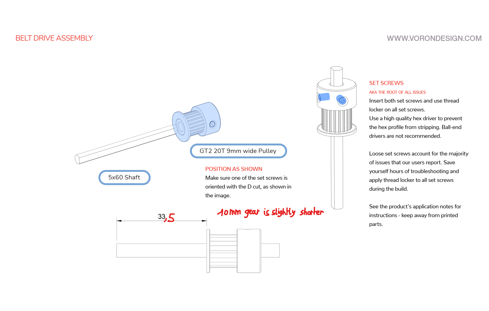

# STL's for 10mm Belts for the Z-Drive

For the case you'll want to use 10mm belts for the Z-drive, these STL's are updated to give a little bit more place.  
The main difference is a 0.5mm widening on both sides of the belt clamps and tooths.  
I'm still building my first voron2.4 so please forgive me if I missed sometheing (or do a sanity check on your own).

## In my case you need to compensate 0.5mm for the gear size

Please check your sizes before using loctite.  

The kit I bought: [link on Aliexpress](https://nl.aliexpress.com/item/1005003938978030.html)
