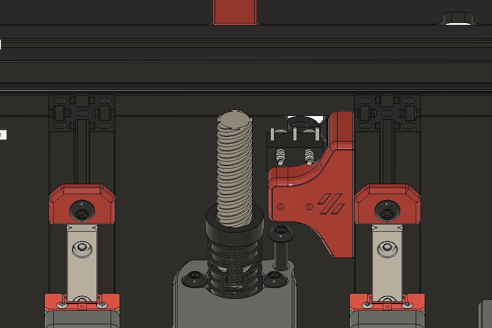

# Dual X Linear Rail

Add one more linear rail under X axis, to make hotend more stable.

Here are the modifications based on origin design:

1. cut down the Z 1515 length from 200mm to 191mm, and cut down the Z lead screw from 200mm to 195mm

2. add two holes in mid panel for install two 1515 corner connector

3. add one MGN7H Linear Rail with Carriage 150mm
