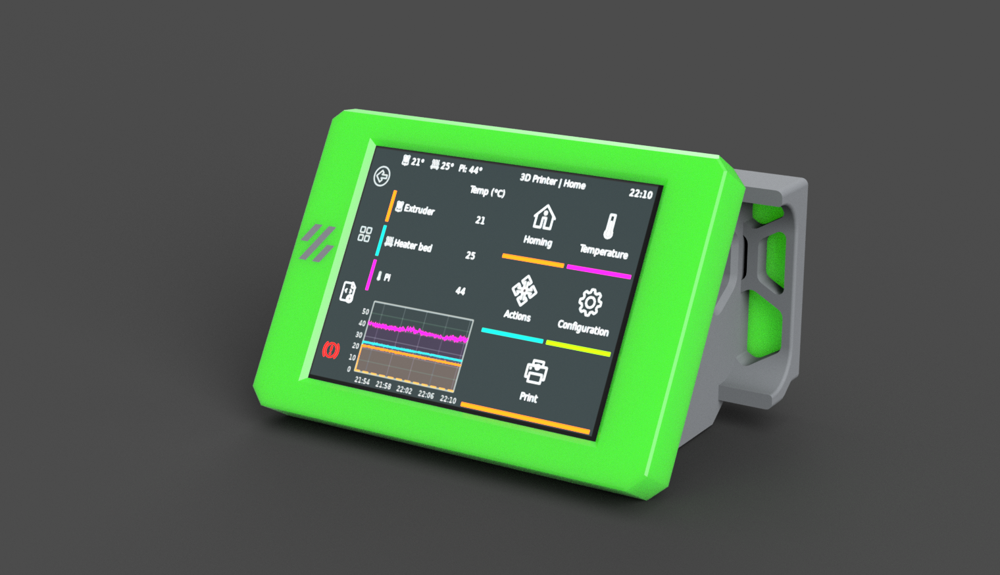
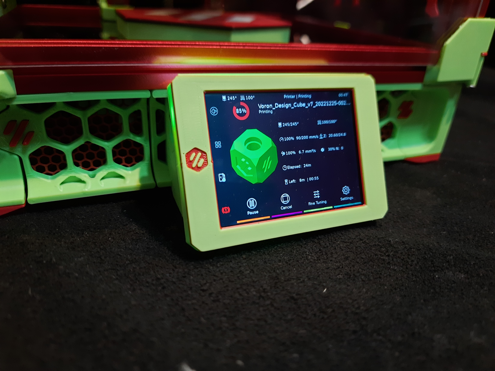

# Voron 0.2 Waveshare 2.8 DSI Display 
 

##

### BOM
[Waveshare Display](https://www.waveshare.com/2.8inch-dsi-lcd.htm)

[DSI Cable](https://www.amazon.com/A1-FFCs-Black-Raspberry-Camera/dp/B07J57LQQS/ref=sr_1_3?)

This display mount attaches using stock hardware on the V0.2 as well as the hardware that is included with the display

 ---

|  | 
|:--:| 
| *Thanks DragonKitty! for testing the display mount* |

---

To install the display follow the driver installation procedure on waveshares website [here](https://www.waveshare.com/wiki/2.8inch_DSI_LCD)

if you find that the drivers that you need are not included in the waveshare repo, they removed older versions but i have zipped and uploaded those [here](Software) along with the old instructions from waveshare 

After the drivers are installed run the following command to open up the config.txt for the raspberry pi
    
    cd ~
    sudo nano /boot/config.txt
   
This line you added in the driver installation 
   
    dtoverlay=WS_xinchDSI_Touch,invertedy,swappedxy,I2C_bus=10

Needs to be changed to 

    dtoverlay=WS_xinchDSI_Touch,invertedy,invertedx,I2C_bus=10

save and exit that file

then while still ssh into the pi you will need to place [this](Software/90-monitor.conf) file in the following directory, you may have to create that directory if it is not already created

    /usr/share/X11/xorg.conf.d/

now you can proceed with installing klipperscreen as normal i typically use [kiauh](https://github.com/th33xitus/kiauh) to do that as it makes it that much easier 

