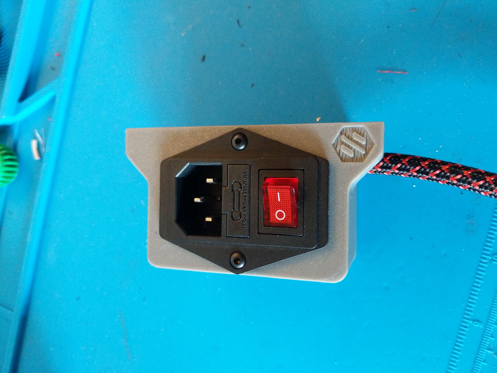
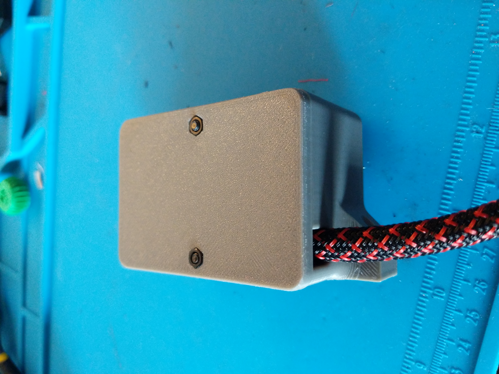
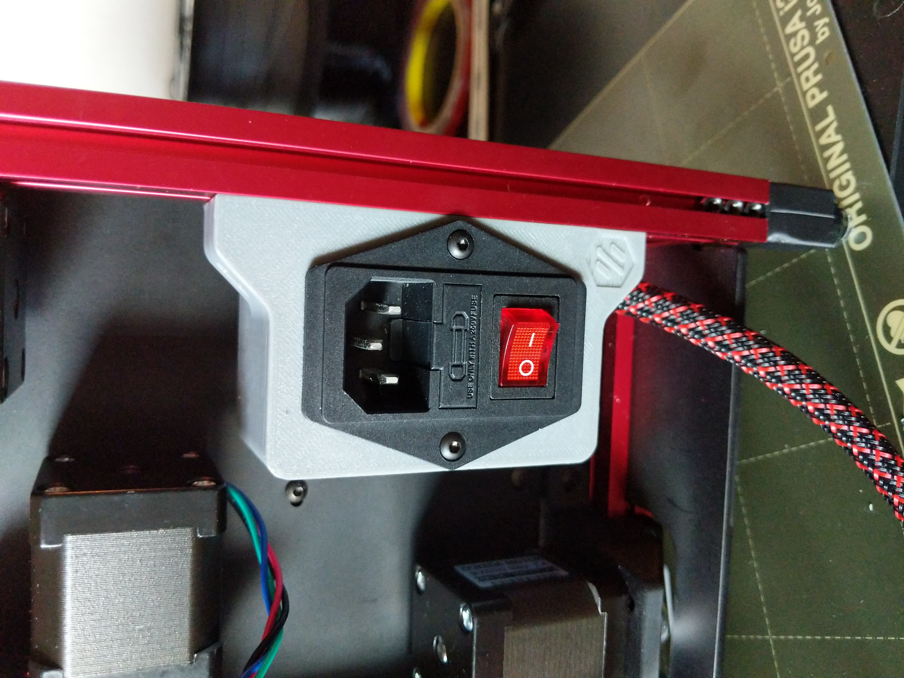

# C14 Fused inlet for the V0 with a cover on the back to cover the contacts

This is a mount for a c14 fused inlet found here on amazon 
https://smile.amazon.com/Antrader-Module-Socket-Switch-IEC320/dp/B07CTC5JVV

this uses 2 M3x40 screws to assemble and 2 M3x12 screws to attach to the frame
 
##### Pictures

