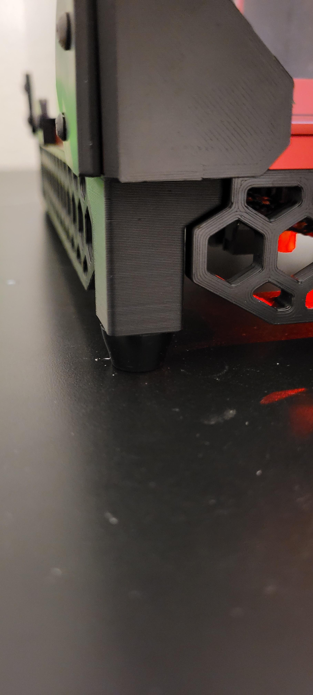

# Raised stock legs to allow for more airflow

These are extended stock legs for the v0, to raise it up a bit more to give more airflow under it

this uses m3x40 screws to assemble
 
##### Pictures

