# Hinged Hat for the V0

This is my new design for a fold away hinged top hat for the V0, i have included the step file for all the parts i designed, as well as added a BOM for everything you need to get in order to build this, 

assembling is pretty straight forward i have added the steps i took when assembling it in picture form [here](Images/Assembly) 

# Step 1
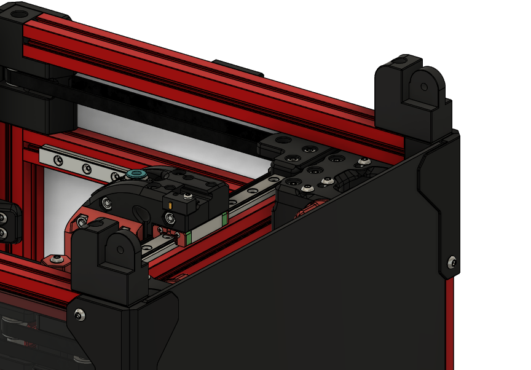 was attach the bottom hinge pieces to the top of the V0 first with the little pegs on the bottom hinges going into the holes on the A and B drive parts that attach to the top 1515 extrusion 

# Step 2
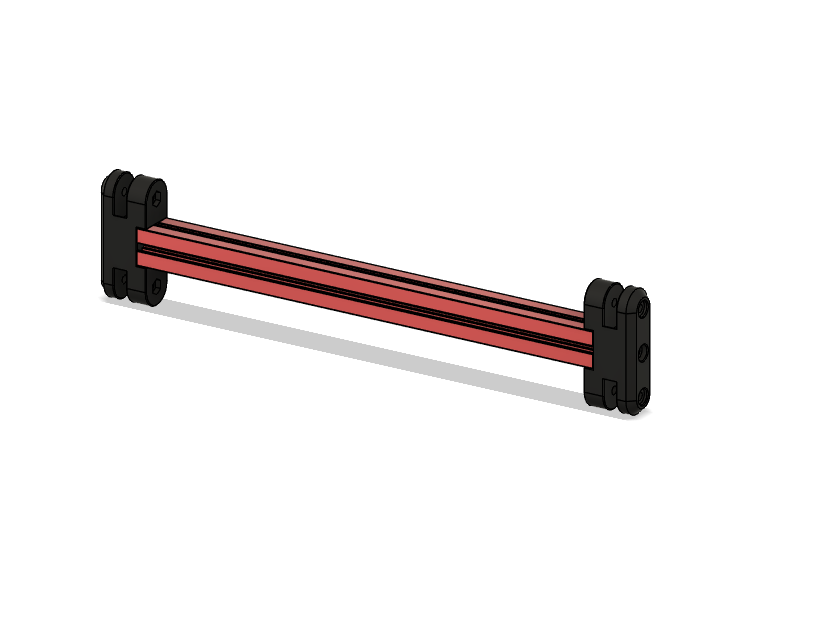 
this uses m3x16 screws to attach the 200mm extrsusion to the printed parts

# Step 3
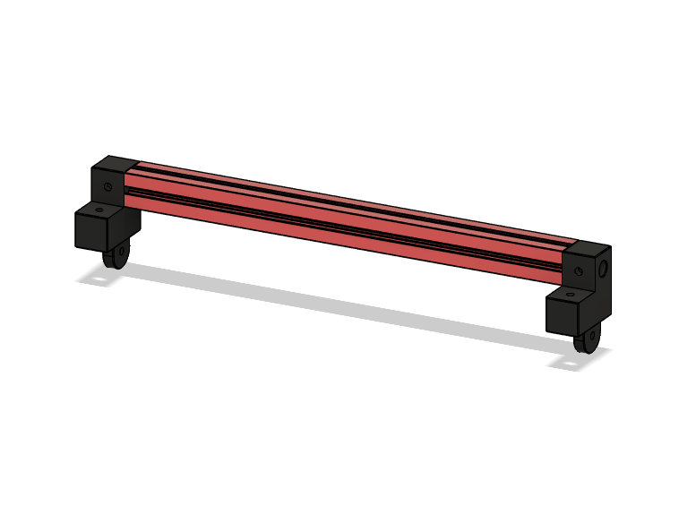 
next is the rear frame for the top hinge 

# Step 4
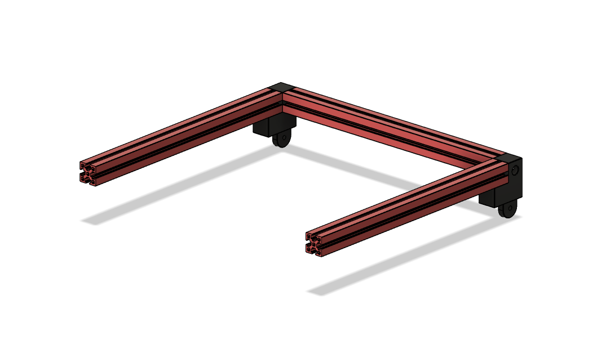 
these are 200mm extrions 

# Step 5
 
next attach the 2 80mm extrusions up against the top hinge piece

# Step 6 
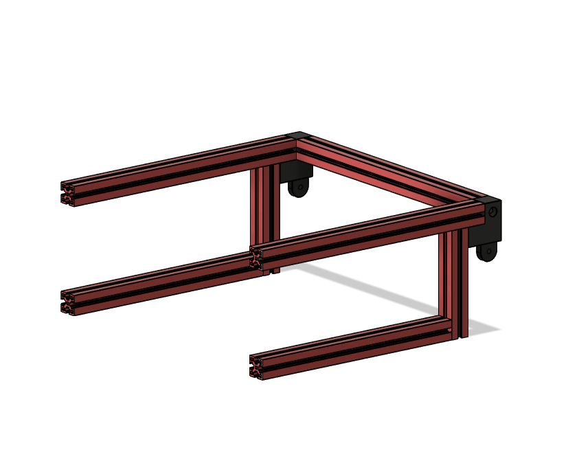 
these are the 170mm extrusions that go up against the 80mm extruisons

# Step 7
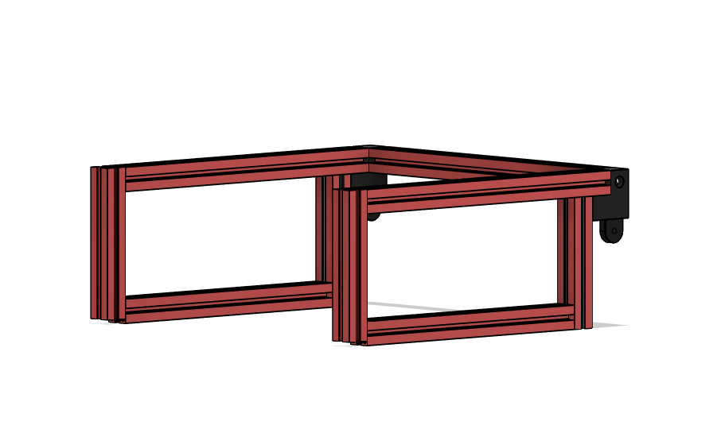 
now add the 92mm extrusions to the front of the frame, now these are 92mm long but the gap between the top and bottom extrusion is 95mm, you want the top of the extrusion to be flush and leave a little gap in the bottom of them which is for the alignment pins

# Step 8
 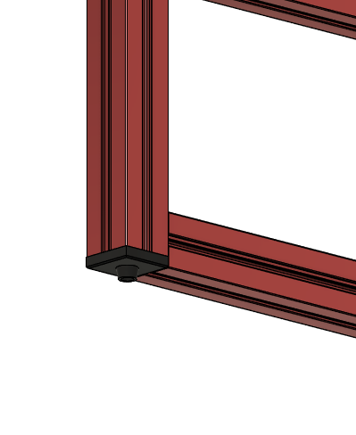 these are the alignment pins 
 
# Step 9 
 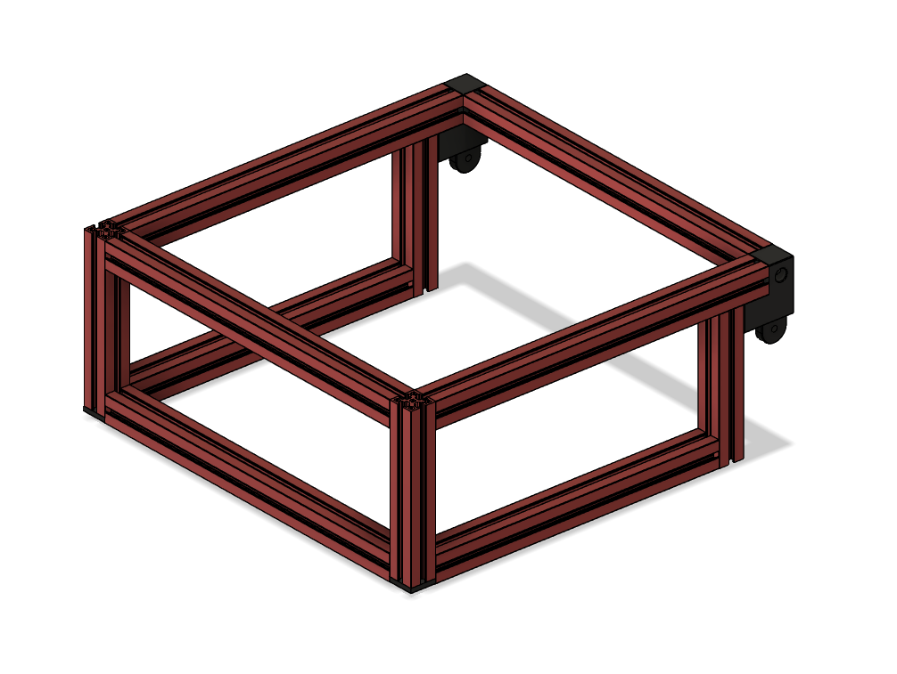attach the front top and bottom extrusion
 
 # Step 10
  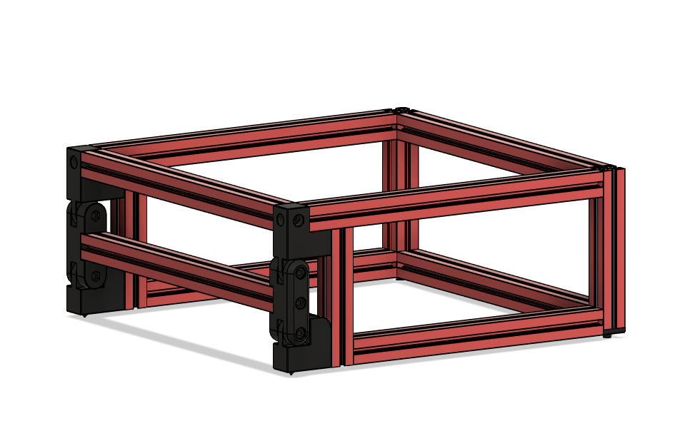 next step is to attach the bottom hinge and top hinge together using the middle hinge assembly you made in step 2
  
  # final step
  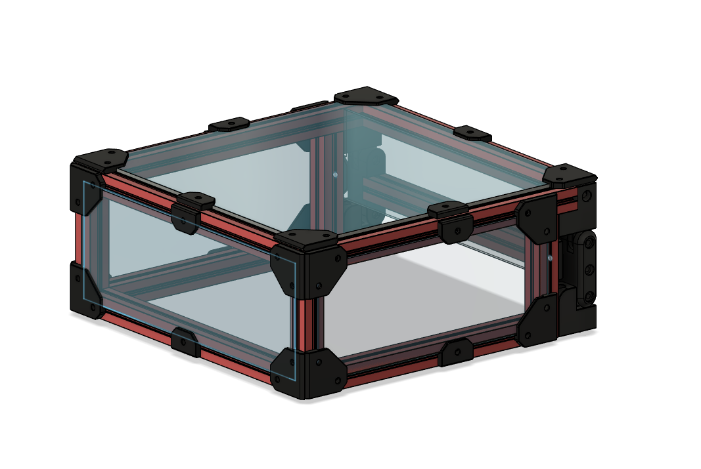 
  Add the panels to the top hat 

bottom hinge uses m3x12 to attach to the frame using an m3 nut that needs to be slid into the top extrusion
top hing which also uses an m3x12 and m3 nut in 1 of the 3 holes to attach it the other 2 are m3x8
the middle hinge (middle screw) is an m3x16
the middle hinge (2 outer screws are m3x20)
other than those the rest are going to be m3x8

i hope the pictures help with assembly they are named in the correct order to assemble it 

when it comes to drilling the holes in the extrusions to screw them together, there is a [drilling guide stl](STL/TopHat_hole_Drilling_Guide_x1.stl) in the stl folder and it has 3 holes, the one closest to the end is for the 92mm extrusions on the bottom of them, the same end that the alignment pin stl gets screws on. 
the middle hole in the driling guide is just a standard 7.5mm from the edge to make normal blind joints you did with the v0 and the highest hole is to attach the 80mm extrusion to the 170mm extrusion (you drill the hole in 170mm extrusion)

i found it easier to assemble it from the back of the top hat forward. if you open the step file you can see how it assembles. i have tested this quite a bit and so far its been working great! please feel free to make any modifications to it as you see fit

this is my biggest project ive ever taken on in fusion 360 and it was a lot of fun learning the ins and outs of it

i hope you enjoy it 

-hartk1213 V0.108

 
##### Pictures
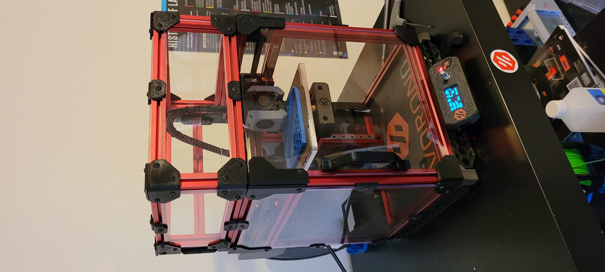
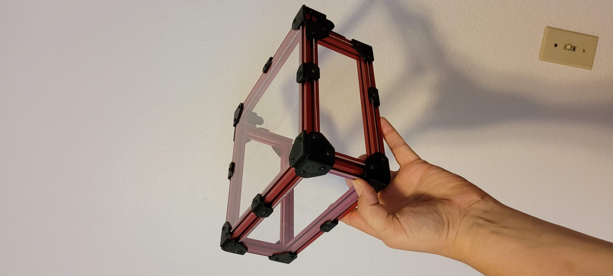
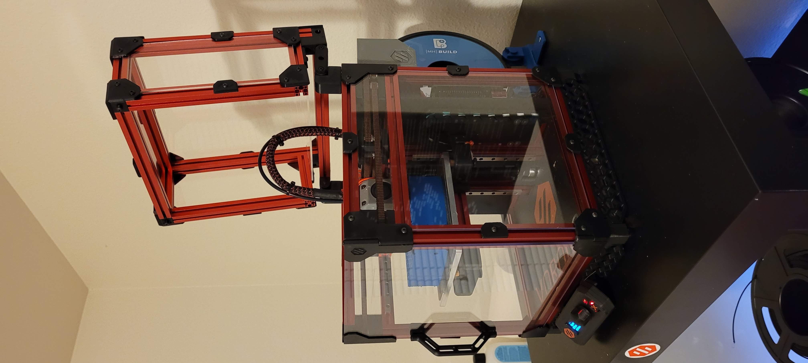
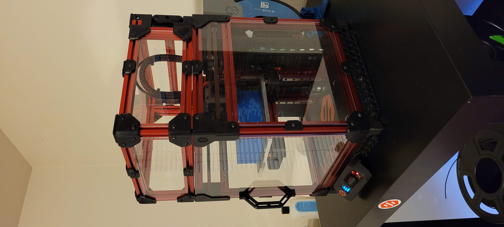
