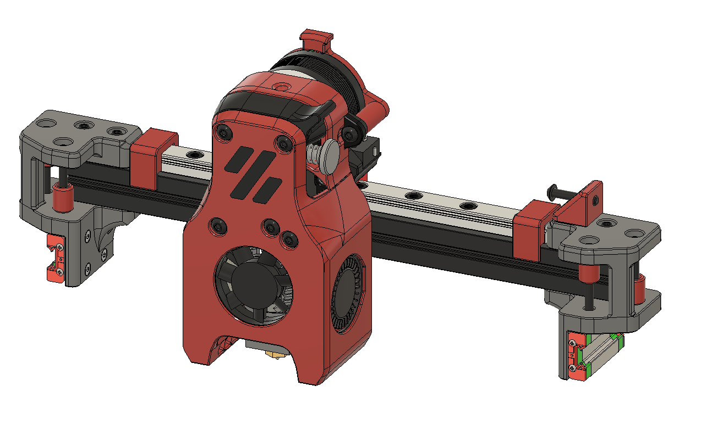
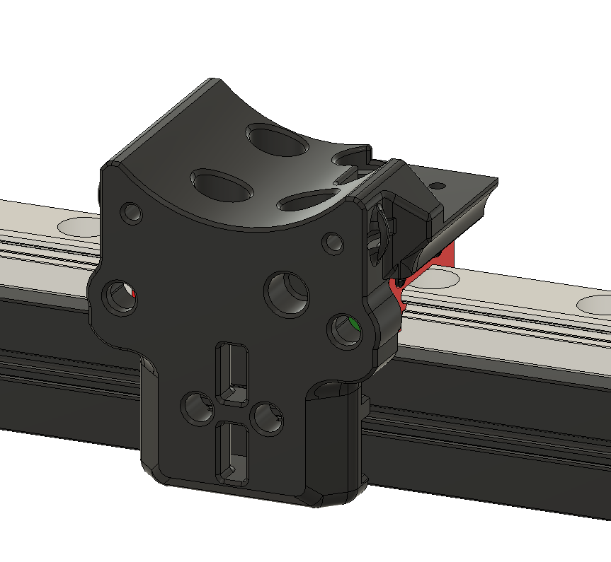

MGN9C X axis
============

This replaces the MGN7H rail on the V0.0 X axis with a single MGN9C
rail.

Required hardware
-----------------

In addition to things you can reuse from the stock build, these items are
required:
- 1x MGN9C-150mm linear rail 
- 7x M3x8 
- 7x M3 Nuts

Instructions
------------

Assembly is exactly the same as the stock V0.0 X axis 

Images
------

