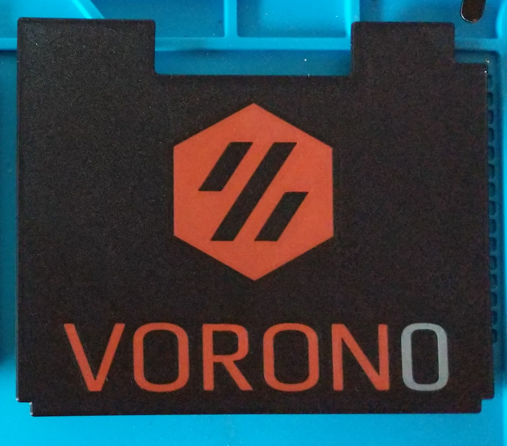

# Deck Panel for V0 to include the Voron logo and the VORON0 name 

i used user @Kruppes blank deck panel to make my own to include the logo as well as the words it uses 3 colors hence the 2nd accent label on the 3rd stl [b],
i used black for the base, red for the logo and gray for the "0" in VORON0

the easiest way i found to print it was to use prusa slicer and if you dont already have an MMU profile (you dont need an MMU to do this i dont even have one) then create a new MMU profile in PrusaSlicer and then drag all 3 stls into the slicer at the same time. It will then ask you if these files are multiple parts of the same file and if so do you want to align them, select yes and it will align all the files in the correct orientation. what i do next is on the side where you can see the 3 stl files, i delete 2 of them and then slice the remaining file, and repeat that for all 3 files. When you print them do not move or touch the build plate and one thing i found to help was for the first 2 of 3 prints change the Gcode to keep the heated bed on after the print is finsihed that way the smaller parts do not pop off the bed on accident because then you would need to reprint them. 

for the 3rd and final print i do a z hop of at least .4mm since the first 2 prints were done at .4mm total (2 layers at .2mm) 

good luck and if you print it make sure to post it to the discord build showcase !

1. [b]_Voron0_deck_panel_0
2. [a]_Voron0_deck_panel_ Logo
3. Voron0_deck_panel_with_logo_and_VORON0
 
##### Pictures

