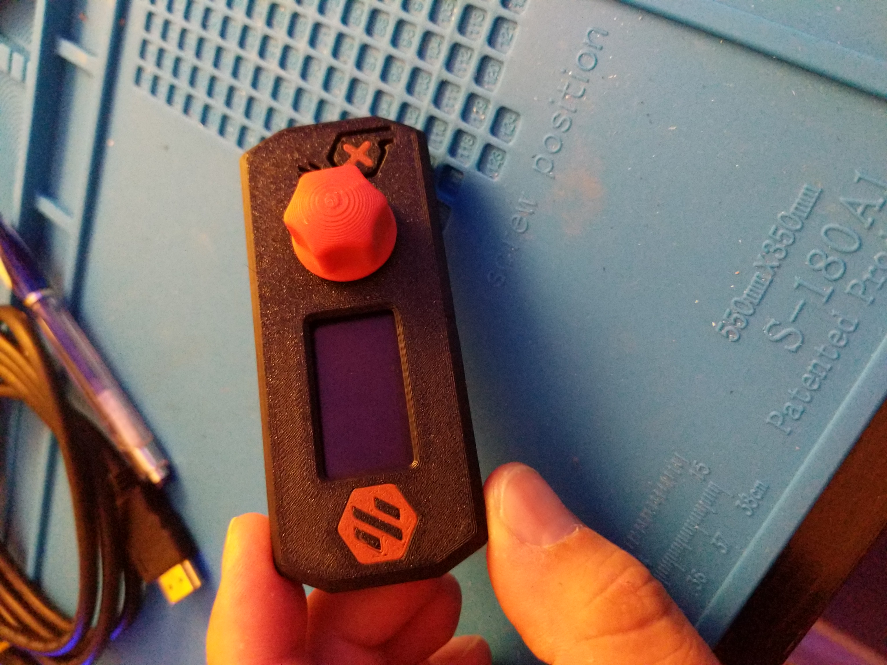

# Dual color for the V0 Display housing

i modified the file to make it so the logo can be printed in an accent color as well as the stop button "X" 

the easiest way i found to print it was to use simplify3d and select all the models and then shift-click align models, what this does it is uses the "Align model origins" feature which places 
all the stls exactly where they need to go, once you do that you can just remove the parts you are not printing and slice each color separately. i ended up with 3 files and i printed them in 
the following order after each print is finished just change filament and start the next print without removing first parts

1. [a]_logo
2. Housing_Front_with_logo

 
##### Pictures

