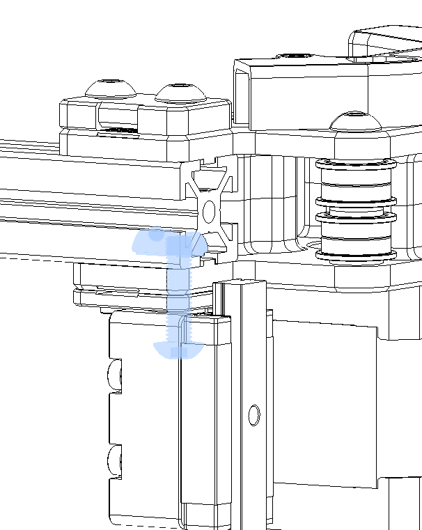

# Voron 2.4 GE5C Z joint  

##

### BOM
Screws			
|Size|Qty|
|---|---|		
|M3x12 |4|
|M3x16 or M3x20 SHCS|16|	
|M5x20 |4|	
|Ge5C Bearing|4|
|M5x1mm spacer|4|
|If using Halleffect 6x3 magnet | 1 |

#### Notes about IGUS bearings

You can replace the GE5C bearings with IGUS models. There are two IGUS spherical bearings types: the `KGLM` and `EGLM` series. The EGLM are compatible with the files found in the `Z_Joints` folder, the KGLM require the files located in `Z_Joints/Phalanx`.

 

First just insert GE5C bearing , it should just pop in

 

Now if you are using the "No Endstops" version you need 4 m3x16 screws per z joint, if you are using the endstop/halleffect version then you need 4 m3x20 per z joint.

 

 

Use an M5x20 BHCS and 1 m5x1mm washer and screw it into the gantry using a roll in tnut

 

This is how it should be assembled when all done

### NOTE: To address the question on whether to use the offset or non-offset pieces

* if you are building a new printer using the ge5c mod, then i recommend the offset parts

* if you are just installing these in a currently built printer then the stock non-offset parts are fine

