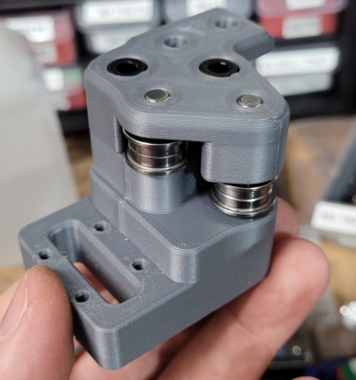

This mod is for the V2, it involves printing new AB drive frames, new XY Joints, new Front Tensioners, and new Z idlers

The pins have replaced m5 screws, at any location where the screw acts like a shaft, holding bearings, pulleys or idlers. This allows for smoother rotation and stops the possibility of motion parts being caught in threads. This work was done by everyone, thanks to ABS plastic and voron printers for the fast iteration, @doomweasel? they fall out yet?

To complete this mod the following files will need to be reprinted 

**A and B drive units**
 - a_drive_frame_lower_pinned.stl 
 - a_drive_frame_upper_pinned.stl 
 - b_drive_frame_lower_pinned.stl 
 - b_drive_frame_upper_pinned.stl

**Front Idlers**
- [a]_a_tensioner_pinned.stl
- [a]_b_tensioner_pinned.stl

**XY Joints**

*NOTE: There are now 2 versions of these files , 1 set for Stock 2.4 and 1 set for  [Arkeets MGN12](../../arkeet/mgn12)*
- xy_joint_left_upper_pinned.stl
- xy_joint_left_lower_pinned.stl
- xy_joint_right_upper_pinned.stl
- xy_joint_right_lower_pinned.stl
- 
or 

- MGN12_xy_joint_left_upper_pinned.stl
- MGN12_xy_joint_left_lower_pinned.stl
- MGN12_xy_joint_right_upper_pinned.stl
- MGN12_xy_joint_right_lower_pinned.stl

**Z Idlers**
either one of these based on if you are using 6mm or 9mm belt
- [a]_z_tensioner_x4_6mm_pinned.stl
- [a]_z_tensioner_x4_9mm_pinned.stl


here is what the XY Joint will look like

 


There is a new file for the A Drive to go along with [Arkeets MGN12](../../arkeet/mgn12) mod that has the X endstop on the toolhead 

the files for the endstop relocation mod are here [Voron2.4_Y_Endstop_Relocation](../Voron2.4_Y_Endstop_Relocation)


the following 5mm Pin hardware is what is needed as well 

**BOM**
```
[A-B] 
threaded @  30mm (x2)
smooth   @  28mm (x2)

[X-Y Joints]
smooth   @  40mm (x4)

[X-Y Idlers]
smooth   @  43mm (x2)

[Z Idlers]
smooth   @  28mm (x4)
```

these can be purchased from here 

Smooth pins

[https://www.aliexpress.com/item/1739093502.html](https://www.aliexpress.com/item/1739093502.html "https://www.aliexpress.com/item/1739093502.html")

threaded pins 

https://www.ebay.com/itm/%CF%865mm-%CF%8612mm-Female-Thread-Cylindrical-Pin-Dowel-Pins-A2-304-Stainless-Steel/184373551069

Misumi Part Numbers 

|Part NO.  |Qty  |
|--|--|
| SFRT5-30-M3 | 2 |
| SFR5-43 | 2 |
| SFR5-40 | 4 |
| SFR5-28 | 6 |


**NOTE:**
2 smooth pins can be substituted for the threaded pins, the reason the threaded pins are there is for easy removal without the need to remove the stepper. but if you dont plan on removing the pins without removing the stepper than smooth pins would work just fine for you in this situation. 


The following users are the main contributors to this mod

@RoboDave 

@DeepFriedHeroin 

@Hartk 

@DOOMweasel 

@Eddie

