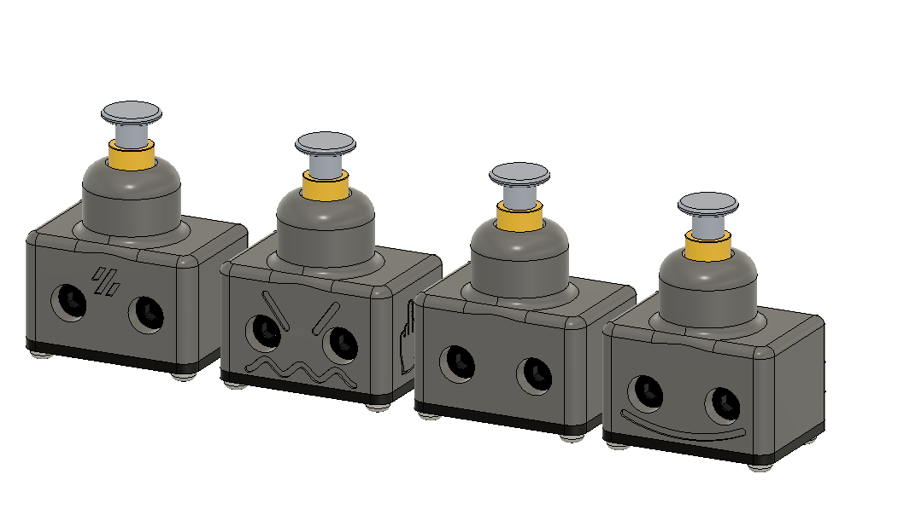
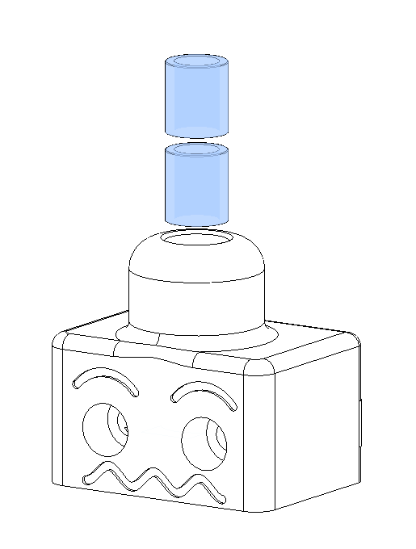
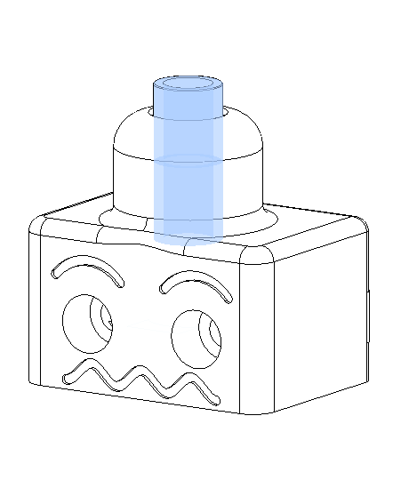
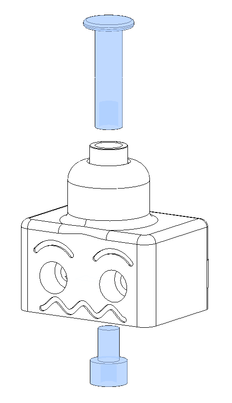
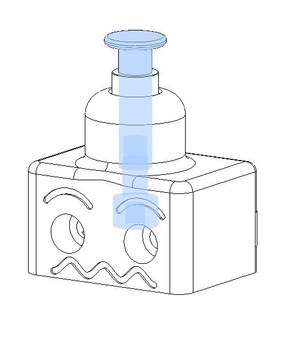
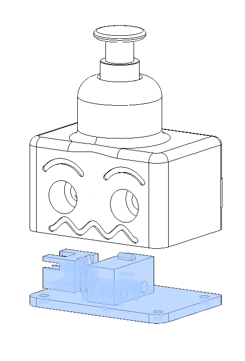
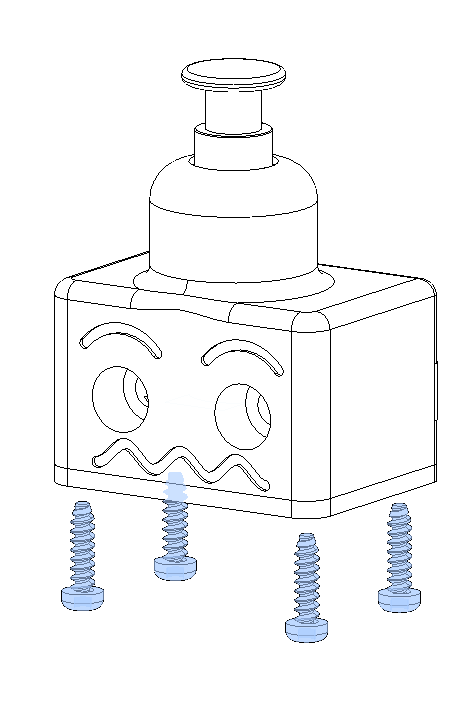
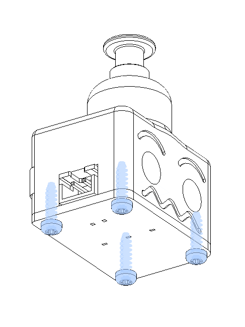
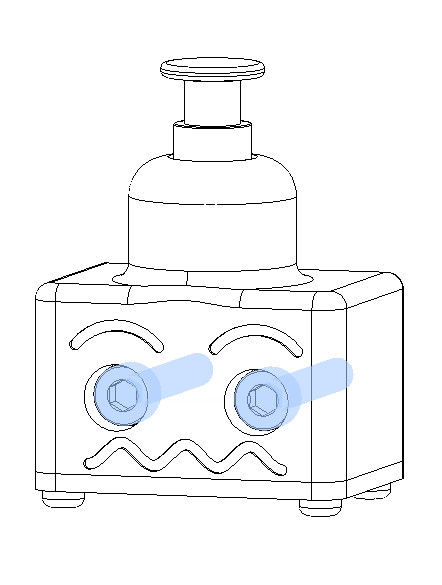

# SexBolt Z endstop 
 

This an alternative way to do the Z endstop pin in a V2, instead of using a deflanged GT2 20T pulley, it uses 2  5x7x8 sleeve copper bearings/bushing 
this is pretty simple to assemble. The reason behind this is to help keep the pin from falling out.

##

### BOM
Screws			
|Size|Qty|Link|
|---|---|---|			
|M4x8 SHCS|1|[Bolt Depot - M4x8 SHCS](https://www.boltdepot.com/Product-Details.aspx?product=6505)|
|5mmx20mm Binding Screw|1|[Amazon - Binding Screw](https://www.amazon.com/dp/B07SNQXKKC)|
|M2x8 Self Tapping|4|[Amazon - M2x8 SHCS Self Tapping](https://www.amazon.com/dp/B00YBMRAH4)|		
|5x7x8 Sleeve Bearing|2|[Amazon - Sleeve Bearing](https://www.amazon.com/dp/B07JLVRYKT)|
|Z endstop PCB | 1 | [Formosissima - Z endstop PCB](https://deepfriedhero.in/products/z-endstop-pcb-for-voron-v2-4)|

Full kit can be purchased [here](https://deepfriedhero.in/products/voron-2-4-sexbolt-kit) 
##

 

First just insert two of the sleeve bearings into the top, they should bottom out with about 2mm or so poking out the top

 

Next insert the female side of a 5mmx20mm chicago screw (sex bolt, binding barrel) and screw in the M4x6 or M4x8 SHCS with some loctite to make sure it doesn't move over time

 

 

Next insert the Z endstop PCB and secure it with 4 m2x10 self tapping screws

 

 

Next just secure it to your V2 like you would the stock Z endstop

 

### This mod was based on the work done by Voron Discord User L.e.o.p.a.r.d for the [Micron](https://github.com/hartk1213/Micron) 3d printer. 

