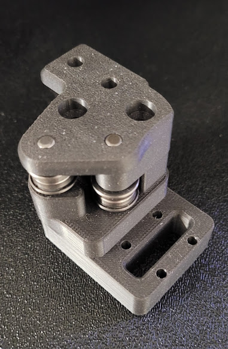
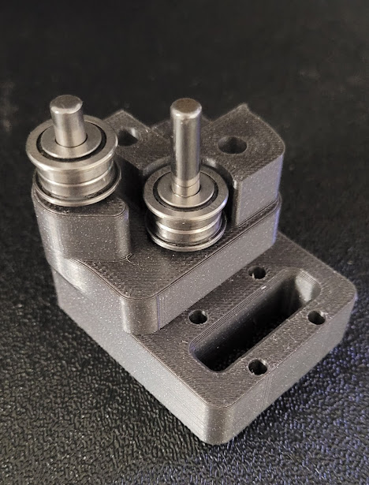
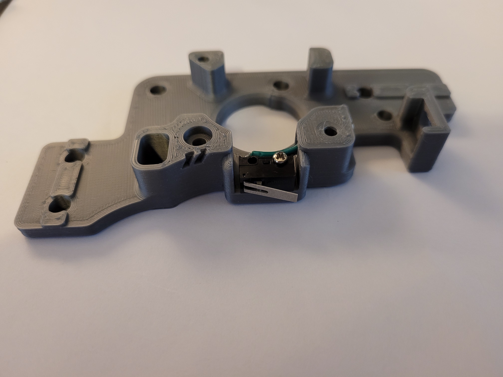
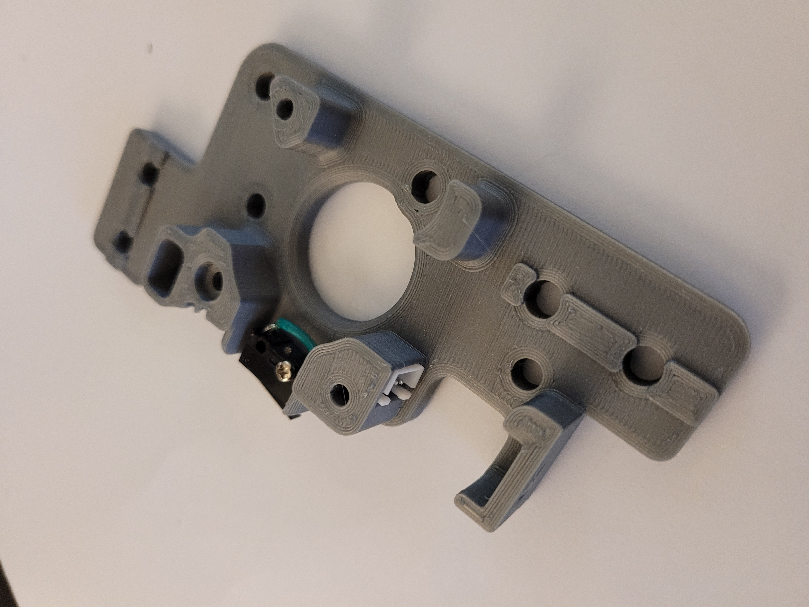
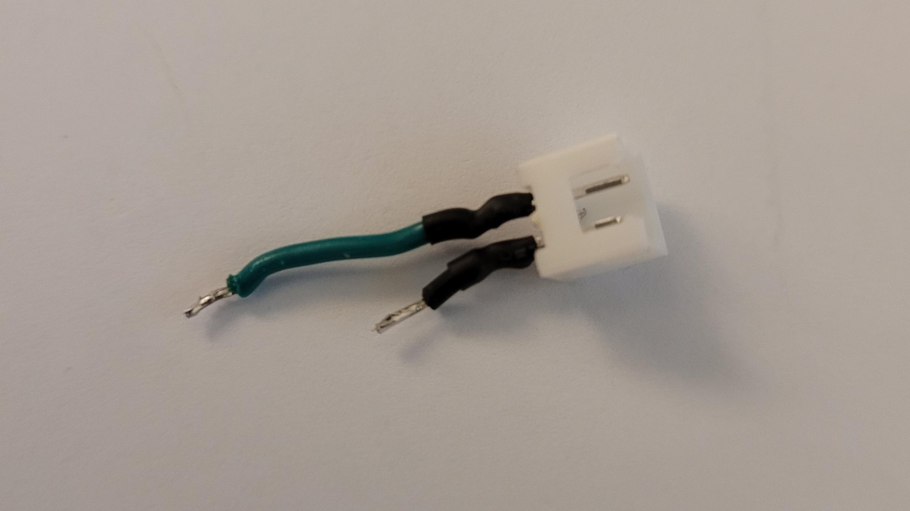
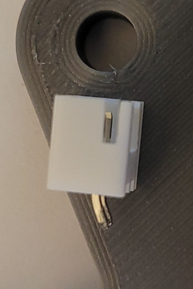
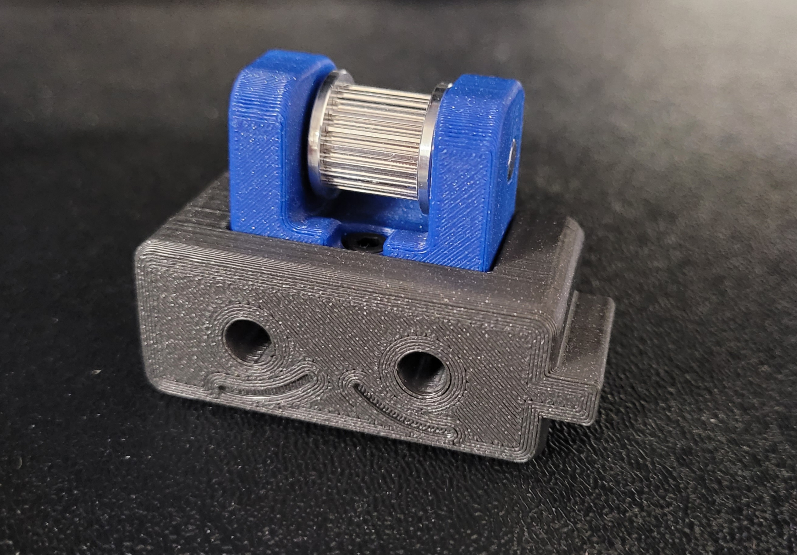

## This has been updated for V2.4r2 and Trident 

This mod is for the V2/Trident, it involves printing new AB drive frames, new XY Joints, new Front Tensioners, and new Z idlers

The pins have replaced m5 screws, at any location where the screw acts like a shaft, holding bearings, pulleys or idlers. This allows for smoother rotation and stops the possibility of motion parts being caught in threads. This work was done by everyone, thanks to ABS plastic and voron printers for the fast iteration, @doomweasel? they fall out yet?

To complete this mod the following files will need to be reprinted 

**A and B drive units**

 - a_drive_frame_lower_pinned.stl 
 - a_drive_frame_upper_pinned.stl 
 - b_drive_frame_lower_pinned.stl 
 - b_drive_frame_upper_pinned.stl

**Front Idlers**
- [a]_a_tensioner_pinned.stl
- [a]_b_tensioner_pinned.stl

**XY Joints**
- xy_joint_left_upper_pinned.stl
- xy_joint_left_lower_pinned.stl
- xy_joint_right_upper_pinned.stl
- xy_joint_right_lower_pinned.stl

**Z Idlers FOR V2**
either one of these based on if you are using 6mm or 9mm belt
- [a]_z_tensioner_x4_6mm_pinned.stl
- [a]_z_tensioner_x4_9mm_pinned.stl

here is what the XY Joint will look like




There is a new file for the A Drive to go along with the latest 2.4r2 / Trident carraige that has the X endstop on the toolhead 
and that is moving the Y endstop to the A drive, this is an optional mod 
this requires a 2pin jst to be soldered to the switch, 
the best way i have done it is to solder the wires to the jst first, then install it with a dab of super glue , then solder the wires to the omron switch 

- a_drive_frame_upper_with_jst_y_endstop_pinned

here are a few pics for reference







you might need to bend the pins a little bit to get them to fit around the curve




here is what the Z idler will look like


the following 5mm Pin hardware is what is needed as well 

**BOM**
```
[A-B] 
30mm (x2)
28mm (x2)

[X-Y Joints]
40mm (x4)

[X-Y Idlers]
43mm (x2)

[Z Idlers]
28mm (x4)
```

these can be purchased from here 

Smooth pins

[https://www.aliexpress.com/item/1739093502.html](https://www.aliexpress.com/item/1739093502.html "https://www.aliexpress.com/item/1739093502.html")

Misumi Part Numbers 

|Part NO.  |Qty  |
|--|--|
| SFR5-30 | 2 |
| SFR5-43 | 2 |
| SFR5-40 | 4 |
| SFR5-28 | 6 |

The following users are the main contributors to this mod

@RoboDave 

@DeepFriedHeroin 

@Hartk 

@DOOMweasel 

@Eddie

