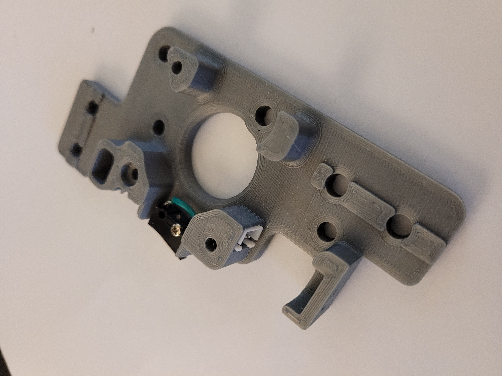
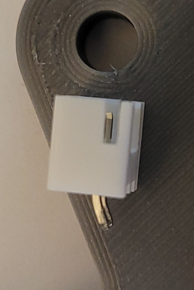

This mod moves the Y endstop to the A drive, to go along with [Arkeet's MGN12 mod](../../arkeet/mgn12)
that has the X endstop on the toolhead.  This mod requires a 2 pin JST-XH to be soldered to the
switch.  The best way I have done it is to solder the wires to the JST-XH first, install it with a dab
of super glue, then solder the wires to the Omron switch.

There are 2 different files

non pinned version
- a_drive_frame_upper_with_jst_y_endstop.stl

pinned version (since this mod also works with the [Voron2.4_Trident_Pins_Mod](../Voron2.4_Trident_Pins_Mod))
- a_drive_frame_upper_with_jst_y_endstop_pinned.stl

here are a few pics for reference

you might need to bend the pins a little bit to get them to fit around the curve

