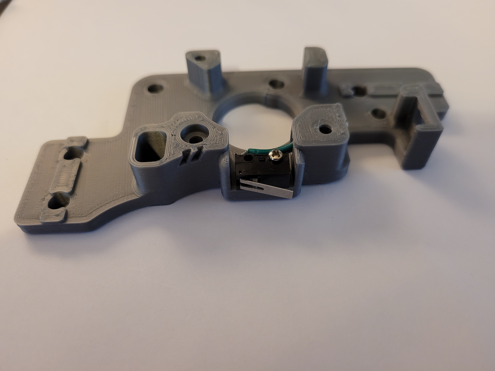
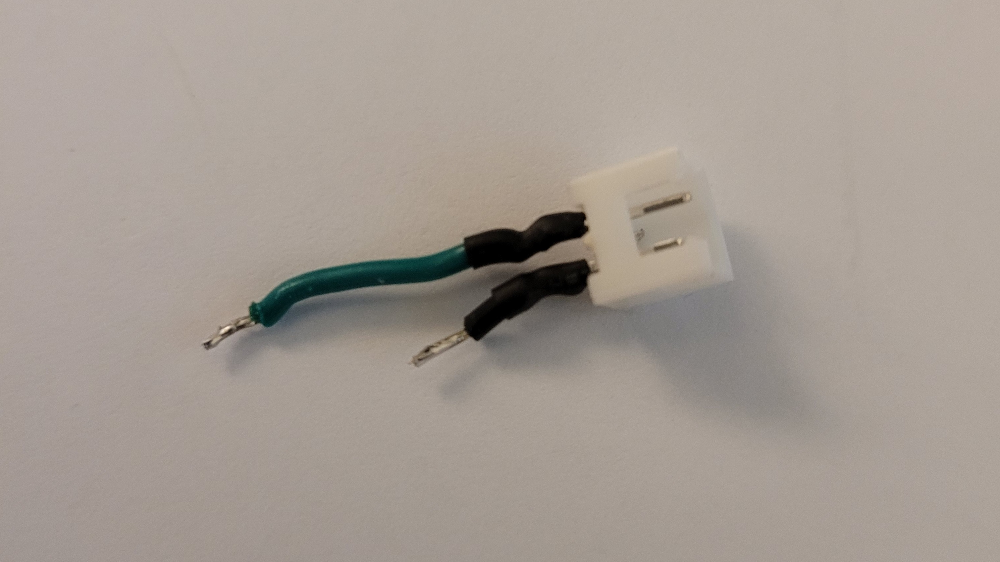

This mod is for the V2 A Drive to go along with [Arkeets MGN12](https://github.com/VoronDesign/VoronUsers/tree/master/printer_mods/arkeet/mgn12) mod that has the X endstop on the toolhead and that is moving the Y endstop to the A drive this requires a 2pin jst to be soldered to the switch, 
the best way i have done it is to solder the wires to the jst first, then install it with a dab of super glue , then solder the wires to the omron switch 

There are 2 different files non pinned version
- a_drive_frame_upper_with_jst_y_endstop.stl

pinned verion since this mod also works with as well with the Pin mod here [Voron2.4_Pins_Mod](https://github.com/VoronDesign/VoronUsers/tree/master/printer_mods/hartk1213/Voron2.4_Pins_Mod)
- a_drive_frame_upper_with_jst_y_endstop_pinned.stl

here are a few pics for reference

you might need to bend the pins a little bit to get them to fit around the curve

