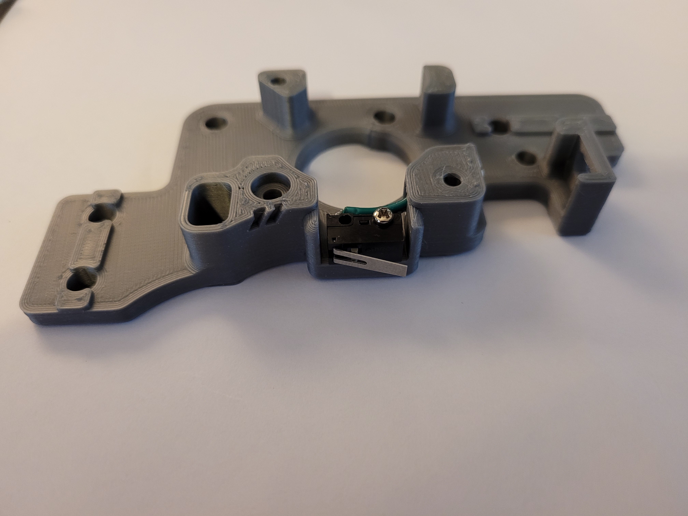
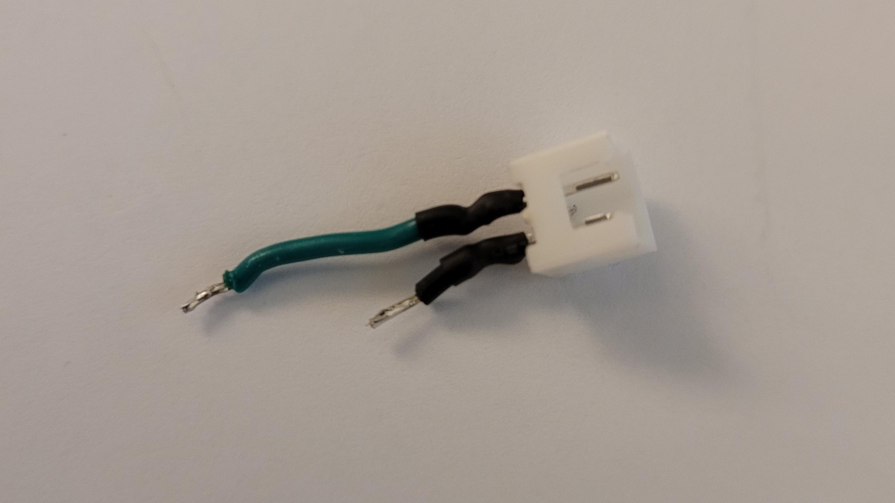
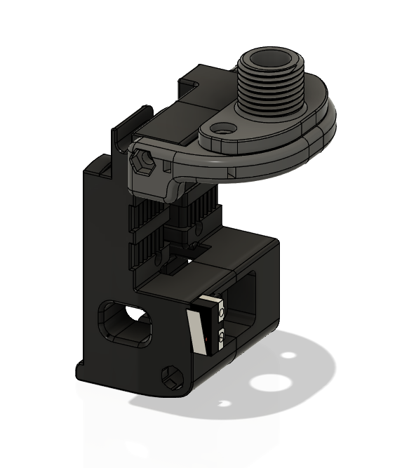

This mod is for the V2 A Drive to go along with [Arkeets MGN12](https://github.com/VoronDesign/VoronUsers/tree/master/printer_mods/arkeet/mgn12) mod that has the X endstop on the toolhead 
and that is moving the Y endstop to the A drive this requires a 2pin jst to be soldered to the switch, 
the best way i have done it is to solder the wires to the jst first, then install it with a dab of super glue , then solder the wires to the omron switch 

- a_drive_frame_upper_with_jst_y_endstop_pinned

here are a few pics for reference

you might need to bend the pins a little bit to get them to fit around the curve

There is also an umbilical toolhead mount for this if you wanted to get rid of the cable chains on the X and Y , this is for the MGN12 mod, but im sure it could be adapted to work with stock mgn9

to use the umbilical you will need the following 
[M12 Cable strain relief](https://www.amazon.com/uxcell-Waterproof-Adjustable-Locknut-4-5-7-8mm/dp/B07R56F4F1/)
2x m3 heatsets
2x m3x8 screws 
1x m3x50 SHCS

