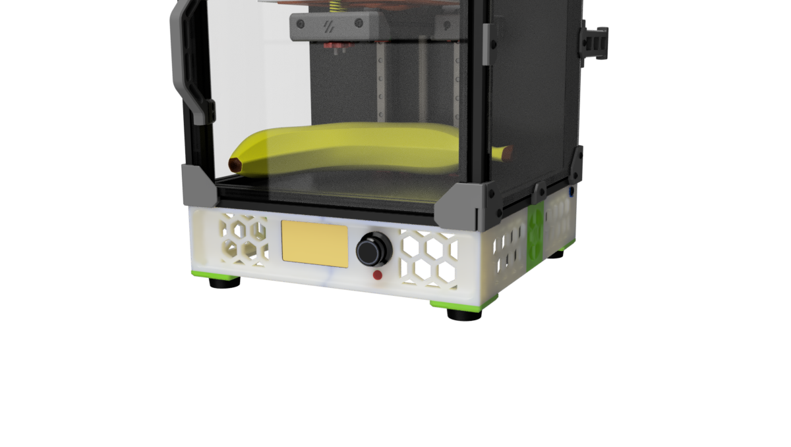

# Collection of Voron 0 Skirts

This is a Collection of Voron 0 skirts that provide some additional features and bring the esthetics closer to the bigger VORON brothers.

Right now, there are 3 variations for the skirts and one common rear and common fan mounts.
To start with the rear ..

## Rear Skirts

The rear skirts match all the different front skirts and have the following features

- integrated power inlet mount. To be used with the "standard" v0 power inlet
- 2 keystone mount to get access to the raspberry pi ports
- bowden clip mount support. Designed for the E3D style bowden clips. This allows to push the filament and not the tube from the outside. Read for the ERCF :)

## Fan Mounts

Option: The fan mounts have clips to hold 40x10mm or 40x20mm fans.
If you go with a 20mm fan make sure to order one with a central rib, like the fans from creality.

# Skirt Options

## 1. Headless

This version is intended for users that like to run the V0 in headless mode i.e. without display

## 2. Mini Display

This version is designed for the 12864 mini display (same as the V2.4 display)
The design includes a little part to get access to the reset switch.

## 2. Waveshare 4.3" Display

This version is designed for the Waveshare 4.3inch Capacitive Touch Display for Raspberry Pi, DSI Interface
The mounts are designed to bolt on the frame and display with original screws from the back.
Therefore similar 4.3 inch display might not work without modifications
I'm using a 60cm DSI cable to connect the display with a Raspberry PI back on the back of the V0 
(a Raspberry Pico mount mod is in preparation)

### Reset / Emergency switch
The front display mount also provide a mounting option for a reset or emergency switch.
I'm using this switch to reset a BTT PSU relays. 

The switch in the cad is a standard 7mm momentary switch that is easy to source even from local providers.
Make sure to get a Normaly OPEN (NO) switch if you plan to use it with the BTT PSU Relays.
(A Relays mount and firmware configs are in preparation)

# Printing

All parts print with standard Voron print setting without any supports.
All parts fit on a V0. However, the max out the build volume on the z axis.
If you need to print on a V0 make sure that your bed springs are really stiff by adding more tension with washers etc.
I had some problems getting nice parts out of the V0 due to the nozzle moving the part due to flex on the bed springs.

# BOM Notes

Obviously depending on which mod you are going to use ..

Waveshare Display:  https://www.waveshare.com/4.3inch-dsi-lcd.htm

12864 Mini Display:  https://biqu.equipment/collections/lcd/products/bigtreetech-mini12864-v1-0-lcd-screen-rgb-backlight-mini-display-supports-marlin-diy-for-skr-3d-printer-part

Rubber Feet: There are many options. The one in the CAD are these ones here https://de.aliexpress.com/item/1005004478863418.html

7mm Momentary switch:  https://de.aliexpress.com/i/32711341102.html

40x20mm fan:    https://de.aliexpress.com/item/1005002920453385.html

# CAD  Notes

The CAD includes all variants in one file.
You need to show/hide the version you like to work with

# Credits

This skirts started as mods for zruncho's Double Dragon and the geometry is derived from this IDEX printer
