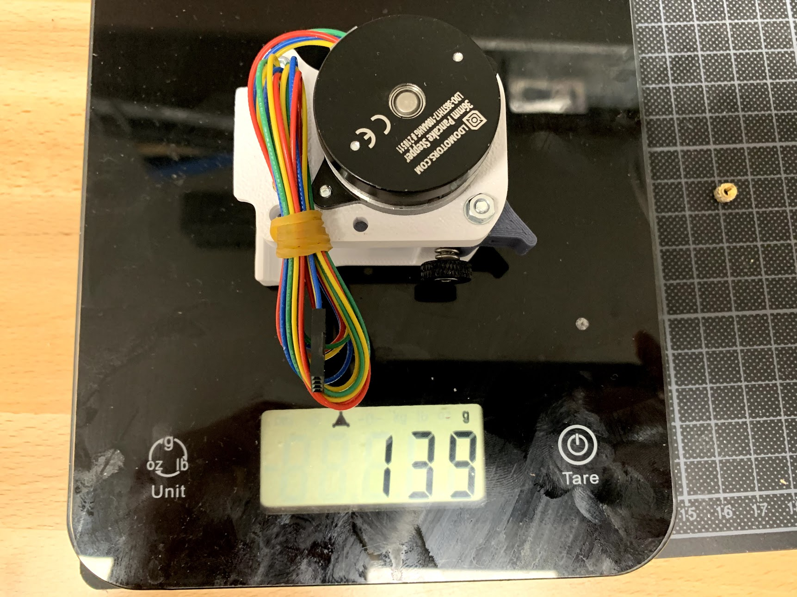
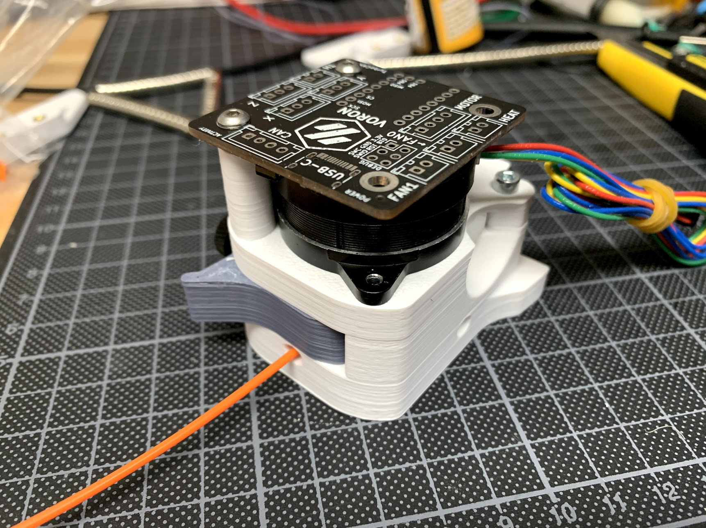
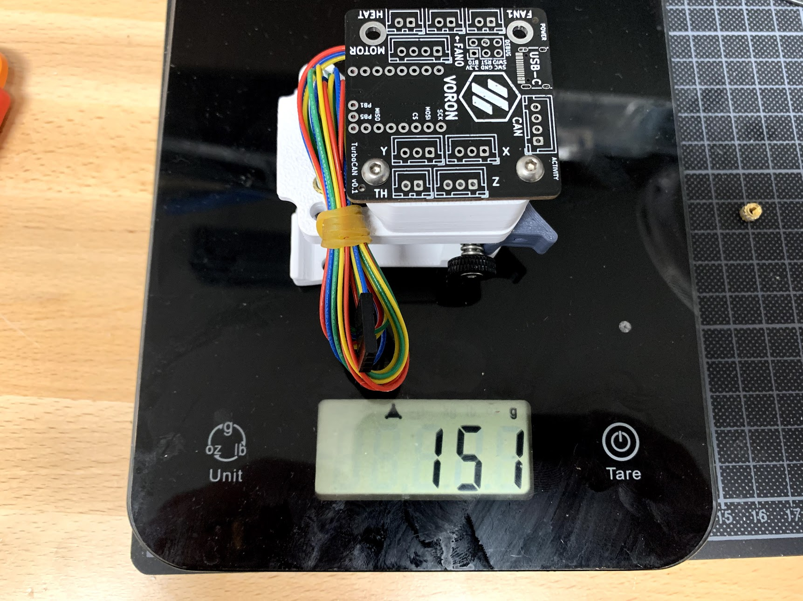

# Euler Extruder for Voron AfterBurner

### Overview

The Euler Extruder is the most lightweight extruder option for the Voron AfterBurner, coming in at just 139 grams (including all hardware). There is a mount available for Nema17 based toolhead boards, such as [TurboCAN] and [Huvud], or you can screw any of the IGUS/Generic drag chain mount there.

Performance-wise it is the same as Sherpa Mini, which is very similar to Orbiter/Galileo. All these are more performant than original Clockwork.

[TurboCAN]: https://github.com/henrikssn/TurboCAN
[Huvud]: https://github.com/bondus/KlipperToolboard

### Printed parts

Print the `extruder_motor_plate.stl`, all other parts can be reused from your existing extruder, given that you have the latest version of clockwork (with the short latch). If you are unsure, you can find correct version of all the clockwork parts in the STL directory.

Additonally, one of:

* `[a]_chain_adapter.stl`: For attaching IGUS/Generic chain mount.
* `[a]_turbocan_mount.stl`: For attaching [TurboCAN] or [Huvud] toolhead board.

### Hardware

* 1x [LDO 36STH17-1004AHG]* 17mm NEMA14 stepper motor with 10t gear (same as orbiter / sherpa mini)
* 1x [BMG Dual Drive Kit]* (same as clockwork)
* 4x M3x30 SHCS
* 1x M3x20 SHCS
* 1x M3x8 SHCS
* 5x M3x5x4 heat set inserts (2x/3x extra for IGUS/Generic chain mount)
* 2x M3x6 BHCS
* 1x [TurboCAN] or [Huvud] toolhead board (optional)

[LDO 36STH17-1004AHG]: https://www.aliexpress.com/item/4001346055973.html
[BMG Dual Drive Kit]: https://www.aliexpress.com/item/4000021186440.html

### Assembly

Follow the clockwork assembly, this is very similar.

### Acknowledgements

This was inspired by (but not derived from) the [Sherpa Mini] extruder from Annex Engineering.

[Sherpa Mini]: https://github.com/Annex-Engineering/Sherpa_Mini-Extruder