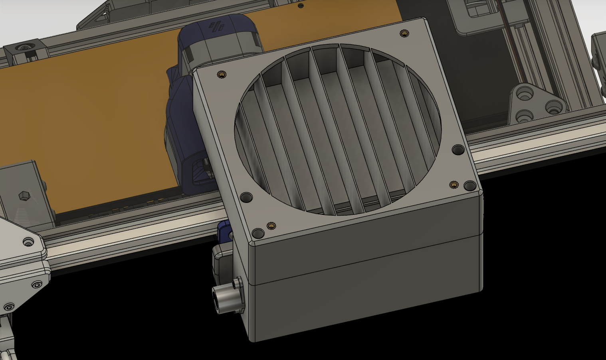

# Voron v2.4 Exhaust 120mm with 4in Duct Adapter

This mod allows use of a 120mm fan and includes an adapter to connect a 4in duct.  It does not include space for filters.  The bowden adapter has been moved to side entry.

    
    

## Parts Required
| Part | Quantity | Comment|
|------|------|--------|
| M3 Threaded Insert | 12 | |
| M3x10 SHCS | 2 | |
| M3x6 SHCS | 2 | |
| M3x8 SHCS | 4 | |
| M3x30 SHCS | 4 | |
| 120mm x 120mm x 25mm fan | 1 | |

## Printing

- Print using standard Voron part settings and in the orientation used in the STL
- Supports should not be needed.  There are bridging areas, but integral supports are included in the design.

## Pre-Install

- Install M3 threaded inserts into the printed pieces.

    

    

## Installation
1. The standard exhaust grill and mounts will be used, and they should be installed before the new housing.

    

2. Remove the top middle panel clip.

    

3. Install the new housing using 2 M3x10 SHCS.

    

4. Install the bowden adapter panel mount using 2 M3x6 SHCS.

    

5. Install the fan mount box using 4 M3x8 SHCS.

    

6. Install the fan and duct adapter using 4 M3x30 SHCS.

    

