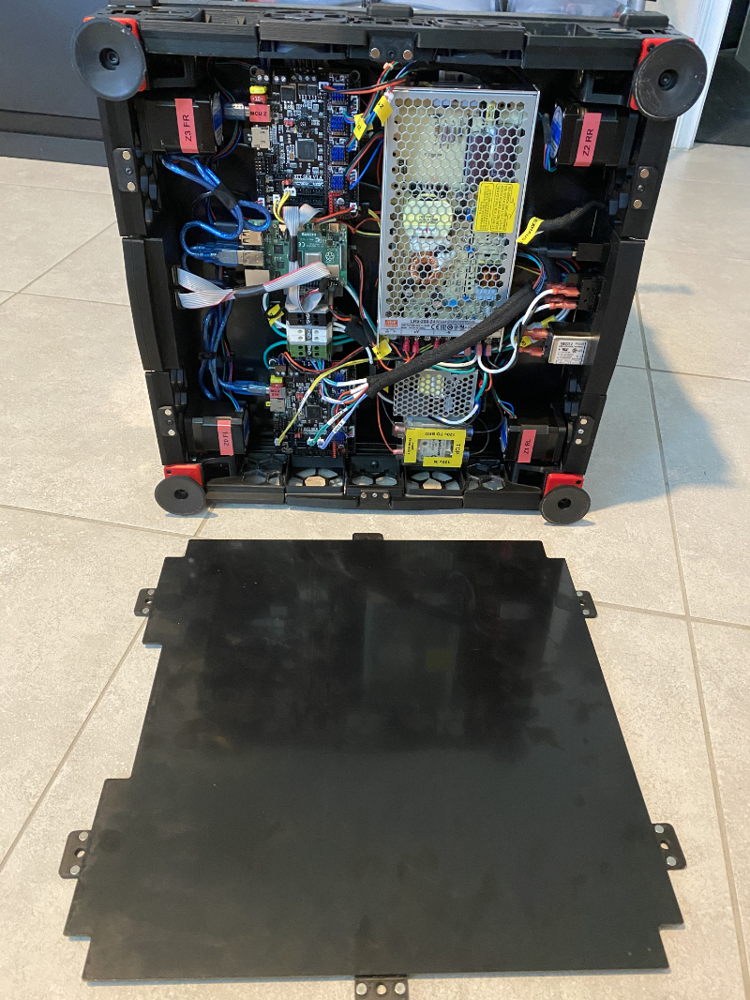

# Voron 2.4 Bottom Panel Magnetic Clips

### OVERVIEW:
Replaces clip & hinge bottom panel configuration with all magnetic clips, thus allowing quick removal and installation without any moving parts. 

 

### BOM:
- 24 ea 6mm x 3mm neodynium magnets
- 6 ea M3x6 (tested w/ BHCS, should work with SHCS)
- VHB tape

### PRINTED PARTS:
- **bottom_panel_magclip_skirt_x6.stl** - With two (2) pressfit magnets in place, is mounted to the skirt with one M3x6 fastener.
- **bottom_panel_magclip_panel_x6.stl** - With two (2) mating pressfit magnets in place, is mounted to the exterior side of the bottom panel with VHB tape.

### INSTALLATION:
1. Print six (6) of each of the STLs. Assemble and keep together each mating pair of clips, thus ensuring proper polarity.
2. Mount the skirt clips to the skirt, again ensuring the mating pieces do not get mixed up. It will cause problems if the polarity on any set is not the same.
3. Place VHB tape on the panel clips. Tape is placed on the same side as the magnets, extending from the inset guide to the edge.
4. Using whatever alignment method you are comfortable with, attach panel clips to the exterior side of the bottom panel.
5. Ensure proper alignment among all clips, adjusting as appropriate.
6. Remove panel and apply pressure for 24 hours for maximum bond.

Note: It will be necessary to lightly pull out of the way the rubber feet depending on the size of the feet and panel.
