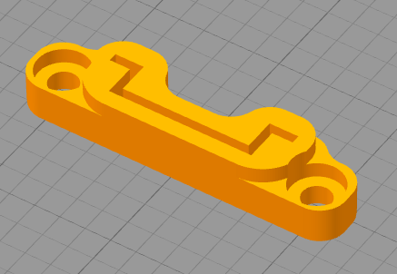

# README

### Overview

This is a mount for 35mm DIN RAIL in legacy v2.2 way. Available in regular and angled version.

Panel version (only angled) can be used to attach DIN rail to the back of Voron 2.4.

### Print parameters

As per Voron specifications:

- Layer height: 0.2
- Infill: 50% or more
- Infill type: Grid
- Perimeters: 4 or more
- Top/Bottom solid layers: 5 or more
- Filament: ABS/ABS+
