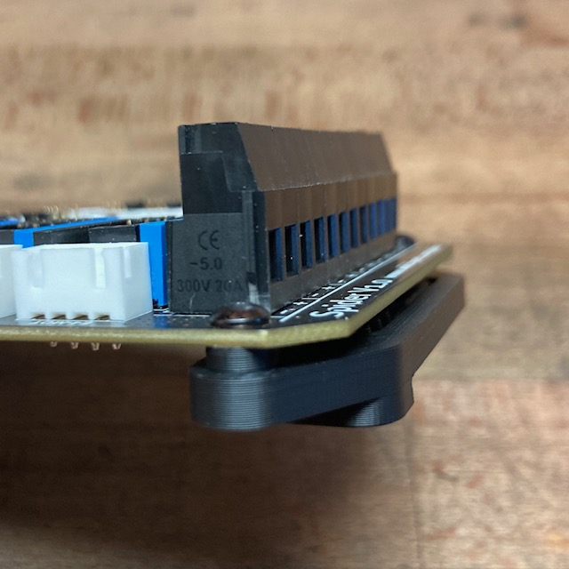

### FYSETC Spider DIN Rail Mount

for horizontal or vertical mounting

Required materials:

for horizontal mounting:

- 1x printed bracket terminal side of the Spider Board: 
- 1x printed bracket USB-Port side of the Spider Board: 

for vertical mounting:

- 1x printed bracket terminal side of the Spider Board: 
- 1x printed bracket USB-Port side of the Spider Board: 

for both types:

- 4x printed spacers: 
- 4x M3 x 8mm BHCS/SHCS 
- 4x M3 x 4mm threaded inserts

Assembly:

Put the four screws through the Spider Board mounting holes and screw it into the spacers. The spacers are intentionally tight so that you don't have to fiddle the spacers between the board an the DIN Mount.

Then screw the board on evenly on the mounts.

Note: The mounting holes on the Spider board are very tight for M3 Screws. I drilled the holes out with a 3.2mm drill bit, but don't encourage anyone to do so, because - reasons.

Disclaimer: It is your printer. If you do this and something breaks or if someone gets hurt, it is fully your responsibility. I take no responsibility.

Feedback: Ping me on Discord hoschi#0238
