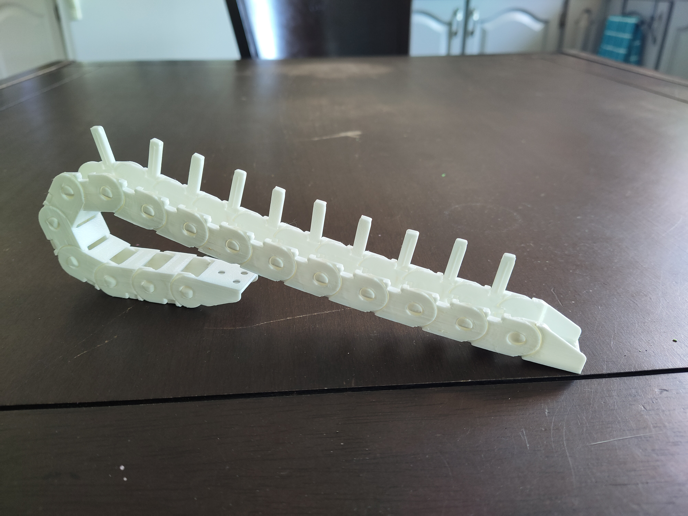
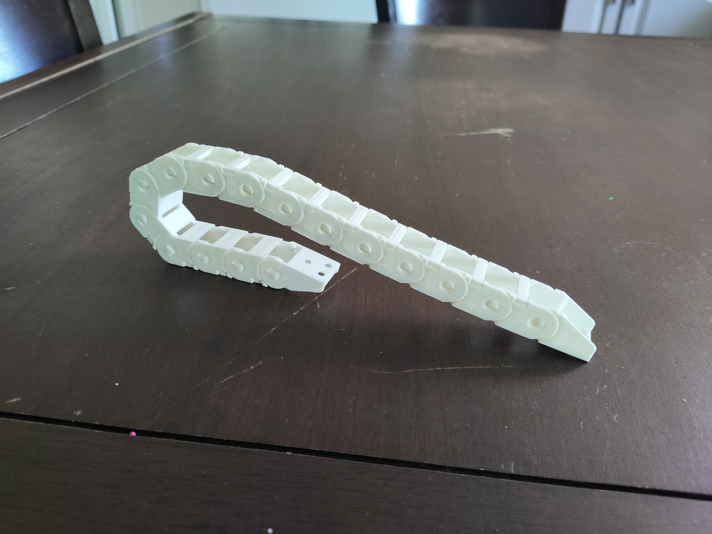

# Printable and openable 10x11mm chain

There are integrated support on the link and the end pieces that you'll have to remove before assembling. Just wiggle them slowly to remove them and trim away any remaining plastic.

I recommend setting *Fill Gaps Between Walls* to Everywhere in Cura.
