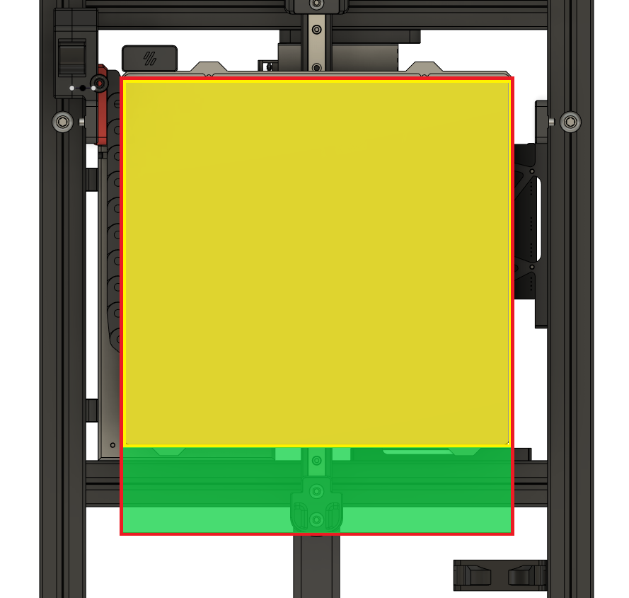

#### Warning : This is for an official Voron Switchwire. It is also assumed that your toolhead can be clear of the bed when the bed is pushed all the way to the rear of the printer with the X gantry resting on the lower endstop blocks. If not, I recommend using a Z-max endstop microswitch for initial Z-homing, or manually attaching the probe.

The macros are working on official Klipper firmware.

The values that are in the config file are the values I use for my Switchwire. You can still use these macros if you use the files for the probe and dock from Annex Engineering. If you do, you'll want to change the value for variable_detach from 1 to 2.

For the initial homing for the Z-axis, there are options for probe homing and endstop microswitch homing, be it at Z_min with the modded KeyBak mount or at Z_max.

There are some safety measures, but this is still a work in progress. For the moment, failing to dock will kill the printer (M112), as failing to dock properly could result in damaging the probe itself or the bed. As for failing to attach the probe, you'll get an error message stating that the probe reports as triggered prior to movement. Be sure to add `Dock_probe` to your print_start macro after your bed mesh or other probing actions.

You can find my `printer.cfg` and other relevant macros for reference [here](https://github.com/hymness1/Switchwire_Things/tree/main/klipper_config)

# Initial Startup

I'm assuming you already have an up and running Switchwire prior to using the Quickdraw Probe and using the modded KeyBak mount.

1. Backup your `printer.cfg` file
2. Download [dock_macros.cfg](https://raw.githubusercontent.com/hymness1/Quickdraw_VSW/main/klipper_config/dock_macros.cfg) and add the file to `klipper_config` folder. Do not include it yet in `printer.cfg`
3. Manually move the toolhead so you can easily attach and detach the probe manually
4. With the probe detached, run `query_probe` in the terminal. It should report as triggered
5. With the probe attached, run `query_probe`. It should report as open
   * If it reports as open when detached and triggered when attached, you'll need to invert the pin in your `printer.cfg` file in the `[probe]` section.
   * Press down the trigger of the probe microswitch and issue a `query_probe` command. It should report as triggered. A third hand might be handy.
6. Manually move the toolhead higher up. Home the toolhead and test that it triggers by pressing the trigger on the probe. If not kill the printer.
7. In `printer.cfg` :
   * In the `[probe]` section, change `y_offset` to `34.5` and `speed` to `3`.
   * In the `[homing_override]` section, change the last line from `G0 Z5 F500` to `G0 Z15 F500`.
   * Save and restart firmware.
9. Set your Z-offset
   * Home the toolhead
   * Manually remove the probe from the toolhead
   * Use the paper test to get your Z-offset
   * Update your `printer.cfg` `[probe]` section with the calculated Z-offset.
   * Save and restart firmware
     * You could also use `probe_calibrate` to set your z_offset. Be sure to manually remove the probe after probing.
10. Get the dock coordinates
   * Attach the probe to the toolhead
   * Home the toolhead
   * Using Fluidd or Mainsail UI, or the terminal, go at Z15 (or any height higher than the dock) and slowly move the toolhead towards the dock (it should be at X250). Slowly move the toolhead down 1mm at a time, verify that the dock and the probe are aligned on the X direction (if not, adjust the X coordinates or if you can't, you might need the spacer). Continue to move the toolhead down up to the point that the probe is in the dock (without pressing down against it). Take notes of the coordinates.
   * Move the toolhead 25mm to the left. Probe should detach and stay in the dock. If everything is good, repeat the last steps another time to verify and go to the next step.
11. Update `dock_macros.cfg` with your dock coordinates. Also update all the other values in the GlobalVariables section with your printer specific values. Save and exit.
12. In `printer.cfg` :
    * Remove or comment `[safe_z_home]` and/or `[homing_override]` sections
    * In `[stepper_z]` section, change `endstop_pin` for the pin used for the modded KeyBak microswitch
    * In the same section, add the parameter `position_endstop` and enter the value for the Z coordinate of the modded KeyBak microswitch location (for example, mine is set at `-2.6`). We'll calibrate it in the next step. Save and restart firmware.
13. Detach the probe from the toolhead. Manually move the toolhead at the middle of the gantry. Push the bed all the way to the rear.
14. Issue the command `query_endstops`. Your Z endstop should report as open.
15. Issue the command `query_endstops` while pressing down your Z endstop trigger. Your Z endstop should report as triggered.
    * If the last 2 steps doesn't report as they should, invert the `endstop_pin` or check your wiring.
16. Test your Z endstop :
    * Issue a `G28 Z0` command. Manually press the Z endstop trigger. If the toolhead continues to go down, kill the printer, adjust your `printer.cfg` section or check your wiring. When everything work as intended, continue to the next step.
17. Still with the toolhead in the middle of the gantry and the bed all the way to the rear, issue a `G28 Z0` command.
18. In the terminal, issue `G0 Z25` command. Manually attach the probe to the toolhead.
19. In the terminal, issue `G28 X0` command.
20. Using Fluidd or Mainsail UI, or using the terminal, move to the dock X coordinate. Move the toolhead down 1mm at a time and babystep so the probe enters the dock as in step 9. Try to have it at the same location as when you calculated the dock coordinates earlier. Note the Z coordinate.
    * This doesn't have to be super precise. Z endstop homing is only used for the initial Z homing in order to attach the probe from the dock.
21. Calculate `last step dock Z coordinate` minus `dock Z coordinate from step 7`.
22. In `printer.cfg`
    * Add `[include dock_macros.cfg]`
    * Enter the correct value for the `position_endstop` in `stepper_z` section by substracting the result in step 20.
    * Save and restart firmware

# Normal behavior and general notes

The Z endstop microswitch (whether using the modded KeyBak mount or a switch located at Z-max) is only used for initial Z homing if the probe is not already attached to the toolhead. It is a good idea to add `Park_toolhead` to your end_print macro or cancel_print macro, so the probe is virtually always attached to the toolhead.

When homing with the probe attached, terminal will report a wrong value for Z position that should be way higher than supposed, in example `probe at 125.000,84.500 is z=236.425000`. It is normal behavior and is a workaround the fact that you can't have 2 different Z endstops. After homing, position of the toolhead is set to probe z_offset.

Be sure to add `Dock_probe` in your print_start macro after the bed mesh or other probing actions.

If you don't plan to use a Z endstop microswitch for initial Z homing, don't change your `endstop_pin` in the `stepper_z` section of `printer.cfg`.

# About the modded KeyBak mount and the endstop microswitch located at Z_min (or sensorless homing at Z_min) and Y travel

The Switchwire has about 230mm of print area in the Y direction, but has around 250mm of Y travel (mine has 257mm), from the endstop to the endblock. About 20 of those millimeters are located outside the bed at the front when the bed is pushed all the way to the rear of the printer. At this location, the nozzle and the part cooling ducts can be clear of the bed when homing at Z_min. If it's not your case, please use another method for initial Z homing, like a microswitch located at Z_max.

* In yellow : Printable area
* In red : Full Y travel area
* In green : Y travel outside the bed. Lower end of this area is a safe place to home at Z_min
