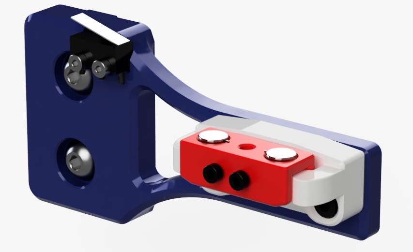

# Quickdraw probe for Voron Switchwire
A Magnetically Coupled, Removable, Z Probe and Dock System inspired by the design from [Annex Engineering](https://github.com/Annex-Engineering/Quickdraw_Probe) and remade from scratch so it works better on the Voron Switchwire. Basically, the probe and dock has been designed so the probe detaches on the X-axis instead of the Z-axis, being easier on the magnets and so better reliability, whilst the dock arm has been improved by shaving 3mm of thickness, allowing for the docking coordinates to be at X250 and a better fit on the right vertical 3030 extrusion. A spacer is available if for some reason you need a bit of play in the dock coordinates and you'd only have to scale it to the right thickness.

By using the dock, you will loose 27mm of X travel.

You might want to look at [my fork](https://github.com/hymness1/VoronUsers/edit/master/printer_mods/hymness1/Quickdraw_probe_Voron_Switchwire/) for more up to date files and code.

Here's a video of initial homing sequence with the probe docked and not attached to the toolhead :
https://youtu.be/5mihNdWIw-k

For the Dock Arm, Dock, Probe Drop-in Attachment and Quickdraw Probe you will find here, you'll need :
* 1x Omron D2F-5 microswitch for the probe (recommended)
* 1x Omron D2F-5L microswitch (for the Dock Arm, other microswitches of the same size with a lever should work too)
* 8x 6x3mm magnets
* 2x M2x12mm screws (magnetic)
* 2x M3x8mm SHCS
* 2x M2x10 Self Tapping screws
* 2x M5X12mm SHCS
* 2x M5 T-nut for 3030 extrusion
* 4x M3x5x4 threaded heat inserts
* About 140cm of 24AWG wire
* 2x MicroFit3 male pins

If you want to go with the modded carriage instead of the probe drop-in attachment, you can find it at Annex Engineering : https://github.com/Annex-Engineering/Quickdraw_Probe
