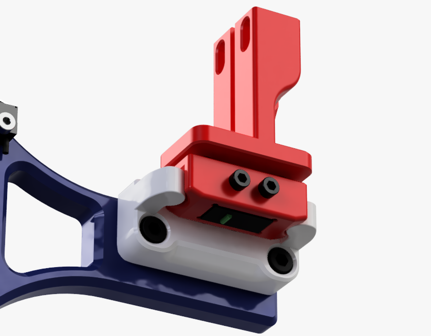

# Quickdraw probe for Voron Switchwire
A Magnetically Coupled, Removable, Z Probe and Dock System inspired by the design from [Annex Engineering](https://github.com/Annex-Engineering/Quickdraw_Probe) and remade from scratch so it works better on the Voron Switchwire. Basically, the probe and dock has been designed so the probe detaches on the X-axis instead of the Z-axis, being easier on the magnets and so better reliability, whilst the dock arm has been improved by shaving 3mm of thickness, allowing for the docking coordinates to be at X250 and a better fit on the right vertical 3030 extrusion. A spacer is available if for some reason you need a bit of play in the dock coordinates and you'd only have to scale it to the right thickness.

The KeyBak mount has been modified so you can screw in a microswitch, allowing to home the Z axis prior to picking up the probe from the dock.

By using the dock, you will loose 27mm of X travel.

Here's a video of initial homing sequence with the probe docked and not attached to the toolhead :
https://youtu.be/5mihNdWIw-k

For the dock arm, dock and probe you will find here, you'll need :
* 6x 6x3mm magnets
* Omron D2F-5 microswitch (recommended)
* 2x M2x12mm screws (magnetic)
* 2x M3x8mm SHCS
* 2x M5X12mm SHCS
* 2x M5 T-nut for 3030 extrusion
* 2x M3x5x4 threaded heat inserts

You will also need the modified carriage that you can find, among other informations, at Annex Engineering : https://github.com/Annex-Engineering/Quickdraw_Probe
