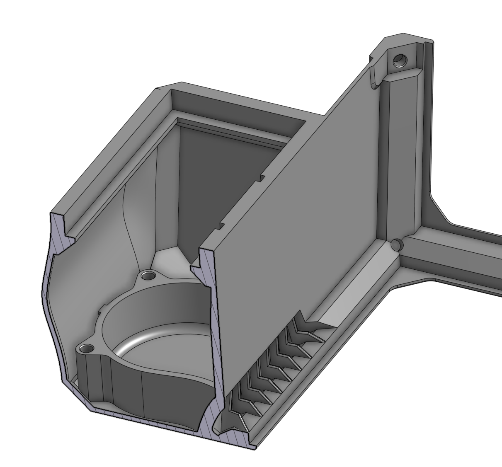

# Voron V0.1 Tophat Extractor

Tophat Exhaust Fan with activated carbon and HEPA filters.





## BOM

(the BOM is for upgrading from an existing Tophat)

* 1 pc. 60x60x25 Fan (preferably without "automatic restart" feature, which prevents PWM) 
* 1 pc. Cut to Fit Carbon Filter
* 1 pc. HEPA Filter for Roomba 800 Series
* 2 pcs. M3x8 Screw
* 16 pcs. M3x5x4 mm Heat Set Inserts (or what you have left from your Voron)
* 1 pc. cable tie
* 1 pc. your old tophat
* 240g of ABS for printing the parts

## Assembly

1. Print parts
2. Insert 16 Heat Set inserts into the places
3. Using two M3x8 screws, mount the 6025 fan into the box. Make sure it sucks from the inside of the tophat. Put the fan cable into the grove on either the left or the right side, depending on your fan.
4. Print the [cutting template for the filter onto A4 paper](Filter-Template.pdf) and cut the carbon filter according to the markings into the box. Push into box.
5. Add the HEPA filter on top
6. Assemble the rest like the normal V0.1 tophat and mount to Voron, connect the fan to a free port. Mount using cable tie so it does not interfere with the A/B belts.

## Software configuration

To your `printer.cfg` add a section for the exhaust fan.

```
[fan_generic exhaust]
# FAN2
pin: PB15              # Change this to the fan port
max_power: 1.0
kick_start_time: 0.5
off_below: 0.13
cycle_time: 0.15
```

Also you want to add something to your `PRINT_START` and `PRINT_END` sections, depending on the filament. It may cool the chamber down, so maybe run it a bit slower for ABS and on full speed for PLA

```
# Add to PRINT_START gcode - runs the fan at half speed during the print
SET_FAN_SPEED FAN=exhaust SPEED=0.5

# Add to PRINT_END gcode - runs the fan for 3 minutes on full speed
SET_FAN_SPEED FAN=exhaust SPEED=1.0
G4 S180
SET_FAN_SPEED FAN=exhaust SPEED=0.0
```

# Modifications

You can use either the STEP file or edit it on OnShape (See https://cad.onshape.com/documents/acde9c61a85e1d2c4963eee0). Please not that the part is licensed under the GPL. If you publish an STL, please also publish an updated STEP file. If you sell this part, you need to publish your modifications.

# License

Copyright (C) 2022 Iblue van Lyt

This part is free software: you can redistribute it and/or modify it under the terms of the GNU General Public License as published by the Free Software Foundation, either version 3 of the License, or (at your option) any later version.

This part is distributed in the hope that it will be useful, but WITHOUT ANY WARRANTY; without even the implied warranty of MERCHANTABILITY or FITNESS FOR A PARTICULAR PURPOSE. See the GNU General Public License for more details.

There is a copy of the GNU General Public License in the root of this repository.