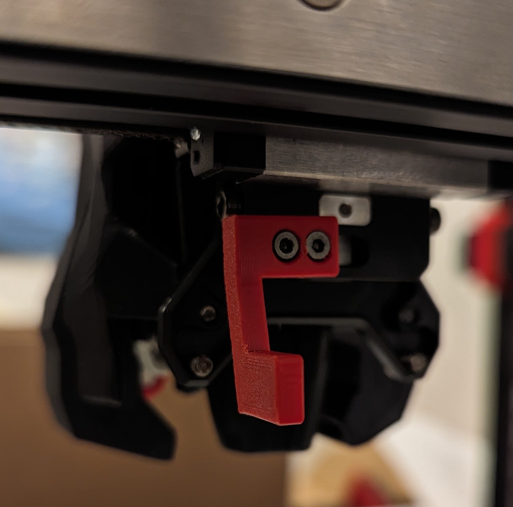
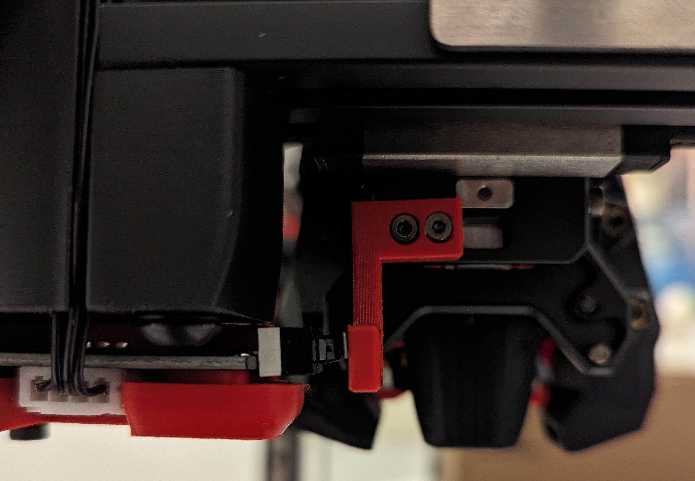

### Description

Replaces the Chaotic Lab CNC Tap V2's X limit switch mounting bracket with a bracket that is capable of triggering a X Endstop that is mounted to the XY Joint of a Voron 2.4 (Maybe a Trident?)

### BOM

None - uses existing hardware contained in the CNC Tap V2 kit.

### Installation

Use the two M2 bolts from the CNC Tap X Endstop mount

