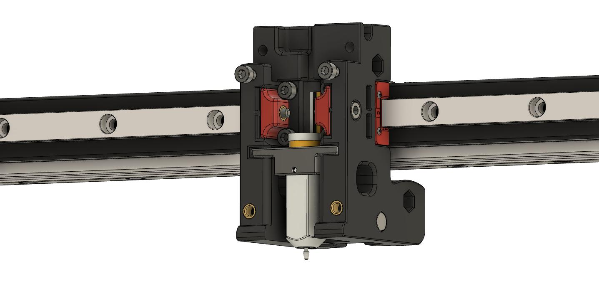

<B> BLTouch X Carriage Mod + Holder </B>

Purpose:
To easily interchangable with PL-08 Probe with BLTouch 3.1.

Why:
To use any surface with Voron (glass, hardpaper, cuprexit...) and remove Z-Offset problems as well more accurate Bed Mesh (actual surface)

<B>BLTouch Mount</B>

<B>PL Probe Mount</B>

What else:

BLTouch needs to be adjusted. You must remove (cut and sand) the top "wings" that normaly mount the probe.
There is no space unfortunately to keep it.

<B><I>This will VOID YOUR WARRANTY, do it on YOUR OWN RISK.</B></I>

There is config for Klipper as well.
I use
[include bltouch.cfg] or
[include probe.cfg]

Check those file for inspiration.

<B>you must remove the lines that double from printer.cfg"</B>

Z-Offset is roughly:

[bltouch]
z_offset: 3.250

From Voron with love!
