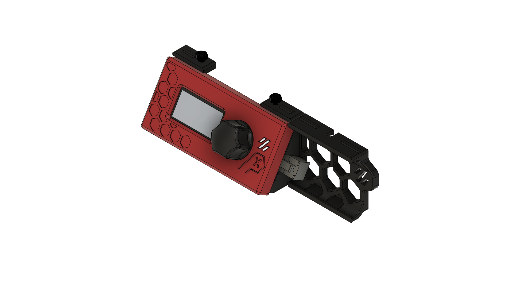

# V0.2 Display 2x3 Microfit Connector (ADXL)
This mod replaces the right foot of the V0.2 Display-Mount to allow the installation of one Microfit 2x3 Connector (43020-0600) to easily connect an ADXL sensor without having to remove the backpanel.

## Notes
The tolerances for the connector to fit and not slip out again are very tight, you might need to adjust the tolerances in CAD if you have problems fitting the Connector.