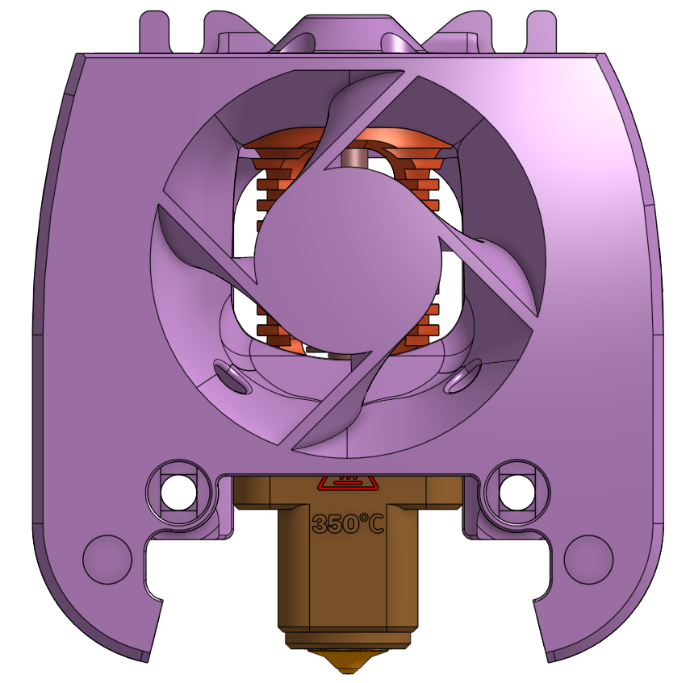
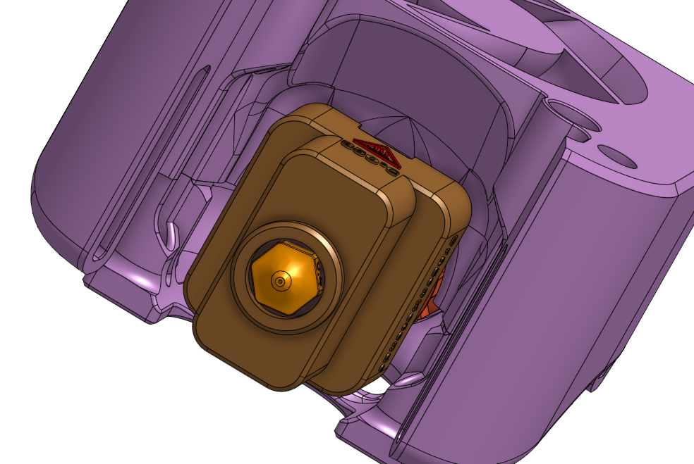
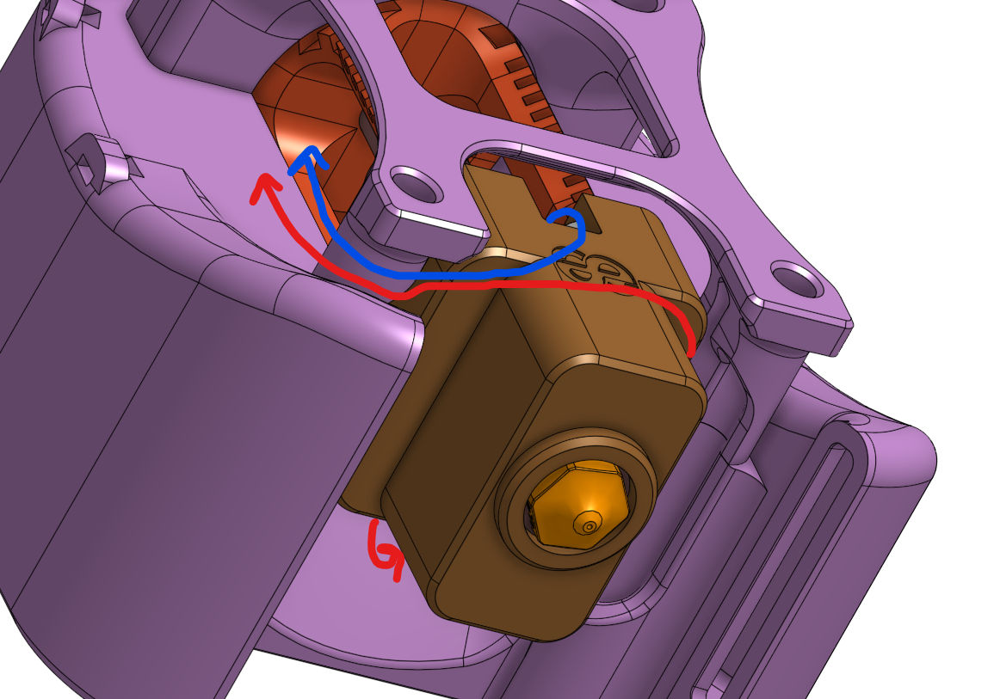
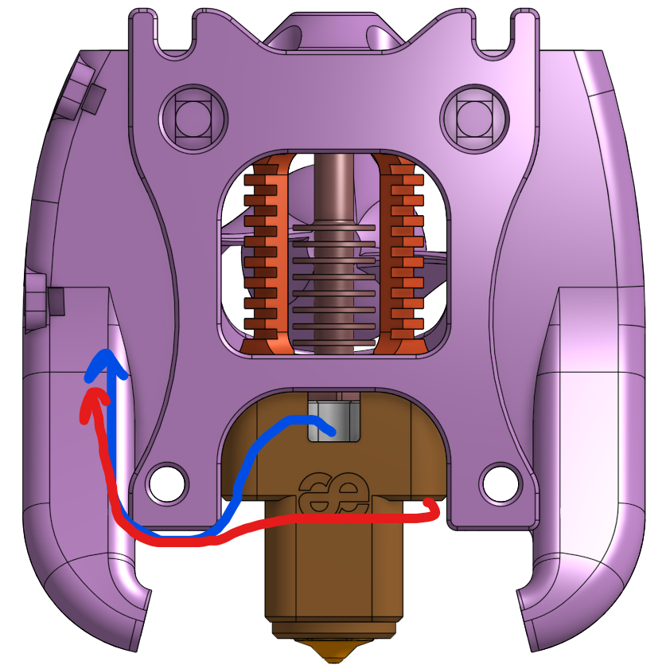

A hotend mount for a "dragon UHF mini" hotend. This is either a dragon UHF without the extender or a dragon SF/HF with a volcano length block (such as the Triangle Labs or Mellow blocks).

Red arrows are heater blue arrows are therm
|  |  |
| --- | --- |
|  |  |
