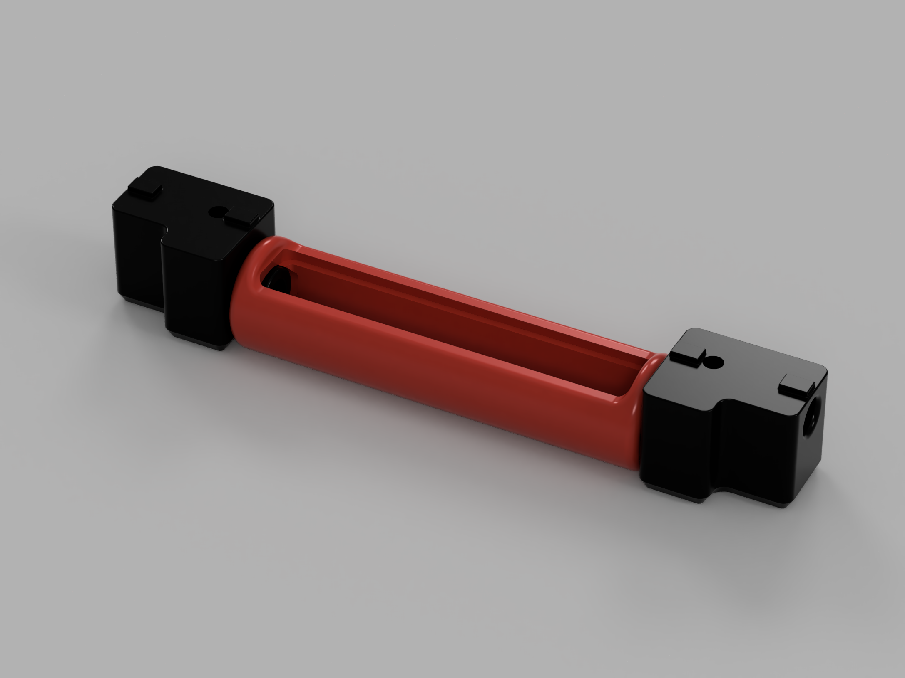

# Bitter USB Cam

This is a modification of [chri.kai.in's Angry CAM USB v2.0](../../chri.kai.in/Angry_CAM_USB) webcam mount for 1515 extrusions. It reuses the cam shell and front/back covers, and only changes the mounting blocks to fit "behind" the front extrusion of the top hat to looks down onto the bed.

If you're wondering about the name: This USB Cam is not quite angry, as you can't see the furrowed eyebrows (couldn't fit them on there), so it's just bitter.

For all instructions and further information, please have a look at the original [Angry CAM USB v2.0](../../chri.kai.in/Angry_CAM_USB)
