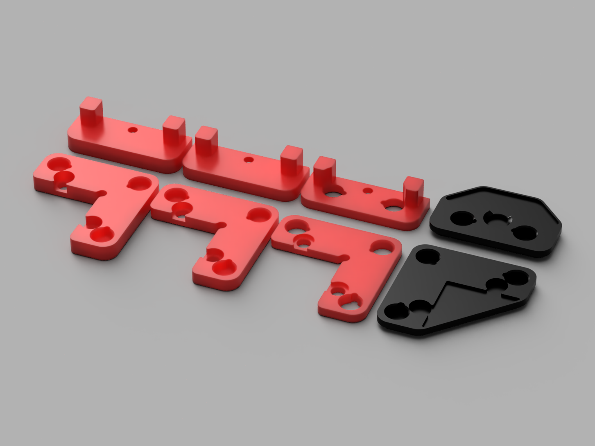

## MagPanel - Magnetic Panel Clips

These are magnetic panel clips designed to work with a panel + foam strip thickness of 3/4/5mm.

They were inspired by [bobbleheed's mod](../../bobbleheed/Magnetic_Panels), which unfortunately only works with a thickness of 6mm.

You will need standard 6x3mm magnets, and you will needs lots of them. Each corner clip needs 6 magnets, and each middle clip needs 4 magnets.
Let's see, 4 corners and 4 middles per panel ... that's 40 magnets per panel, 80 if you do both sides (which would make sense), and 120 if you also do the top panel. Yeah, i can math!

You will also need the same amount of hammer nuts as you need for the regular panel clips, so don't discard those little abominations while removing the old ones. Same goes for the M3x8 bolts.

The mounts come in 3mm, 4mm, and 5mm, and the clips come in flat, with a recess of 0.8mm for VHB tape, and with a raised contact surface of 0.5mm - for those of you that like it toight.

That means you can actually use them with thicknesses of 2.5mm, 3.0mm, 3.5mm, 4.0mm, 4.5mm and 5.0mm. If you have 6mm, please see above.

If you have any suggestions or feedback, contact me on Discord: jangrewe#0314
