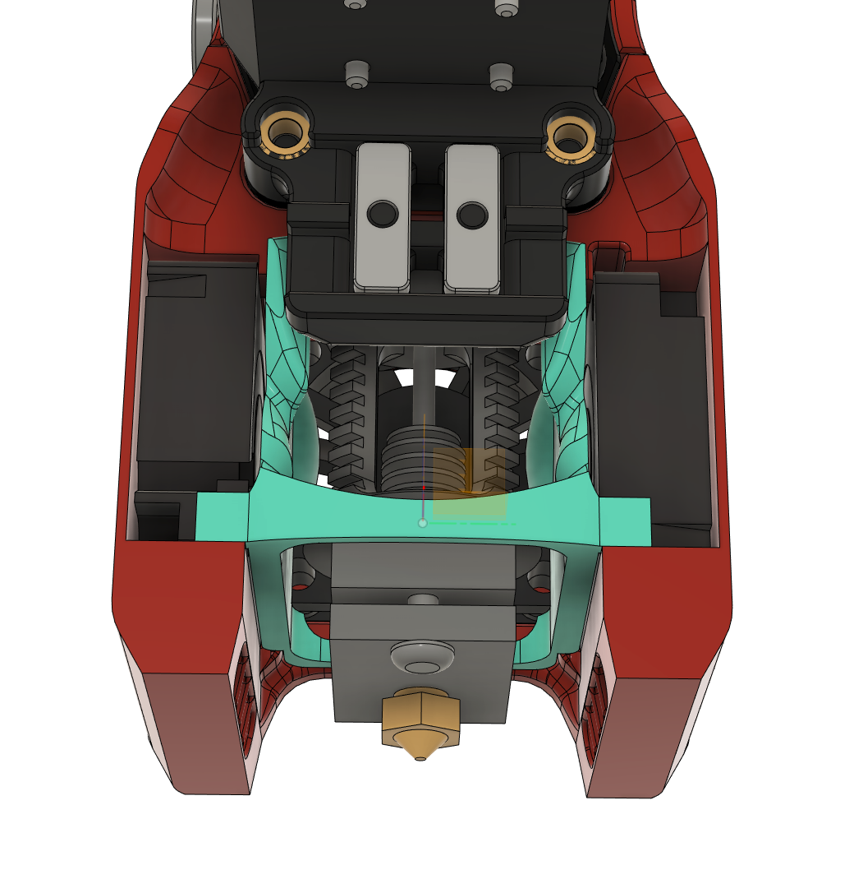
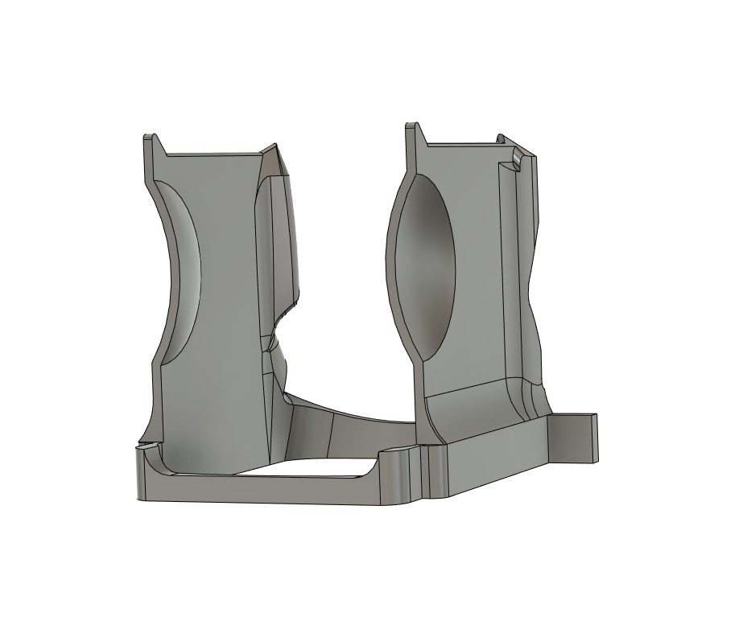
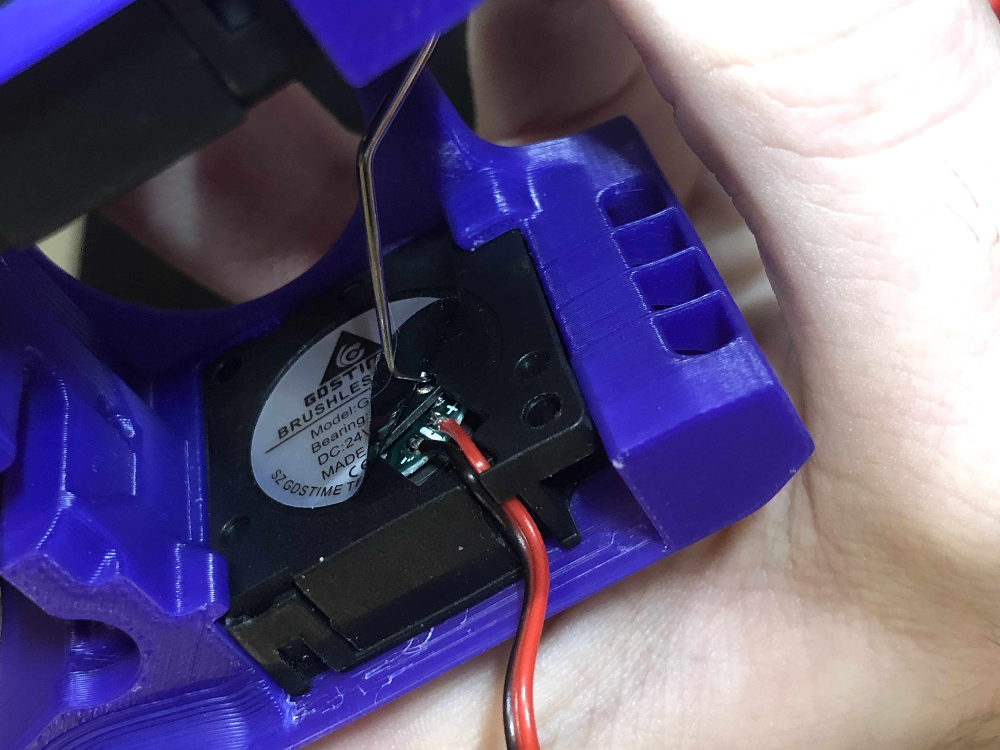
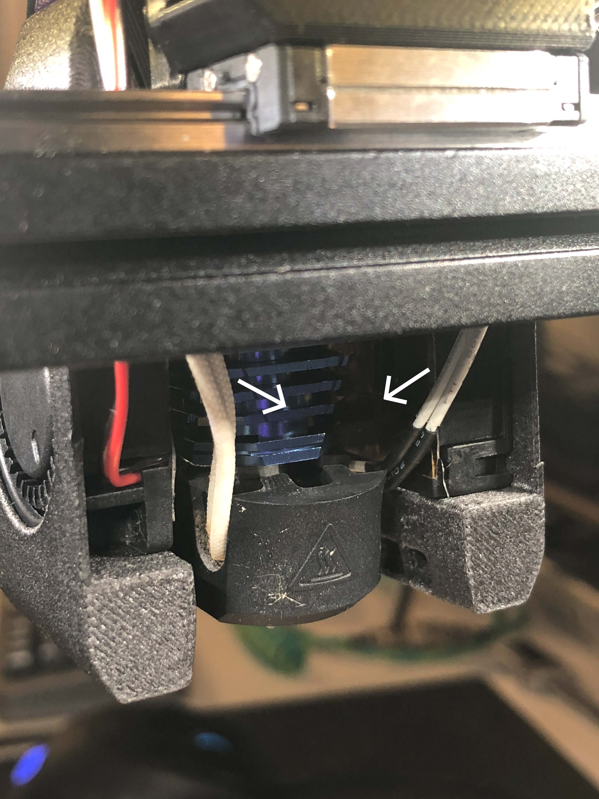
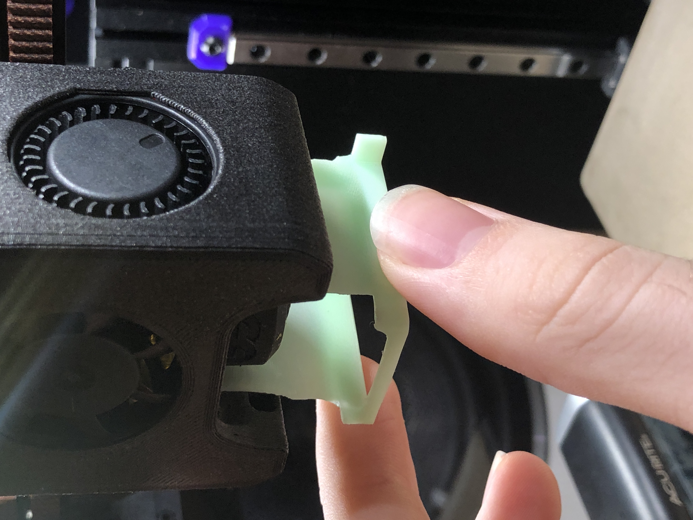
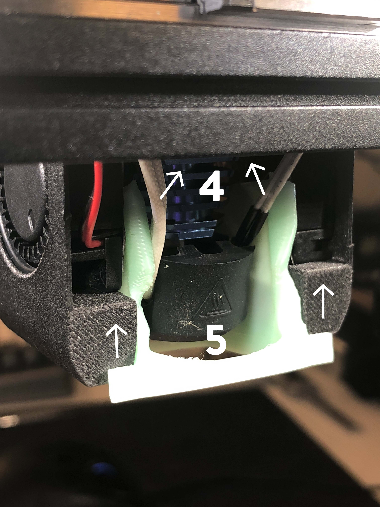
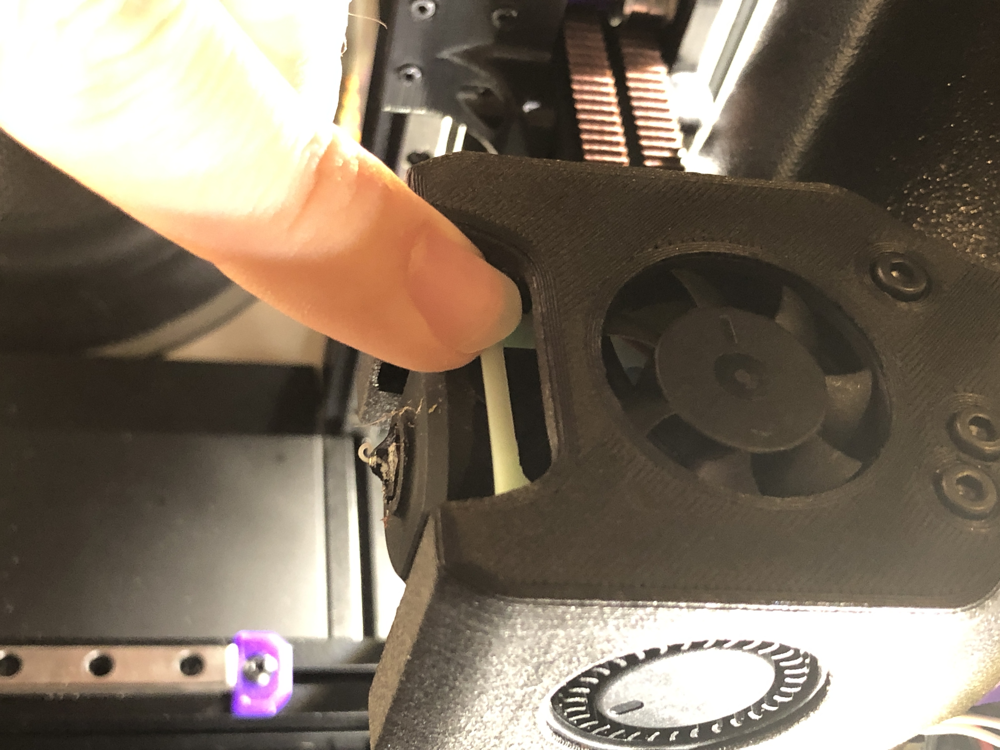
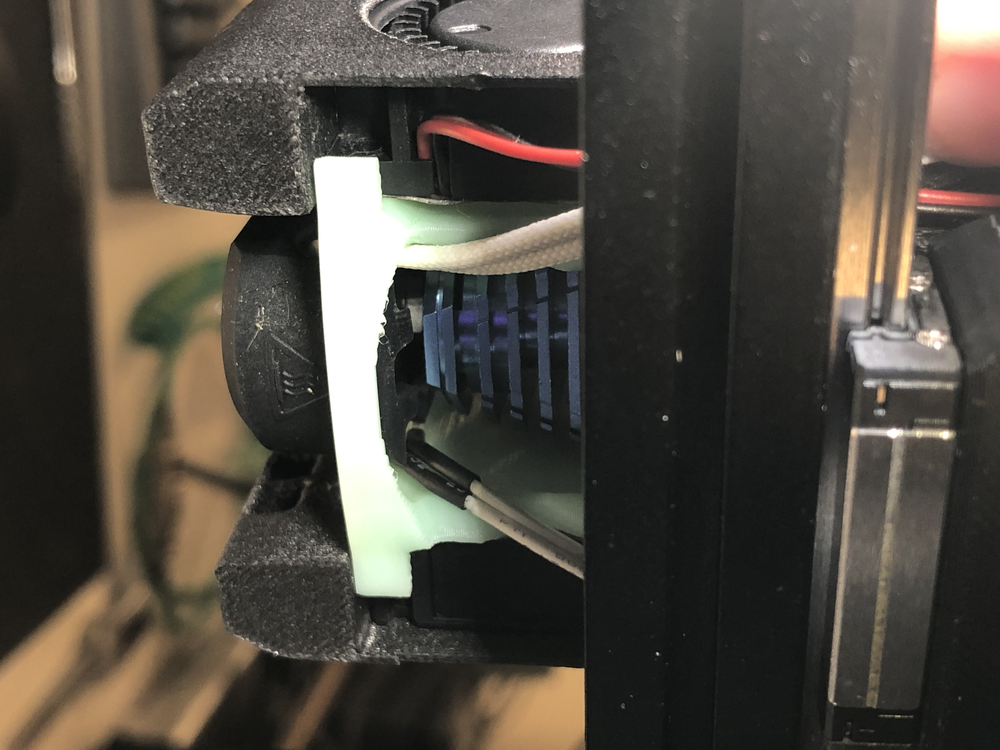

# MiniAB_FanSaver
A 3D-printable baffle to prevent Voron V0.1 Mini Afterburner blower fans from overheating

Is your Mini Afterburner toolhead struggling to keep up with the part cooling you request? Are you running into weird overheating artifacts despite setting absurdly high part cooling speeds? Have you noticed your blower fans slowing down or audibly changing in pitch over the course of a print?

You've come to the right place!

There is an issue that has been cropping up in some Voron V0.1 printers where the combination of high chamber temperature and radiant heat from the hotend can cause the PWM smoothing chips inside your 3010 blower fans to overheat and, as a result, can cause the fans to slow down and speed up intermittently (sometimes even coming to a full stop). In particular, the GDSTime 3010 blower fan included in the LDO V0.1 kit and similar rebranded units have a max operating temperature between 60C-70C, which can easily be exceeded by a fully heatsoaked V0.1 at ABS printing temperatures.

While there are a number of ways to overcome this issue, such as mini-heatsink installation, reflective tape, insulation, or high-temp fans, every other fix I came across was either an incomplete solution or required specialty parts / fabrication that were difficult to source or cumbersome to prepare.

The goal of this project was to make an all-in-one heat-deflecting solution that could be printed on any ABS-capable printer and installed without disassembly of your Mini Afterburner, while still requiring no additional materials or reprints / replacements of existing parts. The result is the MiniAB FanSaver: a combination air dam and heat barrier that keeps your blower fans cool with minimal time and material investment.

The print itself should only take around 20-25 minutes at moderate printing speeds and consumes approximately 3g of material. The installation is fairly straightforward and only requires cutting your two cable management zipties on the sides of the toolhead to slip the FanSaver in underneath. The installation process can be made easier by removing the toolhead from the X-carriage so you don't have to work upside-down inside your printer, but it will fit comfortably without doing so. Before starting with this modification, it is recommended to have two new zipties, a pair of flush cutters / wire cutters, a small hex key or other skinny blunt object for moving the wires around inside the toolhead, and a dental pick, needle, or similar pointy tool for removing your blower fan stickers.

The installation process is as follows:

*Your hotend should be COLD for this process! Please don't try this at 245C and burn yourself. I recommend moving your toolhead to 60,0, dropping your build plate down 75-100mm, and then turning off and unplugging your machine for safety. Depending on the specific geometry of your hotend and associated silicone sock, you may have an easier time installing if you remove the silicone sock first and re-attach it after the FanSaver is in place.*

0. (Optional) Clip all toolhead zipties, remove strain relief & stepper screws, unscrew all 5 toolhead mounting bolts, and lay toolhead face down on print surface.

1. Using a dental pick, needle, X-acto knife, or other pointy tool, get under the edge of the stickers on the backs of your two blower fans and peel the stickers off completely. These insulate the PWM chip from the airflow we're about to provide it, but still let through enough radiant heat that they're not providing any substantial protection in their default state. Be careful not to stab into the wiring cavities that the sticker covers.

2. Clip left and right cable management zip ties and pull heater and thermistor wires toward the back of the toolhead shroud.

3. Begin installation of FanSaver with the flat base facing down (same orientation relative to toolhead as it was printed). The semicircular scoops should be facing toward the front of the shroud / hotend fan and the rear rectangular crossbar with external tabs should face the rear of the shroud.

4. Press your heater and thermistor wires close to the hotend so they're between the two vertical FanSaver panels (this may require more or less wrangling with your hex key or other skinny blunt tool depending on the specific heater and thermistor you have installed and the relative thickness / stiffness of their wires).

5. Ride the rear crossbar's external tabs on the flat backs of the shroud like rails and slide the FanSaver into the shroud while guiding the heater and thermistor wires into the cable management channels.

6. Once you hit the "ceiling" of the shroud with the pointy tops of the rear columns, check for left/right alignment and then gently press the front crossbar upward and forward to lock the FanSaver into place. (If you removed your toolhead, take this opportunity to reassemble the 5 main bolts before continuing)

7. Pull your heater and thermistor wires taut through the cable management channels and zip tie them to the X-carriage. You don't have to go nuts here, but the presence of these wires is what locks the FanSaver in place and prevents the rear crossbar tabs from coming out of their mounting points.

You've successfully installed your FanSaver!

It's tested to be compatible with both Dragon and Dragonfly BMO hotend mounts of Mini Afterburner and Mini Aftersherpa, though likely will not fit the legacy Slice Mosquito variant of the toolhead without modification.

NOTE: Due to its proximity to the hotend, this component is a prime candidate to be printed in something more heat-resistant than ABS such as PC-ABS, CF-Nylon, or any number of more exotic plastics. Otherwise, it probably doesn't hurt to print off one or two extras to swap in if the original part ever gets melty. None of the beta testers thus far have experienced a melting or softening of the FanSaver, but that doesn't mean it can't happen down the road.
