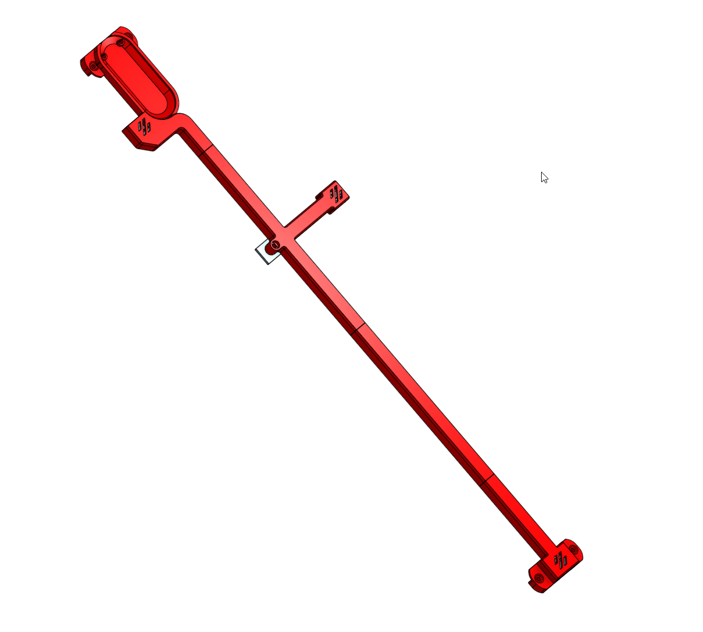
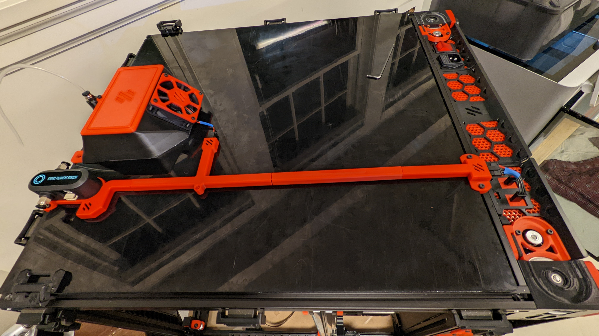
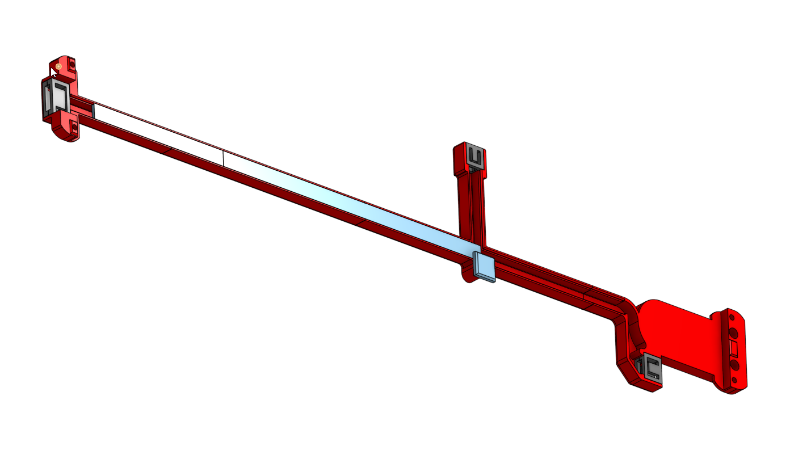
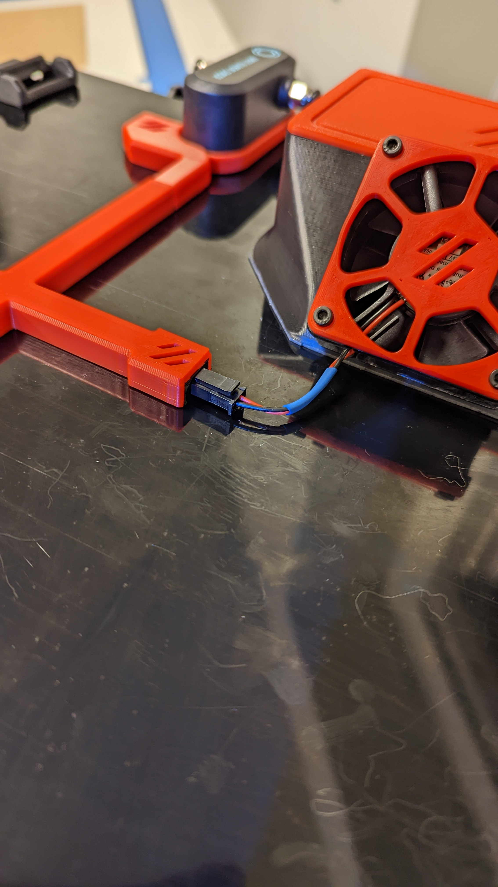

# BackSide Cable Management

This is alternative wiring management solution to current methods.  And it was fun to design :)  The idea was to terminate cable within the channel with microfit connectors for easy maintenance.  Guides are used underneath to secure the wiring.  An optional screw and heat set insert are used to secure the system in place if needed.  Currently designed for V2.4 350mm.  CAD will need modification to work with other size and types of printers.

Note microfit connectors are pressure fit with specials retention jigs.

The BTT smart filament sensor fits into the printed part.  This is a remix from an unknown design listed on teamfdm.com (thanks!)

The system makes use of the keystone skirt, normally for USB/Rasp Pi connections, but in this case two microfit connectors are pressure fit into the slots

# BOM
* 4x M3 x 12 SHCS
* 4x M3 Hammerhead T-Nuts
* BTT filament sensor (should come with 2x M3 x 16 BHCS)
* 2-, 3- and 5-circuit microfit 3 connectors
* Optional M3 heat set insert and M3 x 12 SCHS

# Printing

Print what you need.  Uses standard Voron print profiles.  Supports not needed but in reality the BTT jig could use it (sorry first design and I don't have all my sh*^Y#t together)

# Assembly

Attach the BTT sensor to the jig with two M3 button head screws.  Create the wiring harnesses to attach the microfit connectors.  As an aside, all three ends are males connectors, unusual generally, but easier to build jigs around them.  

Once the harness is built up, add the jigs and insert them into the channels.  They are pressure fit and tight.

Finished cabling should look like this.  Be sure to slide in the cable guide on the unit before attaching it to the frame.

# Optional

If you want to secure the entire system to the panel, use a heat set insert and backer.  The panel is only 3mm thick so you'll need something to secure the rest. 

All the best!
