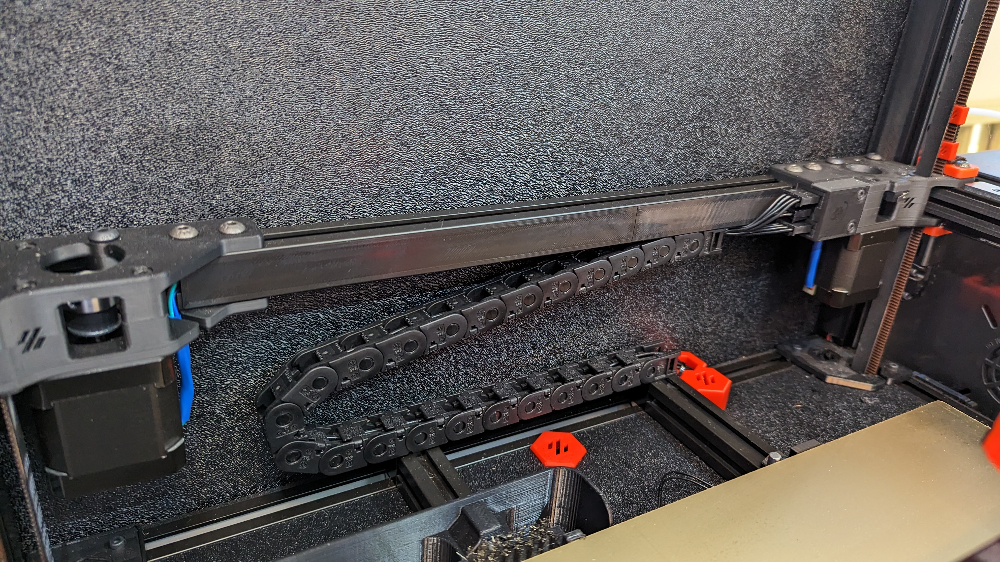
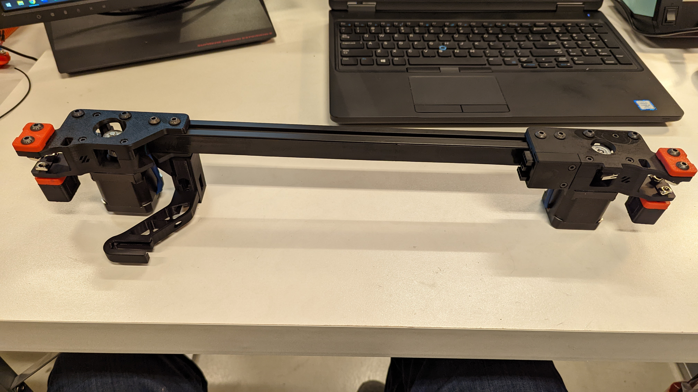
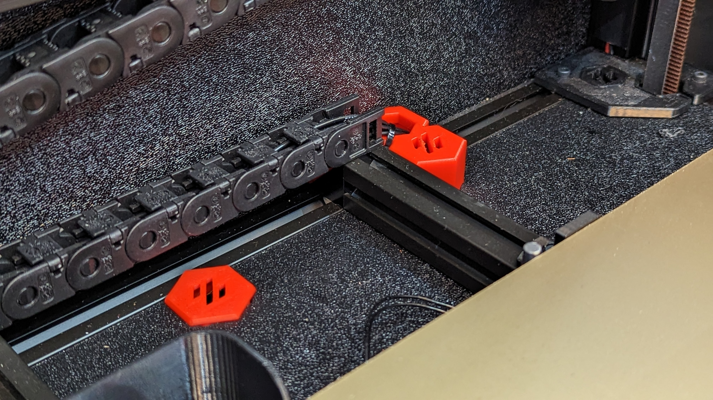
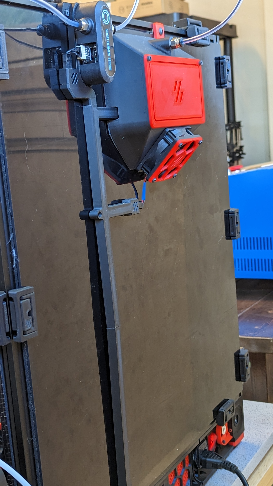
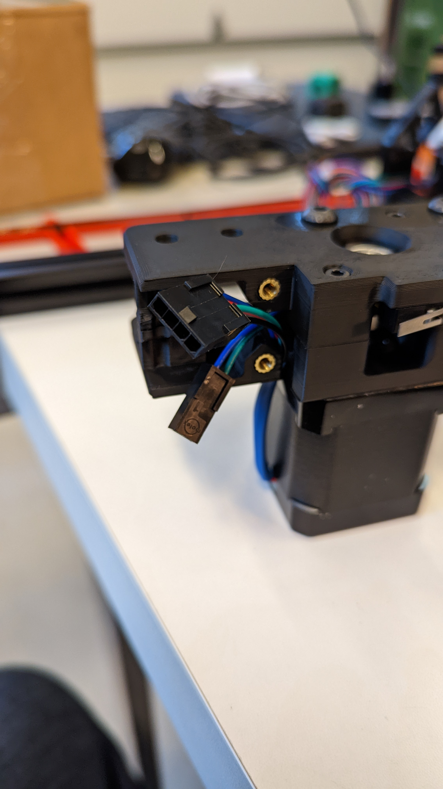
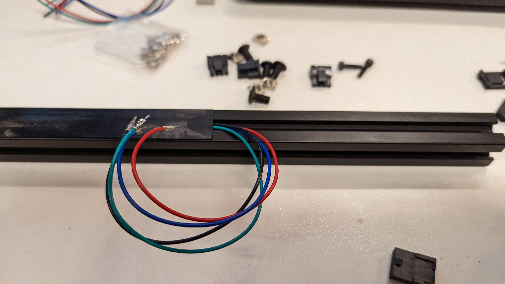
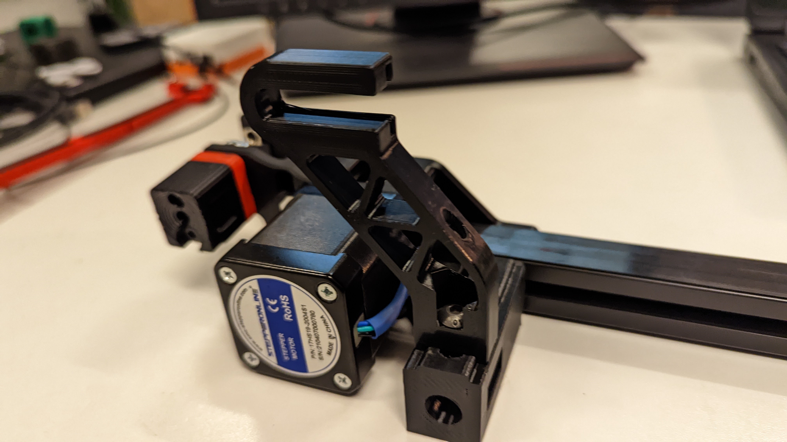
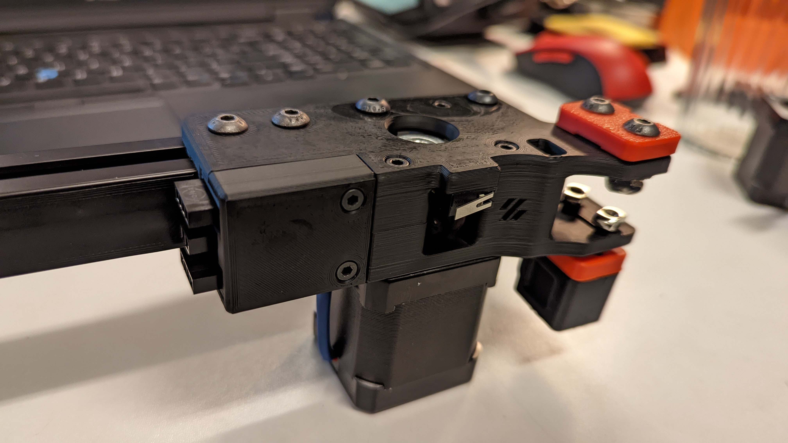
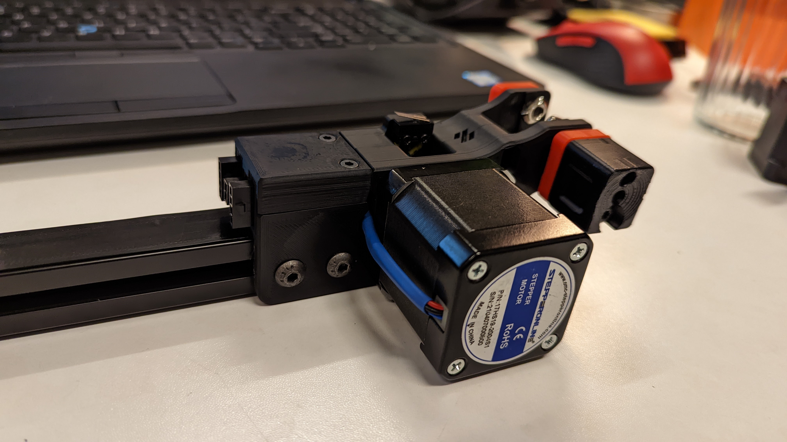
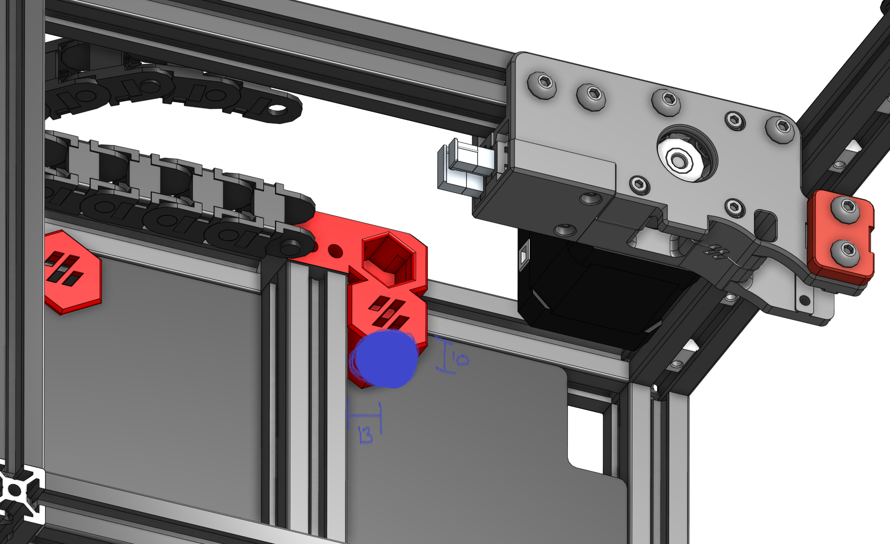

# Ultimate Z Chain Routing System for CAN bus

For all you CAN bus lovers out there, here's the goto method for cleaning up the cables that <b><i>do not</i></b> go to the toolhead.

The end result on the gantry is a self-contained, wire free unit that houses the connections to the A and B motors along with the Y end-stop.

The z chain is replaced with one of the x/y chains - no longer used with CAN bus - and is mounted offset from the center.

This ultimate z chain routing system is a great compliment to the backside cable management system (in a separate mod)

# Prerequisites

- Voron 2.4r1 or r2
- CAN bus routing is through the top of the machine, in line with the PTFE tubing.

# Bill of Materials

- 2x M3 x 12mm SHCS
- 4x M3 heat set insert
- 2x M3 x 8mm BHCS
- 2x M3 x 8mm SHCS
- 2x M3 Hammerhead T-Nuts
- 1x M5 x 10mm SHCS
- 1x M5 Hammerhead T-Nuts
- 1x 2-circuit microfit 3 connector (male and female)
- 2x 4-circuit microfit 3 connector (male and female)
- IGUS X/Y chain (23 links for 350, less for the smaller machines) and 1x end link
- 1x D2F-01L microswitch
- 2x M2 x 10mm self tapping
- tiewrap and heatshrink tubing

# Tools

- Drill with 3/4" bit
- Multimeter to check for continuity
- Soldering iron for the heat inserts
- Wire cutter
- Wire stripper
- Molex microfit 3 crimping tools
- Heat gun for the heatshrink tubing

# Printing

Uses standard Voron print profiles.  Supports not needed for any of the parts.  The cable plug and z chain cable mount can be printed in the accent color of your choice.

# Assembly

For the A drive:

- insert the two heat set inserts in the lower and upper portion of the A drive frame.
- solder wires, about 5 inches in length, to the two end posts of the microswitch.  
- attach the microswitch to the upper portion of the A drive frame with two M2 self tapping screws
- route the wiring through the channel in the upper A drive frame.
- cut the A motor wires to about 6 inches in length and apply heatshrink tubing to the wire closest to the motor housing
- route the motor wires throught the channel in the lower A drive frame.
- assemble the A drive as per normal instructions
- cut wires to length, crimp and add the male microfit connectors.

Here's a look at the A drive with the A motor and microswitch connectors.

For the B drive:

- cut the B motor wires to about (7+L) inches in length where L is the extrusion lenght
- apply heatshrink tubing to the wire closest to the motor housing
- route the motor wires throught the channel in the lower B drive frame.
- assemble the B drive as per normal instructions
- insert back extrusion and route the wiring through the channel facing the front doors.
- apply the wiring cover over the extrusion channel.  You might need more than one cover depending on the size of your printer

Here's a look at the B Drive

- <b><i>tricky bit</i></b> you'll need to fiddle with the B drive wiring to get it through the extrusion channel and into the A drive and then terminate it with a male microfit connector
- test all connections with the multimeter
- snap the clam shells into place around the three connectors
- press fit the clam shells into the top cover
- screw the top cover with two M3 x 12mm SHCS

Completed A Drive.

For the Z chain:
  
- insert two heat set inserts in the bottom z chain mount
- remove all the existing wiring from the existing hole in the bottom panel
- cover up the existing hole with the cable plug
- using a 3/4" bit, drill a hole that is 13mm from the right edge of the right extrusion holding the heat bed and 10mm from the frame

  
- pass A and B motor wires and Y end-stop wires through the newly drill hole
- pass the wires through the bottom z chain mount
- attach the bottom z chain mount to the frame with a M5 x 10mm SHCS and a M5 hammerhead T-nut.  The bottom z chain mount should overlap the bed extrusion.
- screw on the z chain to the bottom z chain mount using two M3 x 8mm BHCS
- route the wiring through the chain and terminate with three female microfit connectors
- verify all your connections with the multimeter
- tie wrap wiring to the bottom z chain mount as shown above
- screw the end link z chain to the gantry extrusion using two M3 x 8mm SHCSs and two M3 hammerhead T-nuts
- connect the microfit connector together and you're done!
  
All the best!
