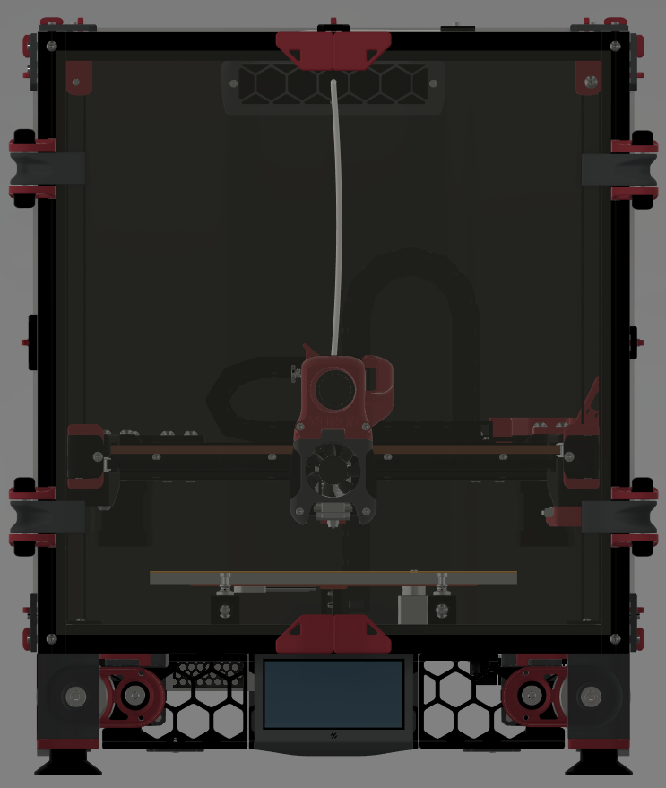
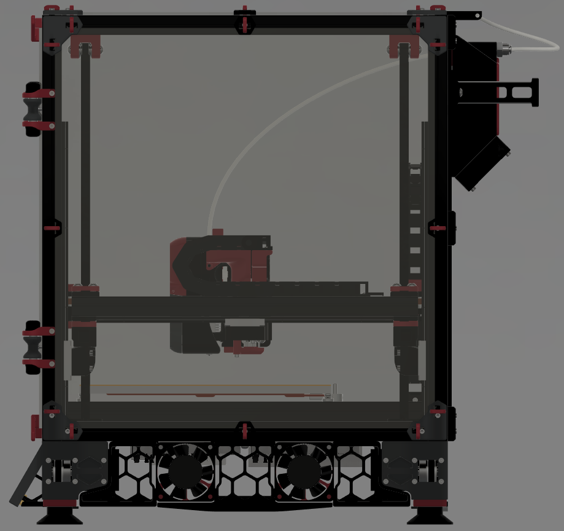
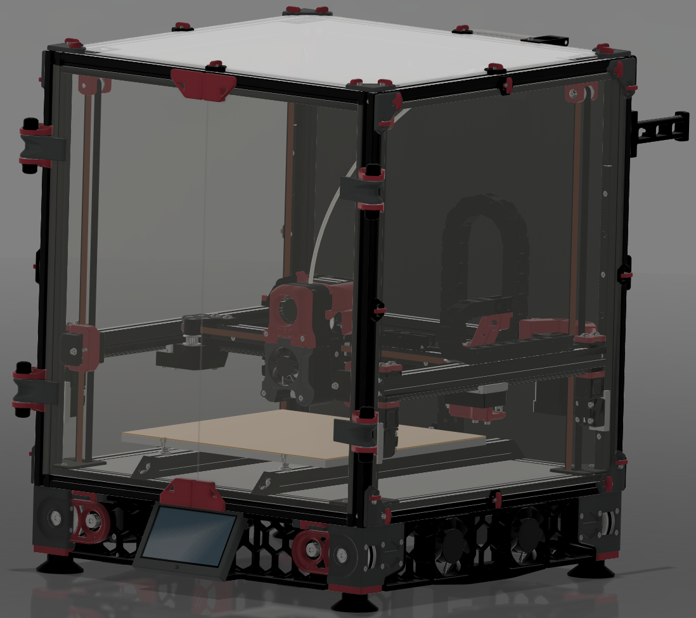
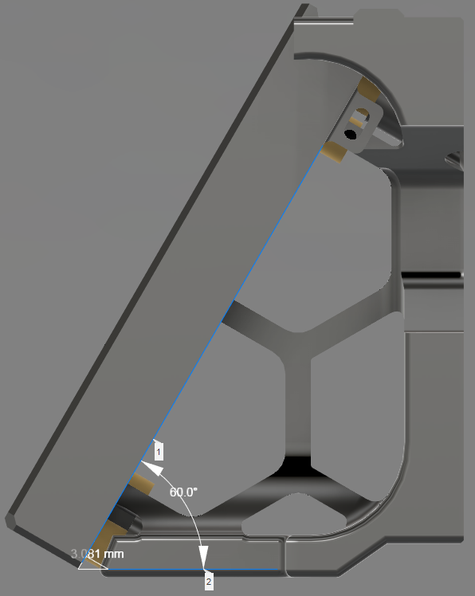
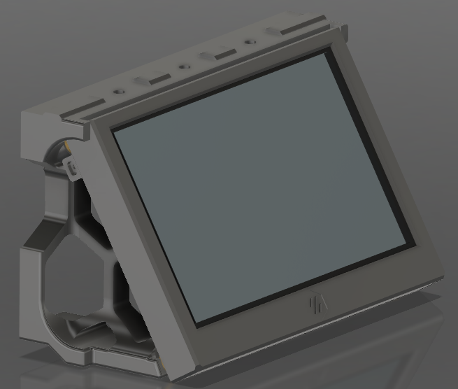
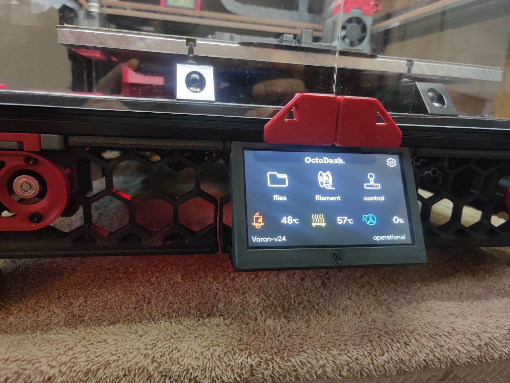
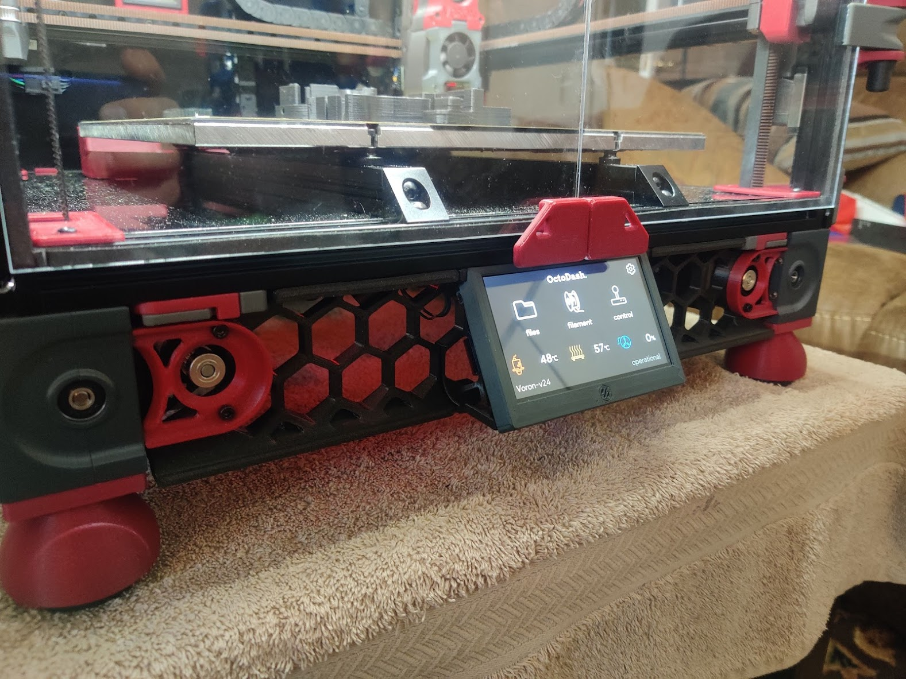
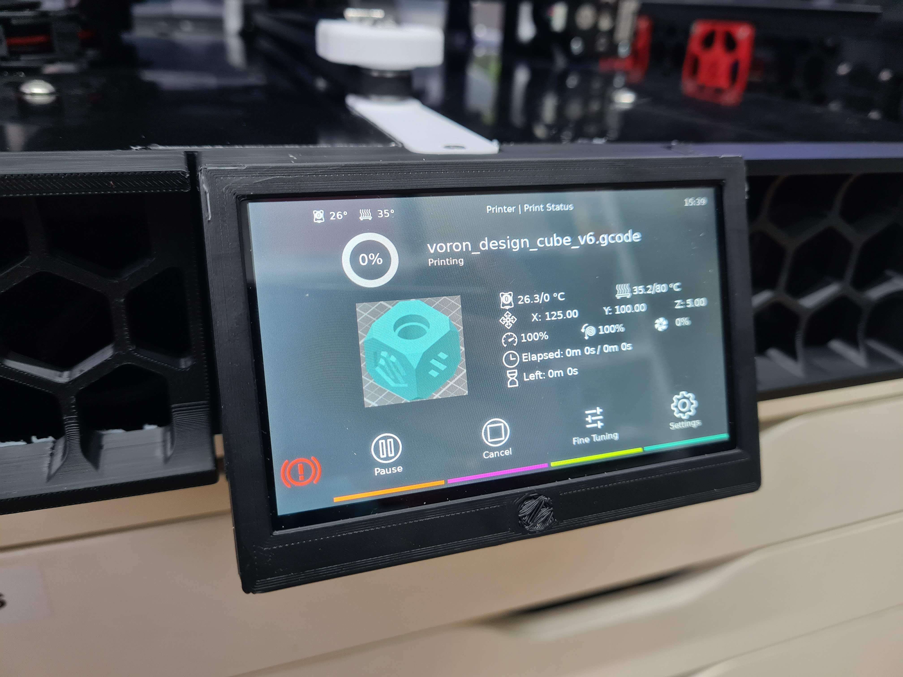
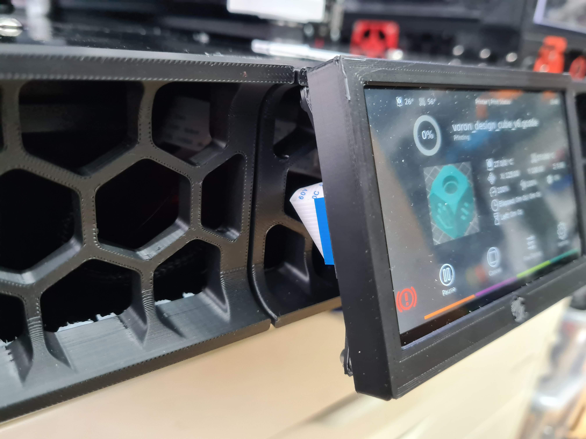
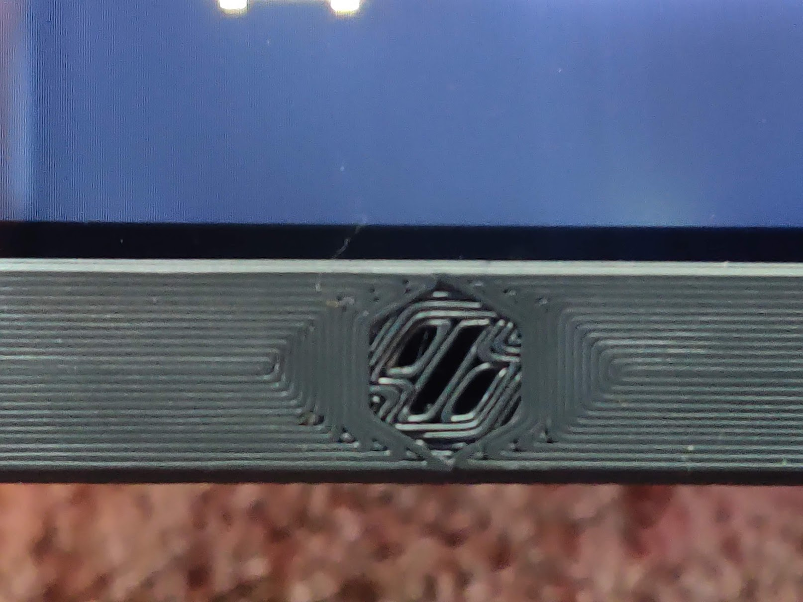

# Voron v2.4 & Switchwire 4.3" Touchscreen Mount

Inspired by [Roboticator's excellent 4" touchscreen mount](../../roboticator24/4inch_touchscreen_mount_for_v2.4), I wanted to use a capacitive touchscreen and a DSI connection instead.

This mod mounts a [Waveshare 4.3inch Capacitive Touch Display](https://www.waveshare.com/4.3inch-dsi-lcd.htm) purchased from [Amazon](https://smile.amazon.com/gp/product/B083TG7Y9B/).  The screen is oriented at a 60 degree angle keeping the height the same as a standard skirt.

    
    
    
    
    

#### Combine with [Roboticator's modified skirts](https://github.com/roboticator24/VoronUsers/tree/master/printer_mods/roboticator24/front%2Brear_skirts_for_v2.4) for a cleaner look.

## 2.4

    
    

## Switchwire

    
    

## Parts Required
| Part | Quantity | Comment|
|------|------|--------|
| M3 X 8 SHCS/BHCS Screw | 3 |2.4 only|
| M3 X 16 SHCS/BHCS Screw | 2 |Switchwire only|
| M3 T-Nut | 3 | |
| M2 x 10 Self Tapping Screws | 2 | Optional |
| M2.5 Screws | 4 | Included with screen |
| DSI Cable | 1 | Long enough to reach your Pi |

## Printing
- Print 1 * faceplate and 1 * screen_mount
- Print using standard Voron part settings and in the orientation used in the STL
- No supports required, but there is one bridge in the mount, the bottom layer of which is not in view once installed
- Voron logo is inset .2mm intentionally to force the solid infill around the hex.  You should not need to support this.
- Use concentric infill for the bottom layer for a different effect

    

## Installation
1. Attach the screen to the mount using 4 x M2.5 screws that were included with the screen
   1. Ensure the screen slid as high on the mount as possible
2. Slide the faceplate onto the screen from the bottom (for switchwire from top), ensuring the sides remain latched behind the PCB
3. Fasten the mount
   1. 2.4
      1. Fasten the mount to the bottom extrusion in place of the spec LCD/mount
      2. You may need to leave the screen screws slightly loose to ensure the M3 screws clear it.  Ensure to tighten afterwards.
   2. Switchwire
      1. Screw the mount at the same grill position as the 12864 display
4. Slide the faceplate up until it is flush to the extrusion
5. Optional: Secure the faceplate with (2) 2 x 10 self tapping screws through the tabs on each side
6. Connect your DSI cable