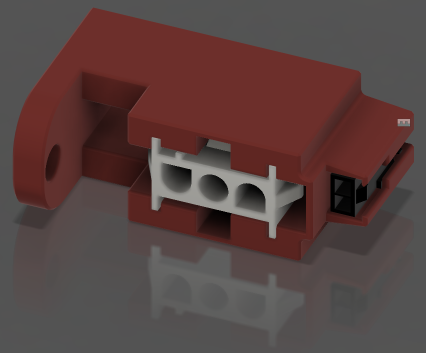
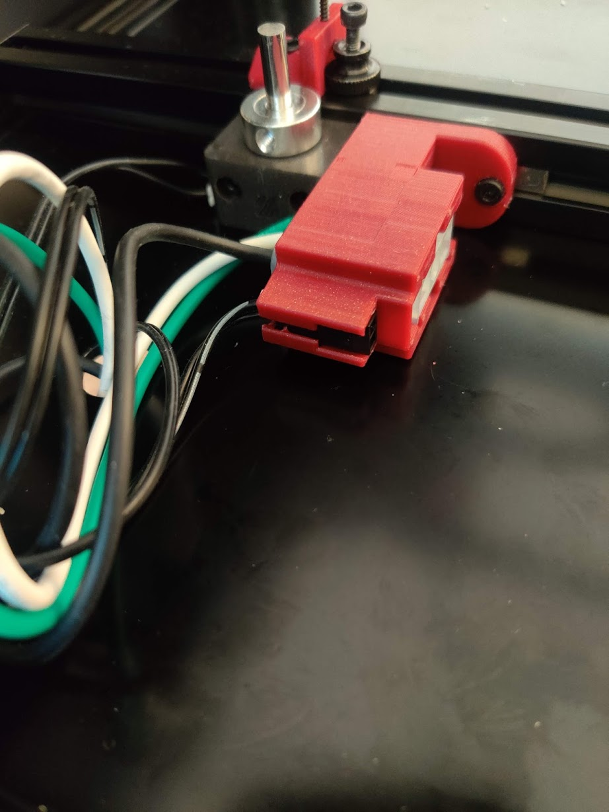
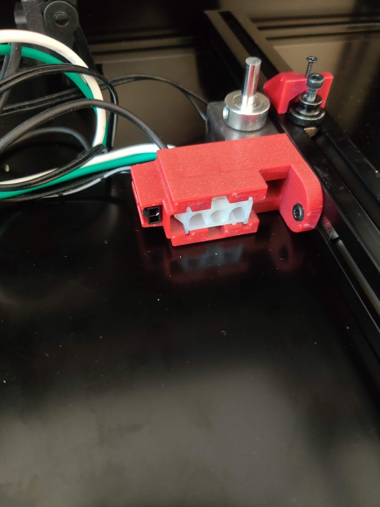
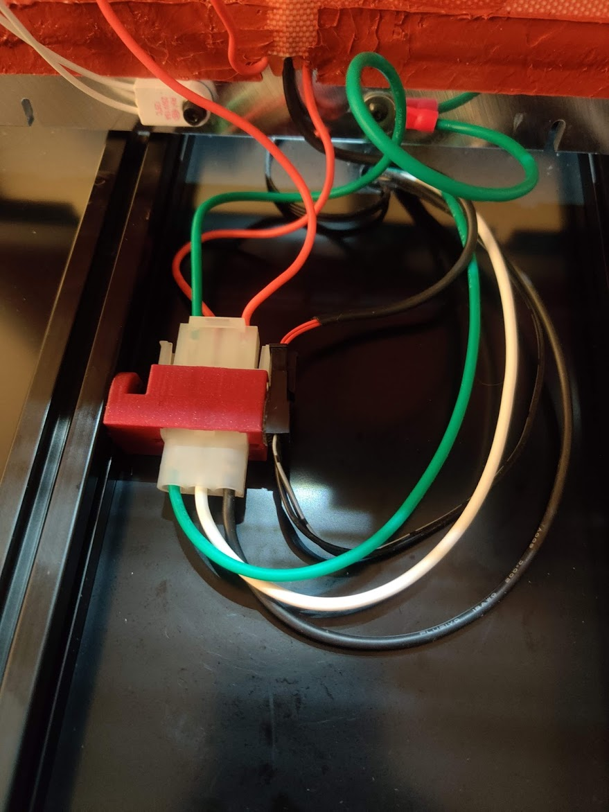
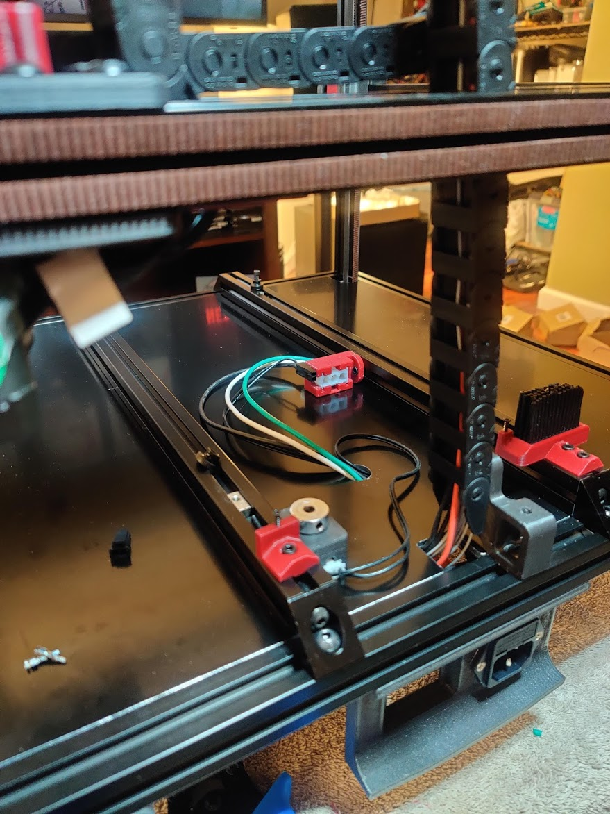

# Molex MLX and Microfit Bed Connector Mount

This part provides a solid mount for the 3 circuit MLX receptacle and a 2 circuit Micro-Fit 3.0 plug housing from the v2.4 BOM.  I recommend you put these connectors on the electronics side.  Mounting the connectors this way allows you to more easily hide the wires and disconnect the bed from the printer with one hand after lifting the bed.  It can be mounted on either bed extrusion, and in either Y orientation you prefer.  Example orientations are shown in the images.

    
    
    
    
    

| Part | Quantity | Comment|
|------|------|--------|
| M3 X 8 SHCS | 2 | |
| M3 T-Nut | 2 | |

## Printing

- Print using standard Voron part settings and in the orientation used in the STL

## Installation
- The MLX connector should snap in smoothly
  - It must be inserted from the flat side of the mount and only in 1 orientation
  - Orient the alignment flange closer to the screw-side of the mount
- The Micro-Fit 3.0 will be a little more difficult to insert.  Apply pressure until it snaps into place
- Both will come back out without destroying the connectors or mount, but it takes some finesse

