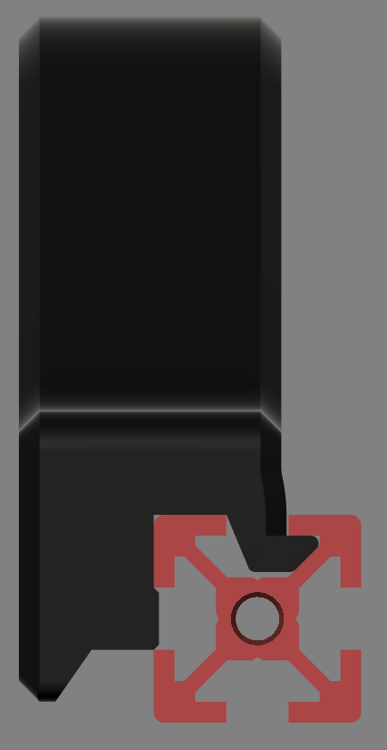
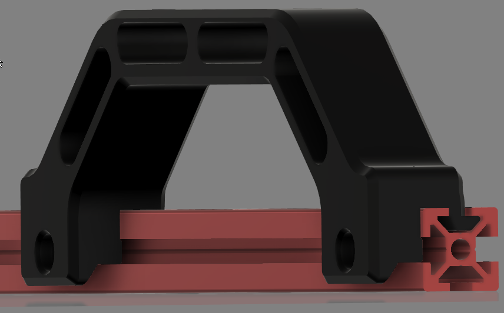
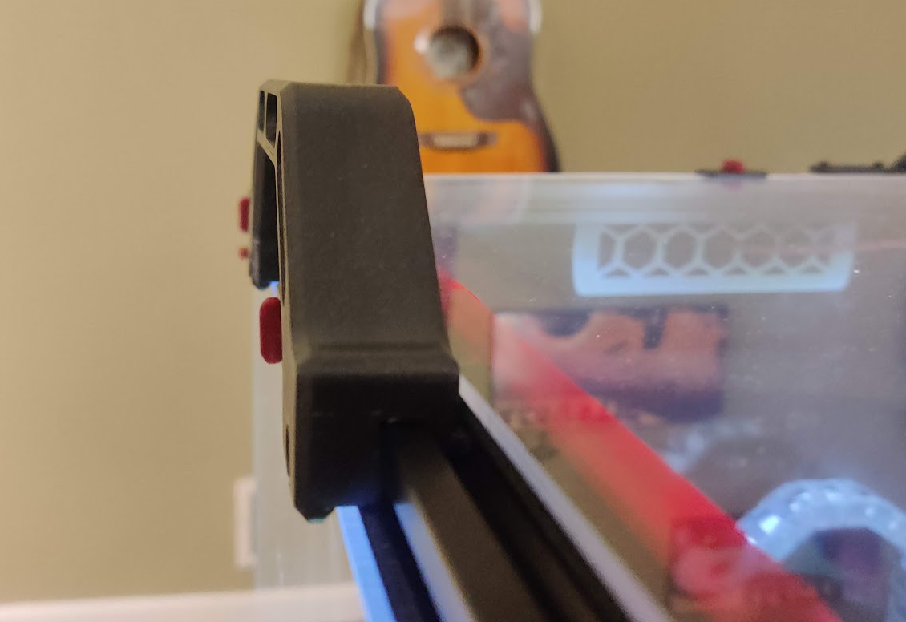

# Voron v2.4 Sturdy Handles

I wanted handles for the v2.4 that were a bit more sturdy than I've been able to find and that didn't act as a clip for the panels.  That's what I have the clips for :).  This is a modified v2.2 handle that has 4 anchor points.  It will not work on the bottom extrusions if you're using skirts, but should anywhere that has access to 2 adjacent sides of an extrusion. It has 6mm of clearance on the side that will go over the panel slightly.

    
    
    

## Parts Required
| Part | Quantity | Comment|
|------|------|--------|
| M5 X 12 SHCS | 2 | |
| M5 T-Nut | 2 | |

## Printing

- Print using standard Voron part settings and in the orientation used in the STL
- Supports should not be needed, but the overhang is < 45 degrees.  That area is hidden from view and tolerances don't really matter there.  Regardless, it prints clean for me.

## Installation
- You will likely need to move the top panel out of the way for installation.  I just removed clips from one side and the middle to lift it up a bit.