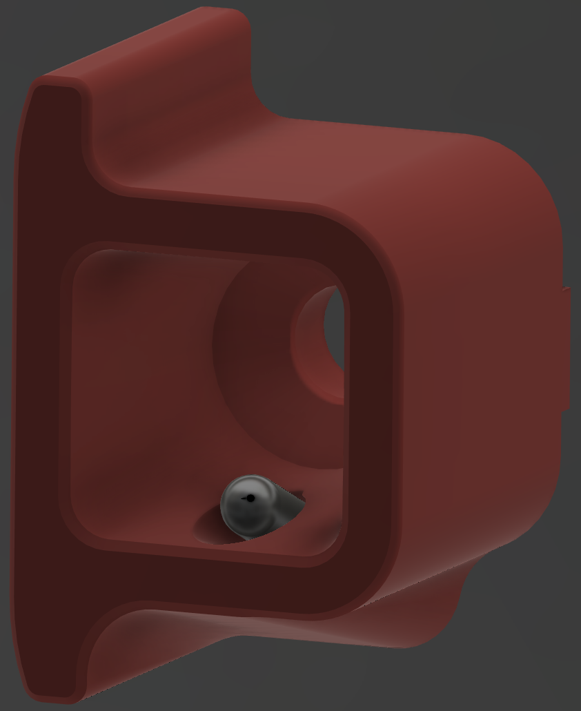
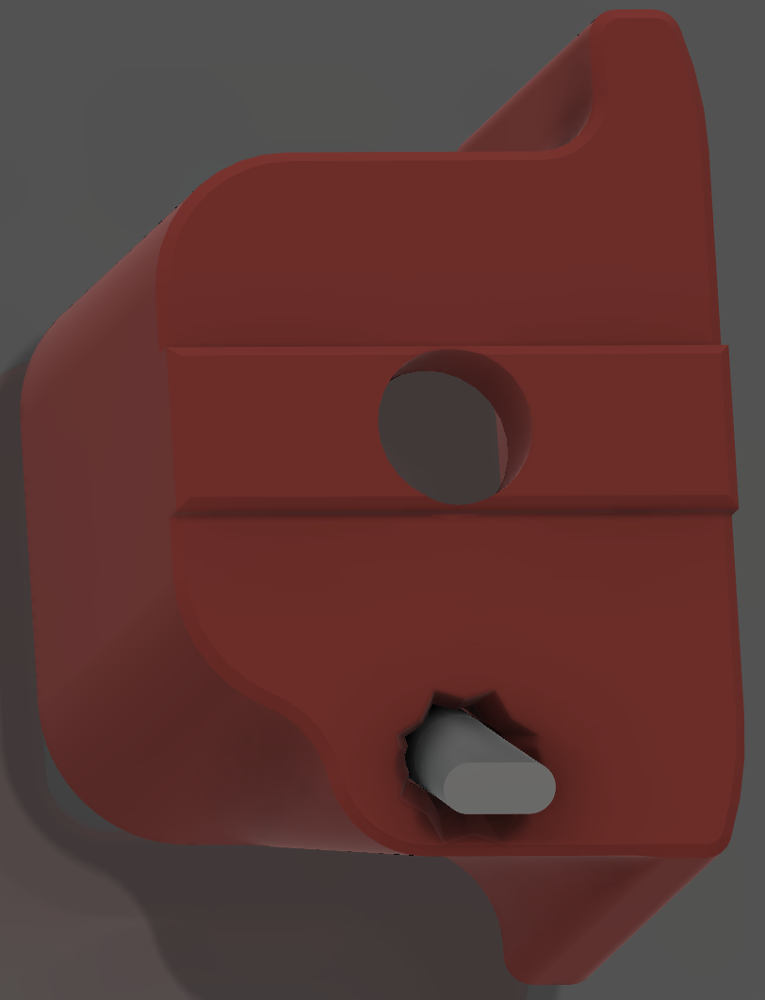
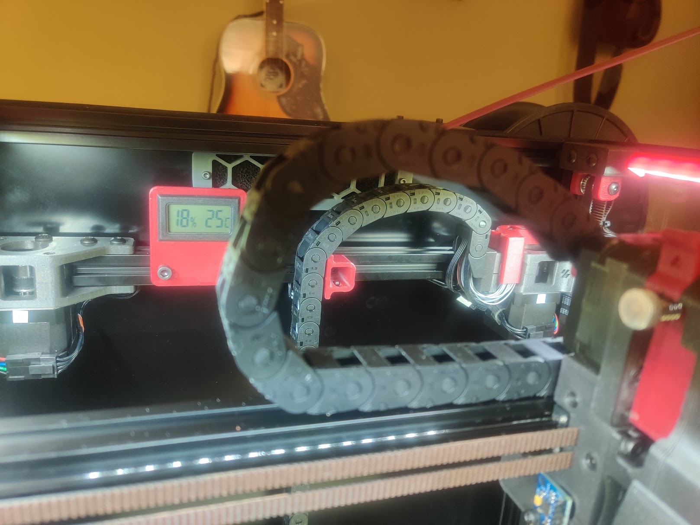

# Voron V2.4 Z Chain Retainer with Integrated Thermistor Mount

When looking for a clean way to mount a chamber temperature sensor, the Z chain retainer seemed like a perfect opportunity.  It should fit any thermistor with a 3mm barrel.

    
    

## Installation
1. Route your wire through the Z chain to the rear X extrusion
2. Secure the wire inside that extrusion
3. Insert the thermistor into the mount
4. Attach the mount to the extrusion, positioned to hold the Z chain vertical*

****NOTE:** Ensure you have enough links in your Z chain to clear the retainer when at max Z.*

 

