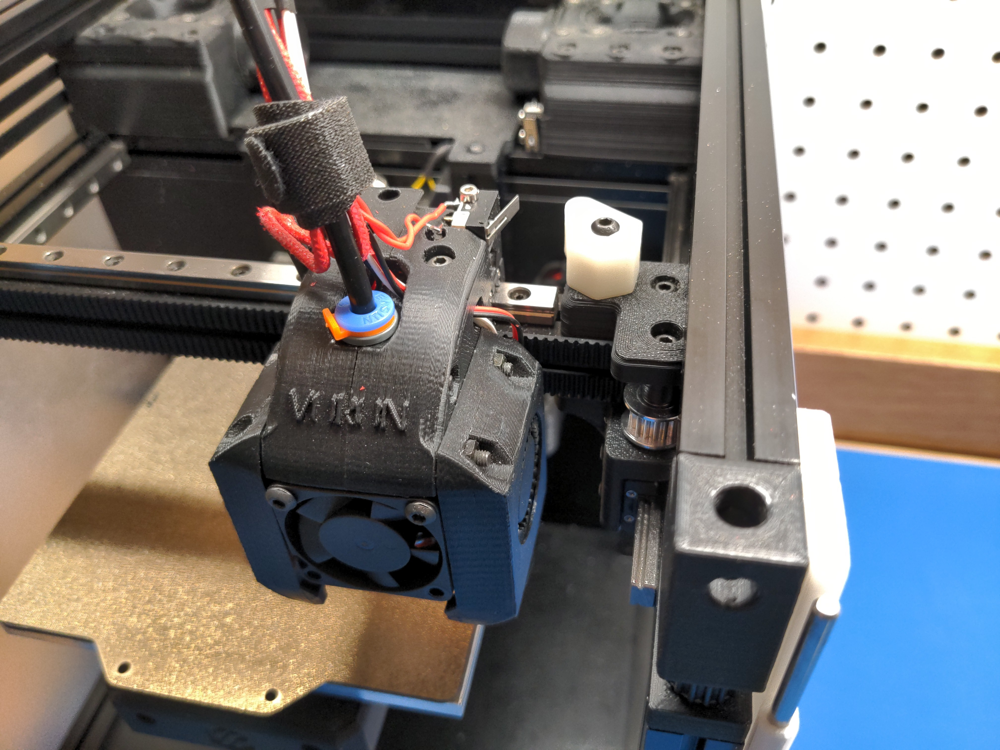
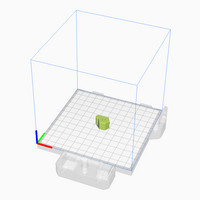
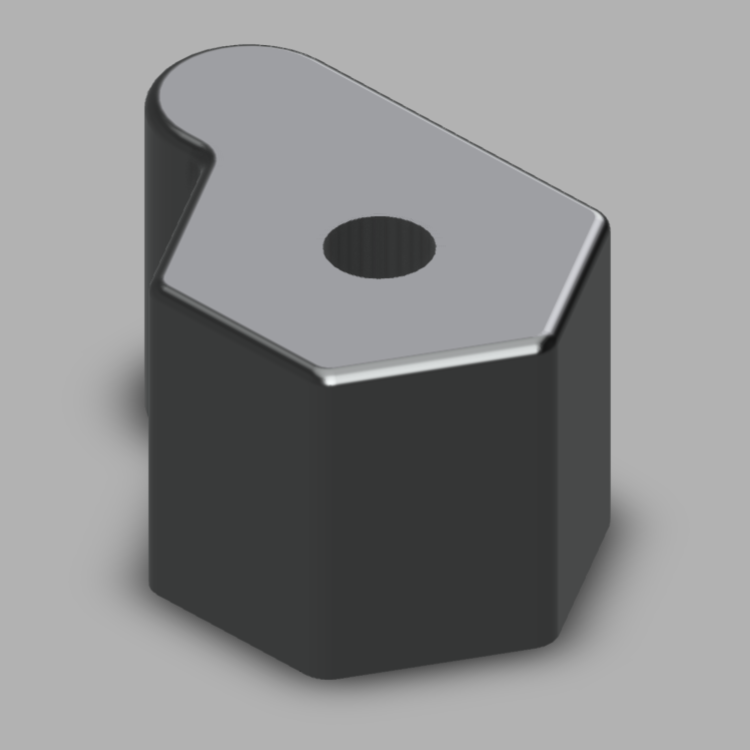

# Voron 0 Adjustable Bowden Endstop

An adjustable endstop strike block for the Voron 0 bowden toolhead.

This strike block can be rotated to set the X axis zero point.

# Bill of Materials

| Qty | Description                                                        | STL Slicer Image                                                   |
|-----|--------------------------------------------------------------------|--------------------------------------------------------------------|
| 1   | [Adjustable Bowden Endstop](STL/Adjustable_Bowden_Endstop.stl)     |  |

# Assembly Instructions

This part is a drop-in replacement for the stock endstop: `Endstop_Strike_Block`.

1. Unscrew the stock endstop, being careful not to move the T-Nut.
2. Loosely attach the modified endstop: `Adjustable_Bowden_Endstop`.
3. Re-orient the toolhead limit switch so the lever is facing backwards. See picture.
4. Spin the endstop until the limit switch triggers at the correct position.
5. Firmly tighten the endstop screw.

# CAD Design Files

[Fusion 360 Web View](https://a360.co/3fExdho)

