# Voron 0 LCD Touchscreen Skirt

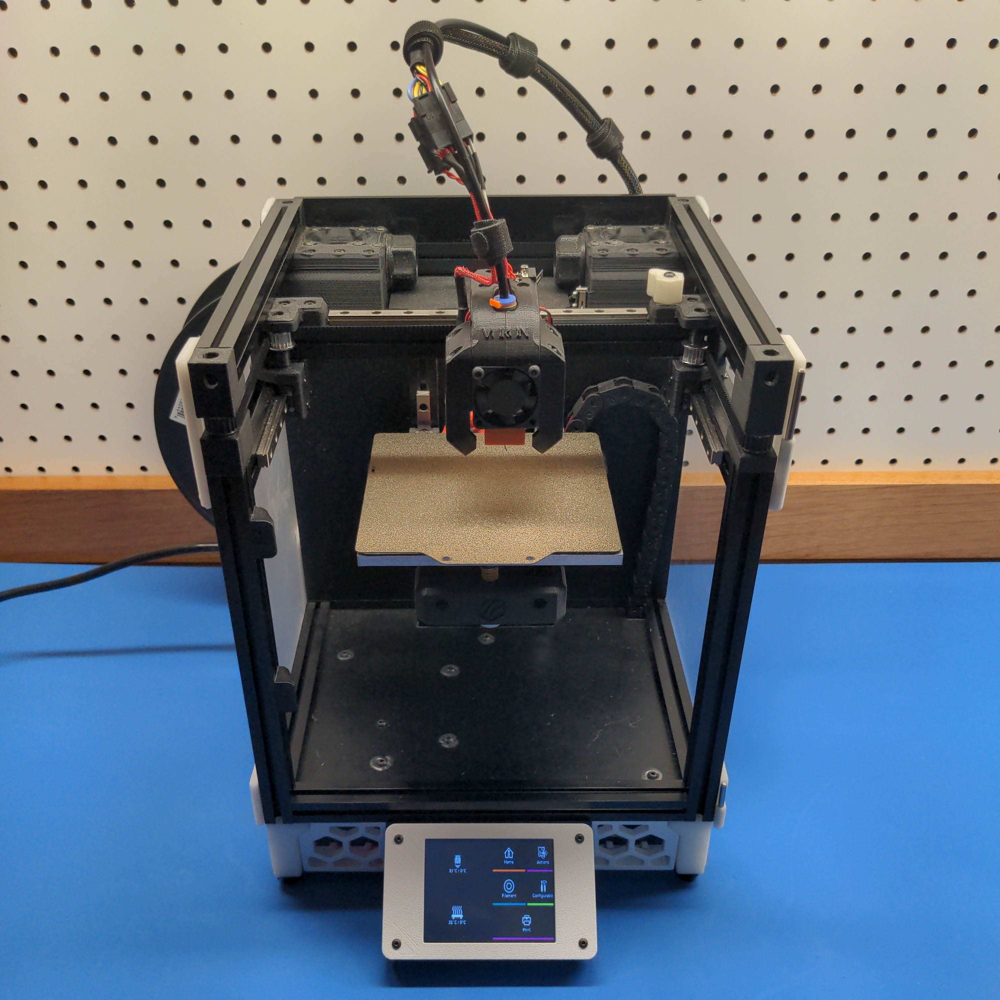

A large LCD touchscreen for [OctoScreen](https://github.com/Z-Bolt/OctoScreen) or [OctoDash](https://github.com/UnchartedBull/OctoDash).

## Bill of Materials
All required parts are listed below. Supplier examples are provided for convenience.

### Non-Printed Parts
**Additional Non-Stock Parts:**
| Qty | Description                         | Supplier Links                                                                                                                                |
|-----|-------------------------------------|-----------------------------------------------------------------------------------------------------------------------------------------------|
| 1   | Adafruit PiTFT Plus 3.2 Touchscreen | [Adafruit](https://www.adafruit.com/product/2616)                                                                                             |
| 1   | M2.5 x 3.0 mm Heat Set Inserts      | [Alliexpress](https://www.aliexpress.com/item/1005002529889373.html), [McMaster Carr](https://www.mcmaster.com/94180A321/)                    |
| 1   | M3 x 50 mm SHCS                     | [Alliexpress](https://www.aliexpress.com/item/4000282775348.html), [Bolt Depot](https://www.boltdepot.com/Product-Details.aspx?product=22479) |
| 4   | M2.5 x 10 mm BHCS                   | [Alliexpress](https://www.aliexpress.com/item/4000888328429.html)                                                                             |
| 1   | 40-pin IDE Extension Cable          | [Amazon](https://www.amazon.com/dp/B08LV3FNDZ)                                                                                                |

**Repurposed Stock Parts:**
| Qty | Description                         | Supplier Links                                                                                                                                 |
|-----|-------------------------------------|------------------------------------------------------------------------------------------------------------------------------------------------|
| 12  | M3 x 8 mm BHCS                      | [Alliexpress](https://www.aliexpress.com/item/4000888328429.html), [Bolt Depot](https://www.boltdepot.com/Product-Details.aspx?product=13335)  |
| 12  | M3 Makerbeam 1515 T Slot Nuts       | [Alliexpress](https://www.aliexpress.com/item/4000886303032.html), [Amazon](https://www.amazon.com/gp/product/B06XHQHD4H/)                     |
| 4   | Rubber Feet (14 x 11 x 9)           | [Alliexpress](https://www.aliexpress.com/item/33014925172.html)                                                                                |

### 3D Printed Parts
| Qty | Description                                          | STL Slicer Image                                                   |
|-----|------------------------------------------------------|--------------------------------------------------------------------|
| 2   | [Skirt Side A](STL/Skirt_Side_A.stl)                 | 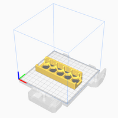                 |
| 2   | [Skirt Side B](STL/Skirt_Side_B.stl)                 | 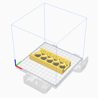                 |
| 1   | [Skirt Front  Left](STL/Skirt_Front_Left.stl)        | 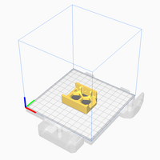         |
| 1   | [Skirt Front Right](STL/Skirt_Front_Right.stl)       | 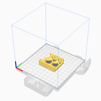       |
| 1   | [LCD Mounting Bracket](STL/LCD_Mounting_Bracket.stl) | 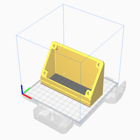 |
| 1   | [LCD Face Plate](STL/LCD_Face_Plate.stl)             | 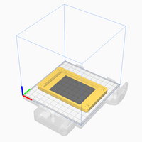             |
| 2   | [Foot Front](STL/Foot_Front.stl)                     | 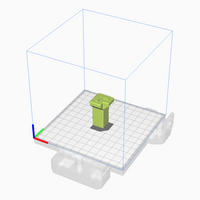                     |
| 2   | [Foot Rear](STL/Foot_Rear.stl)                       | 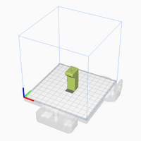                       |

All 3D Parts can be printed without support material: ABS, 0.4 mm nozzle, and 0.2mm layers.

## Assembly Instructions

1. Install 4 M2.5 heat set inserts into `LCD Mounting Bracket`
2. Remove the stock V0 skirt and feet.
3. Install extended feet with 50mm M3 SHCS.
4. Install all `Side Skirt A/B` parts using the stock mounting T-nuts and M3 x 8 screws.
5. Install the `LCD Mounting Bracket` using the middle two T-nuts on the front extrusion.
6. Install `Front Skirt Left/Right` using the remaining two T-nuts on each side of the LCD.
7. Connect the 40-pin ribbon cable to the `Adafruit PiTFT Plus`.
8. Place the `Adafruit PiTFT Plus` into the `LCD Face Plate`.
9. Route the ribbon cable through `LCD Mounting Bracket` to Raspberry Pi.
10. Secure `LCD Face Plate` with four M2.5 x 10 screws.

## Software Configuration
Follow the [Adafruit LCD Installation Instructions](https://learn.adafruit.com/adafruit-pitft-28-inch-resistive-touchscreen-display-raspberry-pi/overview).

The 3.2" LCD is pin-equivalent to the 2.8" LCD. You can safely follow the same instructions.

The recommended installation type is `fbcp`, framebuffer copy:

`sudo python3 adafruit-pitft.py --display=28r --rotation=90 --install-type=fbcp`

The `fbcp` option causes the X11 output to be mirrored on the PiTFT display.

## CAD Design Files

[Fusion 360 Web View](https://a360.co/3fExdho)

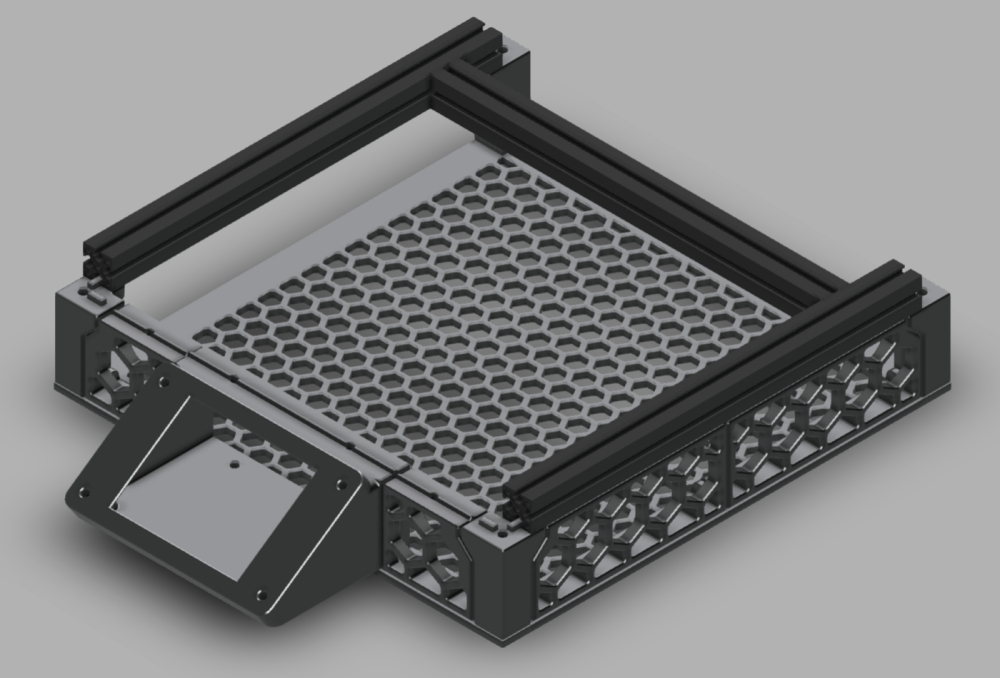

## Gallery
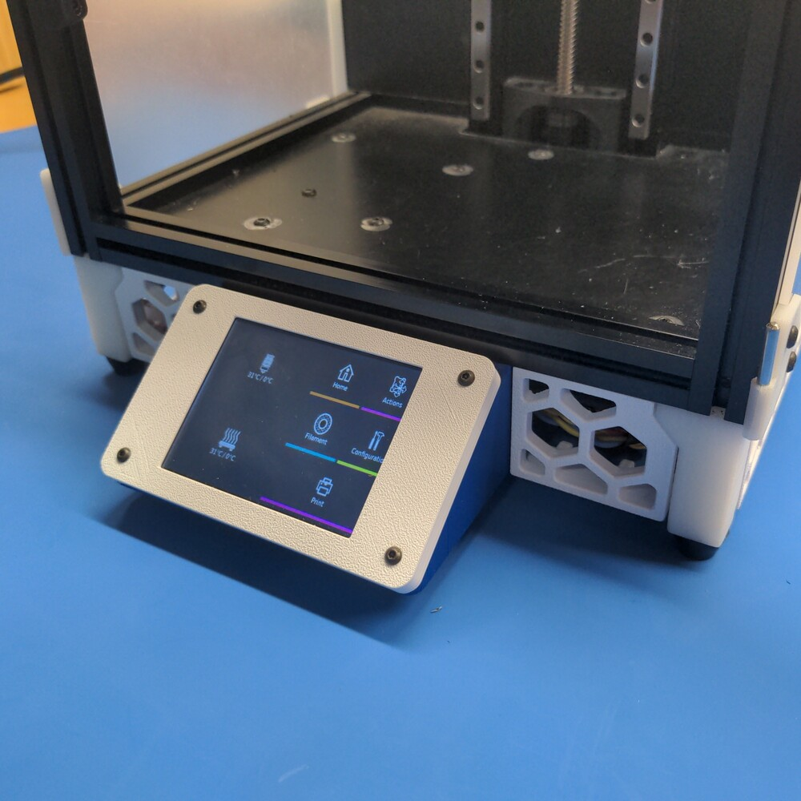

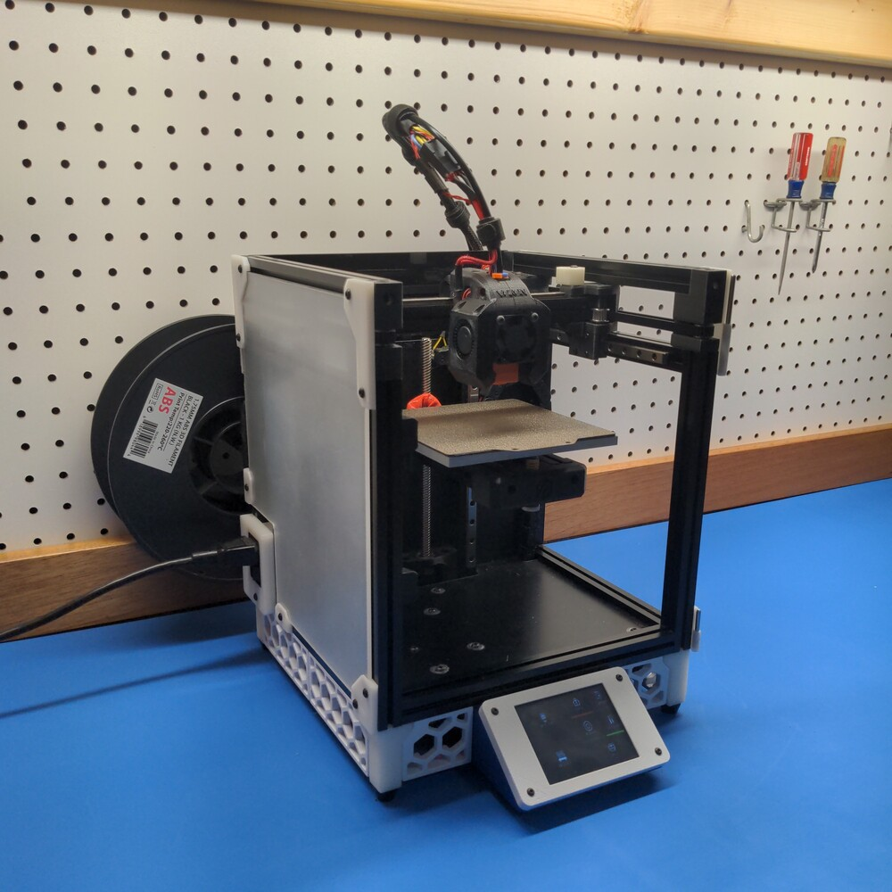
