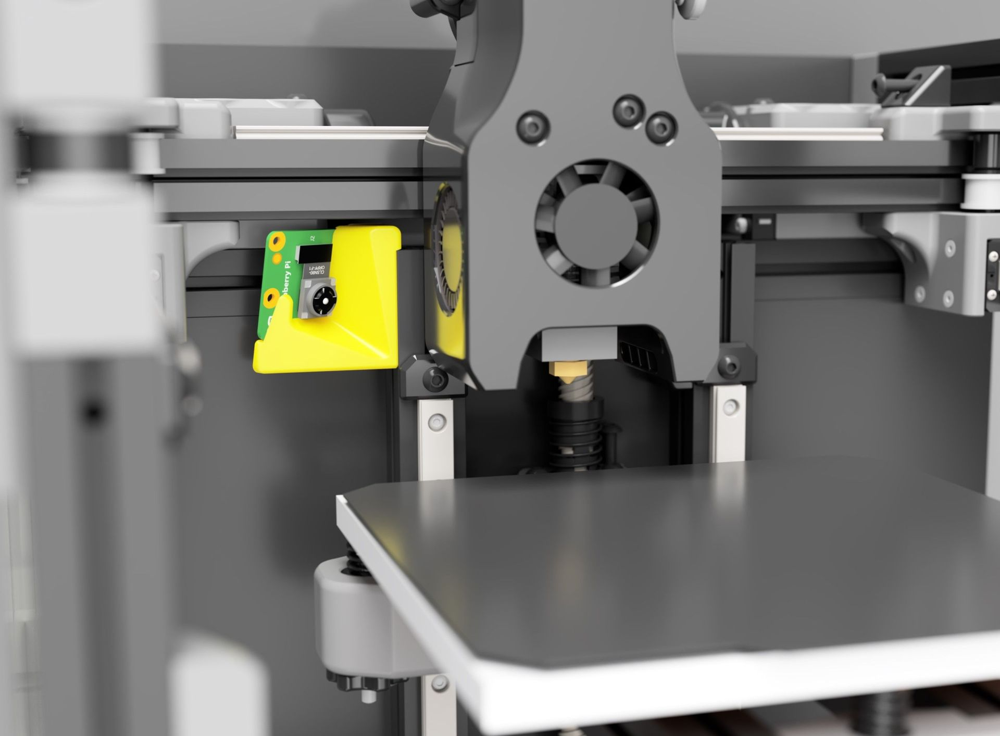
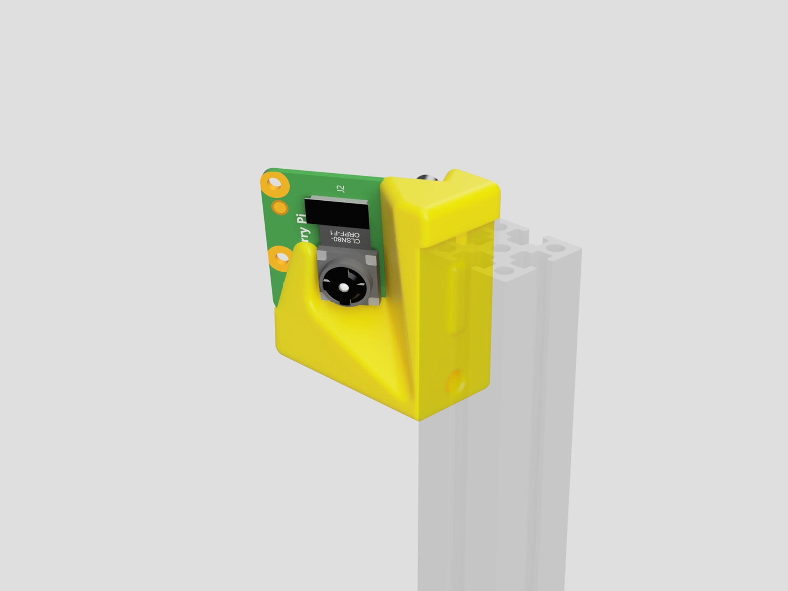
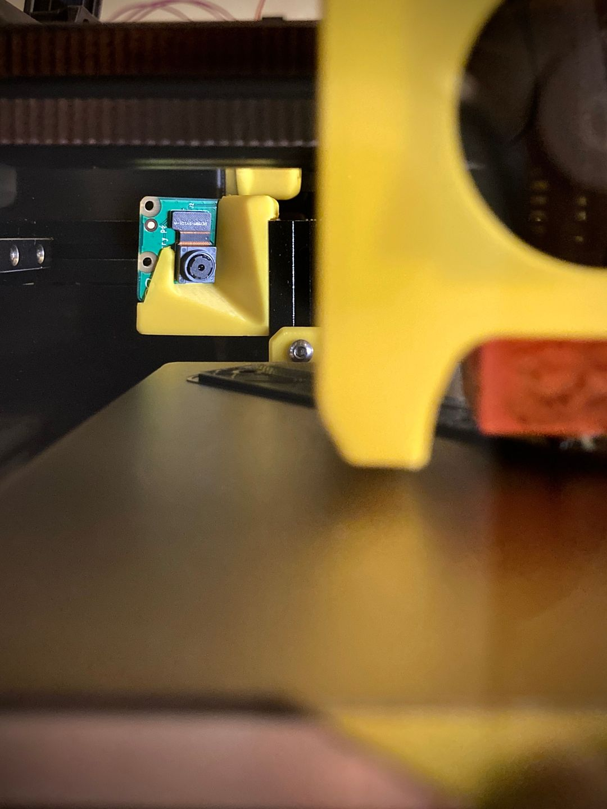
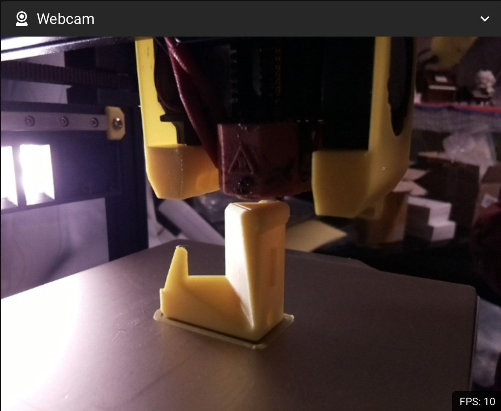
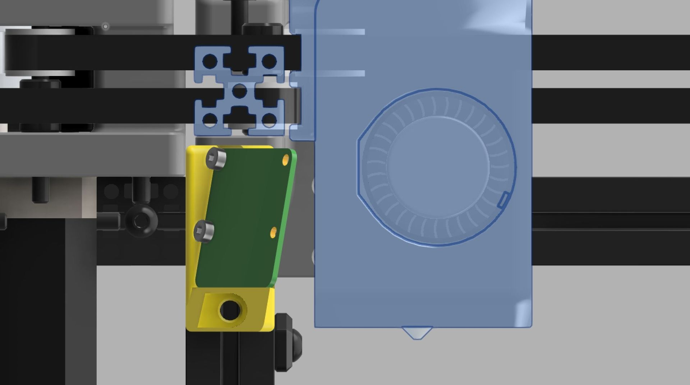
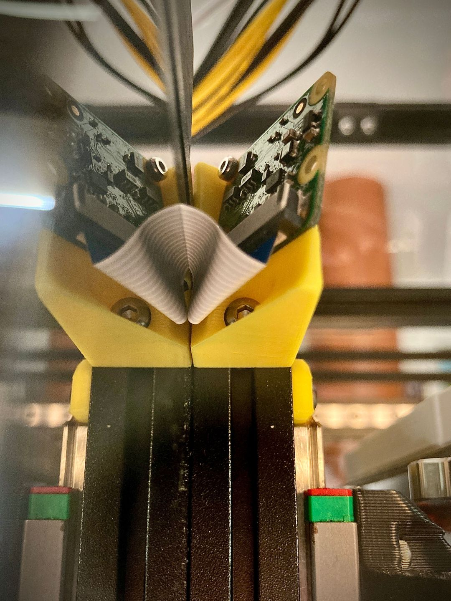

# Voron 0/0.1 Raspberry Pi Camera Mount

This is a low profile raspberry pi camera mount for the Voron 0 / Voron 0.1.

**Please consider [downloading this model on Printables](https://www.printables.com/model/146877-voron-0-voron-01-raspberry-pi-camera-mount) as well to help me earn a roll of Prusament 😆**

## TLDR
1. Raspberry pi camera mount for the voron 0 / voron 0.1
2. Get up close and personal with the nozzle & the print bed (>80% visible)
3. Easy mounting with 1 M3x16 screw, 1 M3 nut and 1 M2x6 screws
4. **NO PRELOADING OF NUTS** thank goodness!
5. **No supports** as always!
5. Battle tested by users on Thingiverse and Printables!

## BOM
| Item | Qty. | Note |
| --- | --- | --- |
| M2x6 BHCS/SHCS | 1 - 2 | For securing the Raspberry Pi Camera |
| M3x16 BHCS | 1 | For securing to profile |
| M3 Nut | 1 | For securing to profile |
| **>300mm Flex Cable** | 1 | May be optional, see notes |

## Long Story
Ever since building my Voron 0.1, I've been trying to find a good mount for a raspberry pi camera. That said, most solutions I have found are a bit too conspicuous for my taste (i.e. they stick out into the tophat area), with no direct line of sight to the nozzle.

That's why I've decided to design my own and I've found a nice spot towards the top of the left z-extrusion with just enought clearance. It also offers good visibility of the nozzle & bed, extremely easy mounting, and great cable management!

Let me know what you think!

## Notes
- **The flex cable** that comes with the camera module will be too short for this mod if  your Raspberry Pi is located towards the bottom left of the electronics compartment (as per the manual). You can either purchase a 300mm / 12 in" flex cable or re-locate the Raspberry Pi towards the top of the compartment.
- **Clearnace** is quite tight (see one of the attached images), so I'd highly recommend that you check for inteference before commencing any prints. You can do so by moving the x-axis by hand along the back of the print bed. I'd also suggest that you check for any stray hotend wires so they don't snag on the camera
- **Material choice** is up to you, but if you're an enclosure (as I do), I'd highly recommend you print this model using ABS.
- **The focus distance** on the camera is usually set a too far out of the factory, resulting in a slightly blurry image. It is suggested that you adjust the focus ring on the camera to get a better image (not sure about warranty however).

## Images

*Raspberry pi camera model used in rendering designed by [Peter Höjerslev](https://grabcad.com/library/raspberry-pi-camera-4)*

