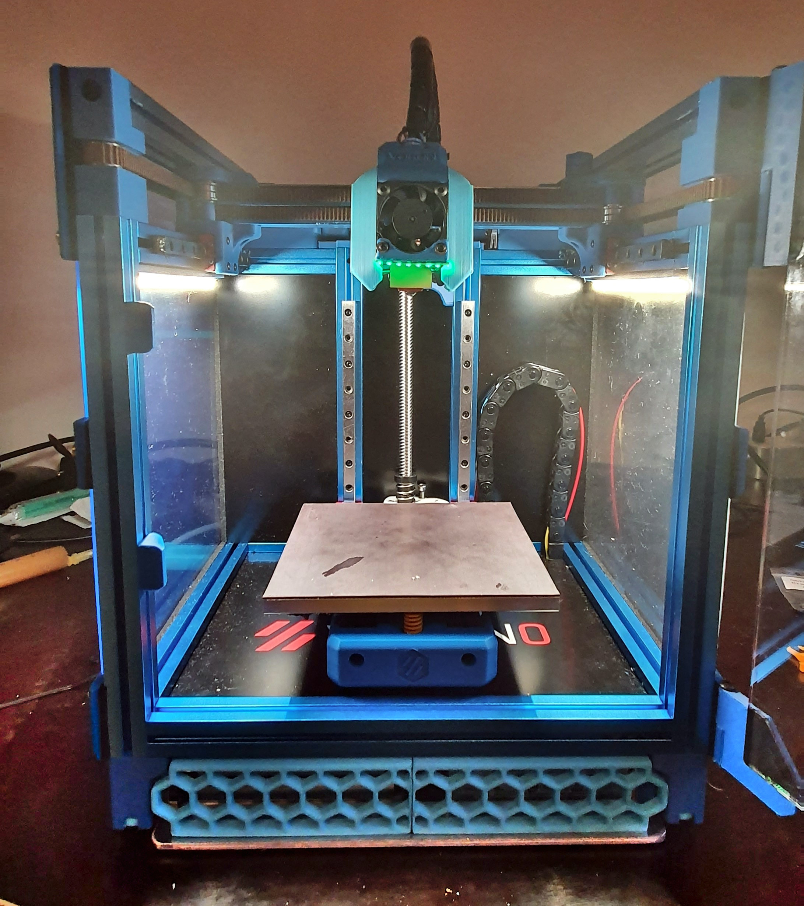
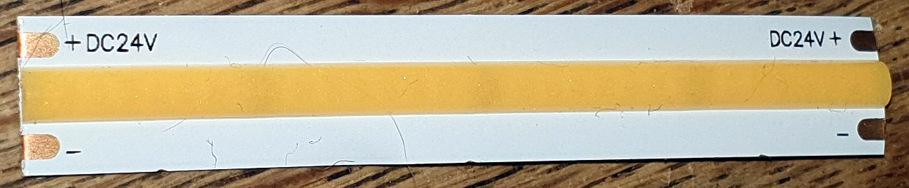
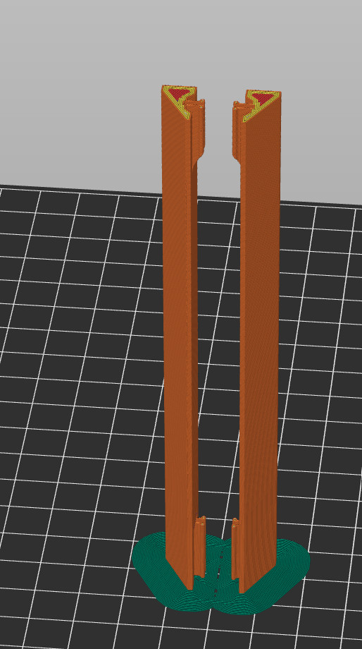

# V0 clippable Caselight LED Mounts

This LED strip mount is sutable for led strips with a width of 8 - 12 mm, but was made 
for [these](https://www.ebay.de/itm/114381606552) 24V COB Led strips. 

Since they come in segments of 62.5 mm, the strip mounts are 125mm long to fit two of those segments. 
When using different leds, the slicer scaling function can be used to shorten them. The clips should still work. 

## How to print them 

The clips were made to print upright, but will probably require a brim for bed adhesion. 
There is a combined STL that combines the normal and mirrored version [here](STL/led_mount_clippable_plate.stl).

