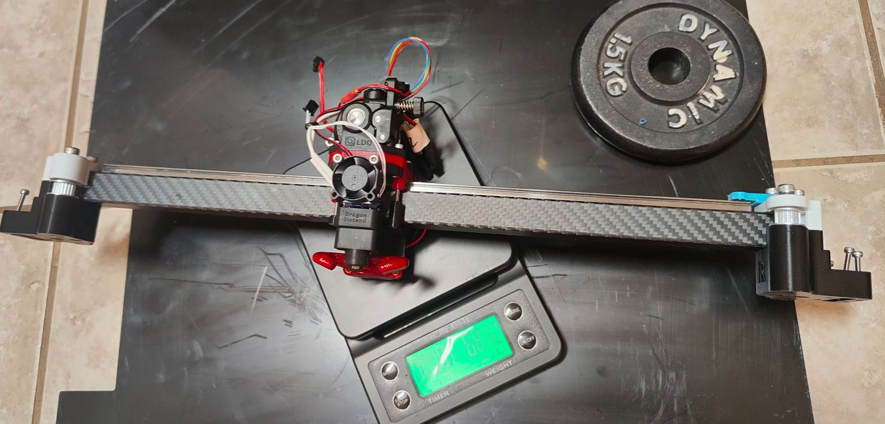
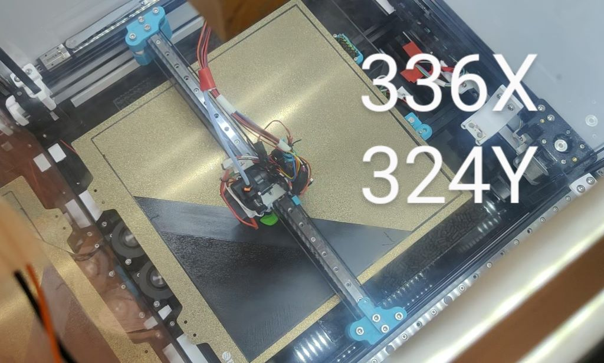
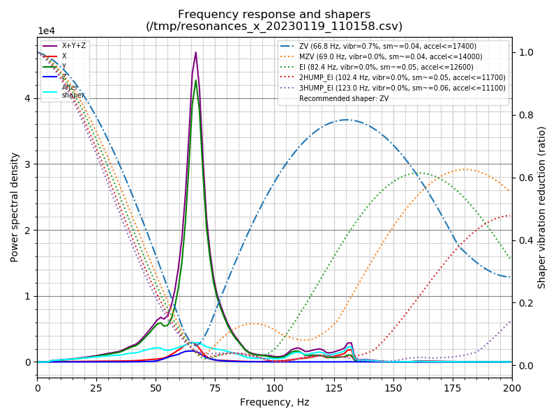
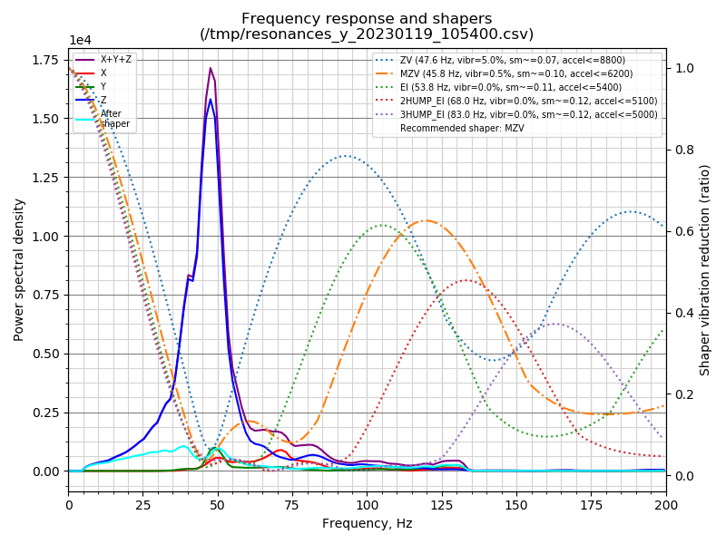
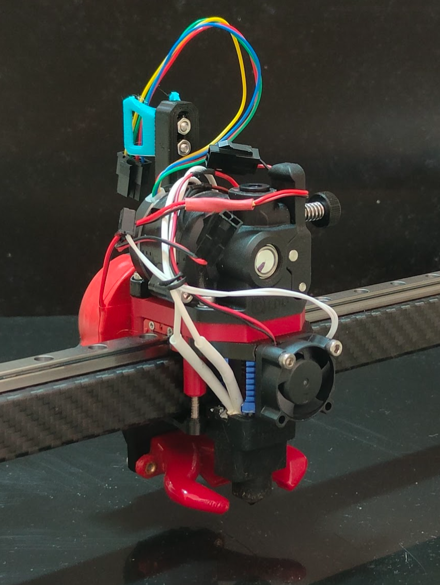
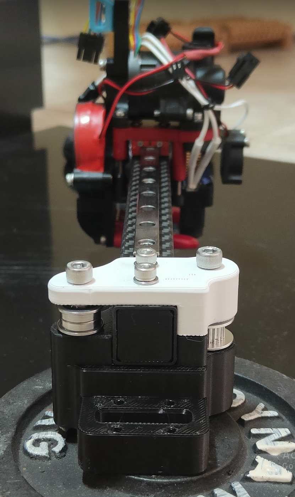
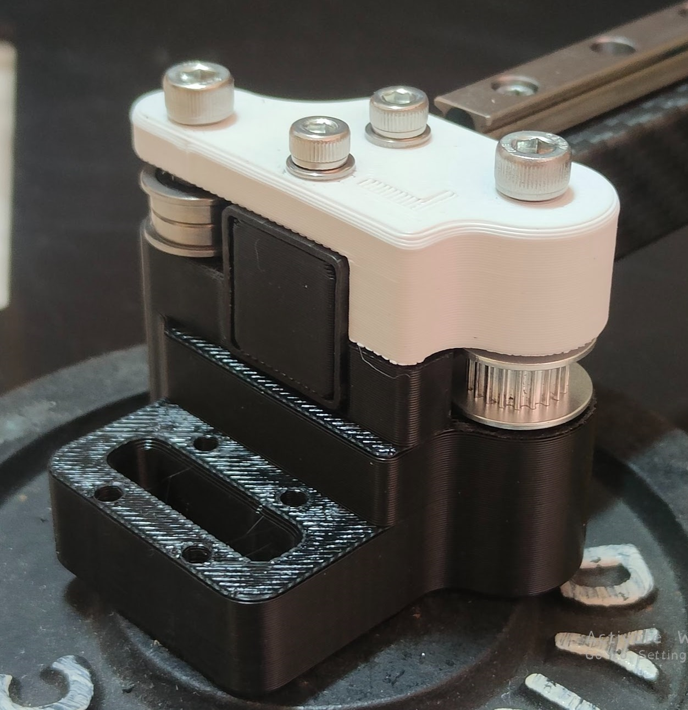
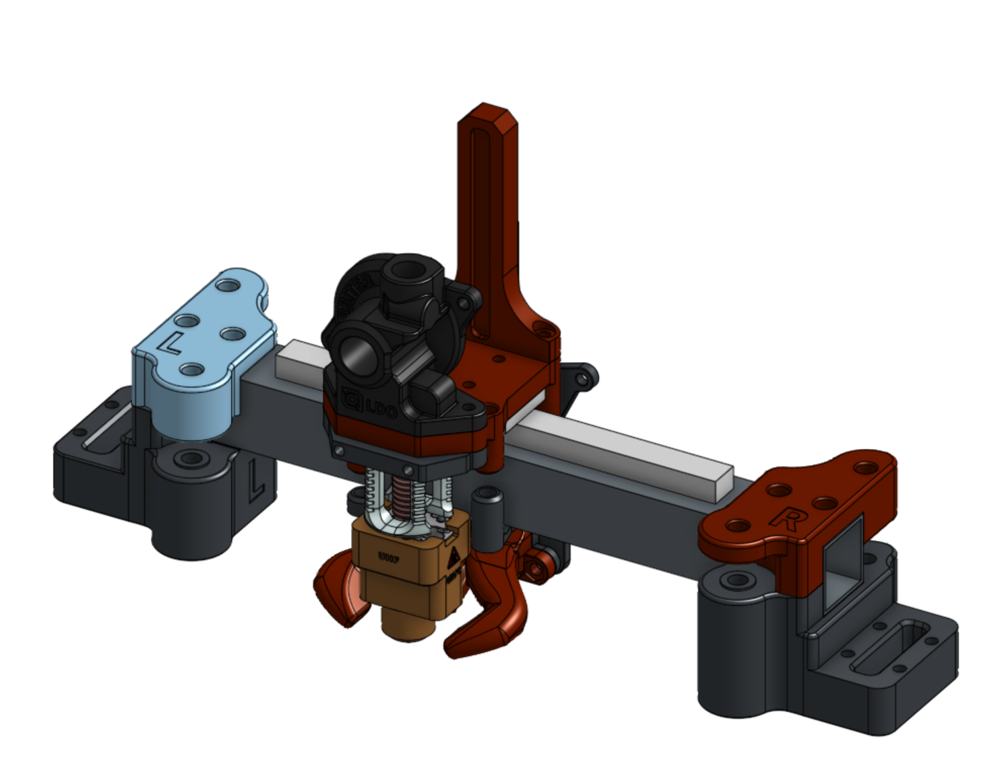
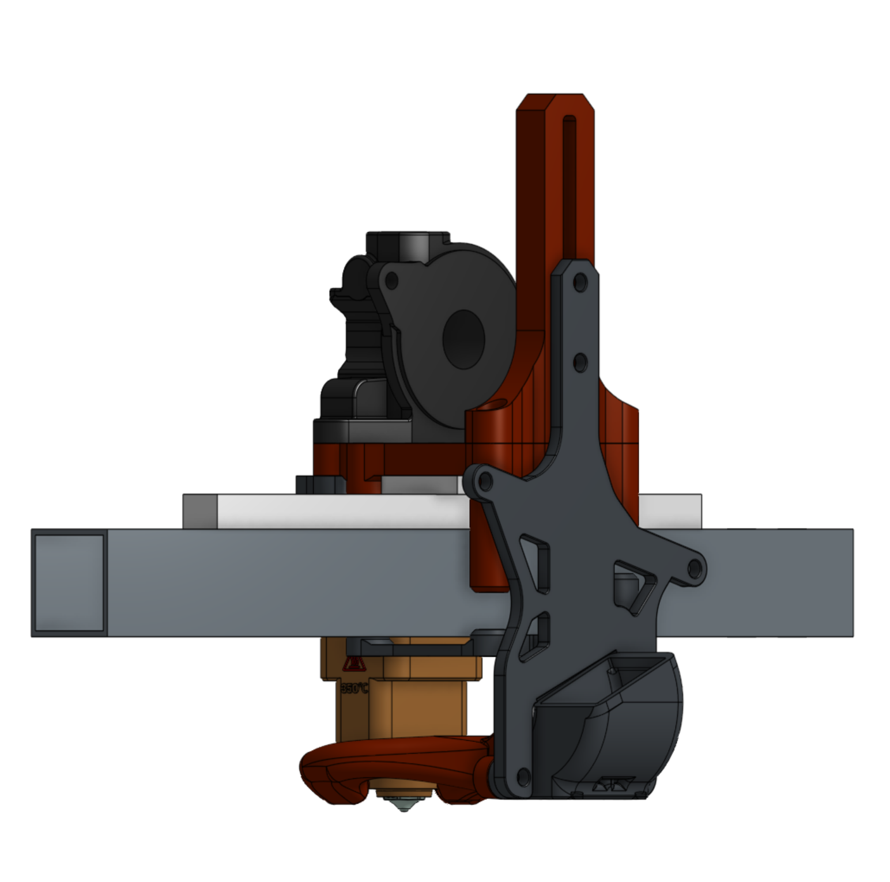
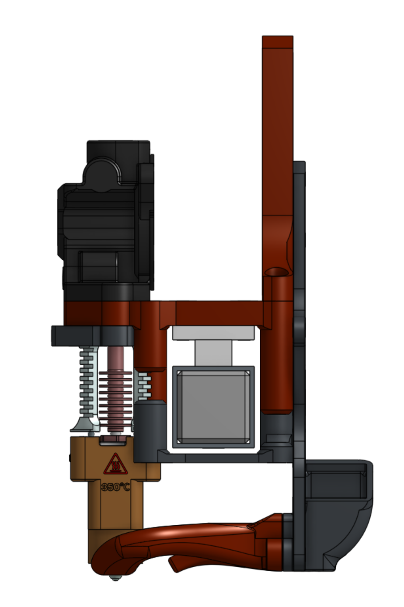

Many thanks to the VzBot and the Voron team for making excellent printers.

# VORON-2.4-TOP-MOUNT-X-RAIL
VORON-2.4-TOP-MOUNT-X-RAIL

# Work In Progress / ToDos
- 2023-01-18 - v3 uploaded - tested to be epic
- Many things under development
- Shift my bed back to increase printable area.

# Known Issues
- Tool head fan and duct at the rear slightly collides with gantry corners in the rear left and right.
  - Solution is to implement heat-set-nuts on the fan mount to save ~4mm.
  - Increase the XY mounts to collide with the gantry sooner to allow more padding space.

# Features
- Top Mount X Rail
- Simple install just new xy parts only. and modified VZPrintable tool head for the Dragon UltraHighFlow.
- No major belt changes just the idler belts are now routed to rear of x axis beam. No cuttin no trimming of belts required.
- Ultra lightweigth design with high accelerations. See Input Shaper graphs below.
- 682gram Total X-Rail Full System Install.
 
- Bed Printable area 336x 324y (TO DO:the bed can be pushed back ~4mm to increase ethe Y to 328ish)
 

# Requriments
- Sensorless homing recommend Y home 1st then X home Then Z home
  - https://docs.vorondesign.com/community/howto/clee/sensorless_xy_homing.html
- klicky prob (really like it so far) Adjustable gantry mount
  - https://github.com/jlas1/Klicky-Probe
  - My Custom adjustable KlickyProbe gantry mount  that suits custom heights of different toolhead FanDucts. in STL folder.
- Umbelical or some kind of no cable chain system.
- Move the Z-Axis chain under the gantry.
  - https://www.printables.com/model/279739-voron-can-bus-z-chain-move

# Inspired By
- https://github.com/VzBoT3D/Vz-Printhead-Printed
- https://github.com/VzBoT3D/VzBoT-Vz330
- https://grabcad.com/library/contribution-to-the-retractable_probe_dock-for-klicky-probe-and-quickdraw-probe-system-for-voron-of-tronfu-adapted-to-vzbotrobe-per-voron-di-tronfu-riadattato-alla-vzbot-1?fbclid=IwAR31FLcYtxWH4eCrtFb1iTl6fMMfGeksUfxyhcuGlu9bqLtTKSHHada0CzA
- https://grabcad.com/library/contribution-to-the-various-vzbot-fanduct-systems-in-combination-with-the-klicky-probedi-jlas1-and-quickdraw-systems-of-annex-1?fbclid=IwAR16A_0Nun4rFj4dr5-l7O6l62gWpChDlT06tSl2N-mH0tbDB2Qwea59Pus

# InputShaper

 

# V3 Images - Current Installation on printer

 

 

 

 

 

 

 

# YouTube

- Watch the videos for my build journey

# Feedback
TopMountXRail@jc84.com
julianjc84#7938
