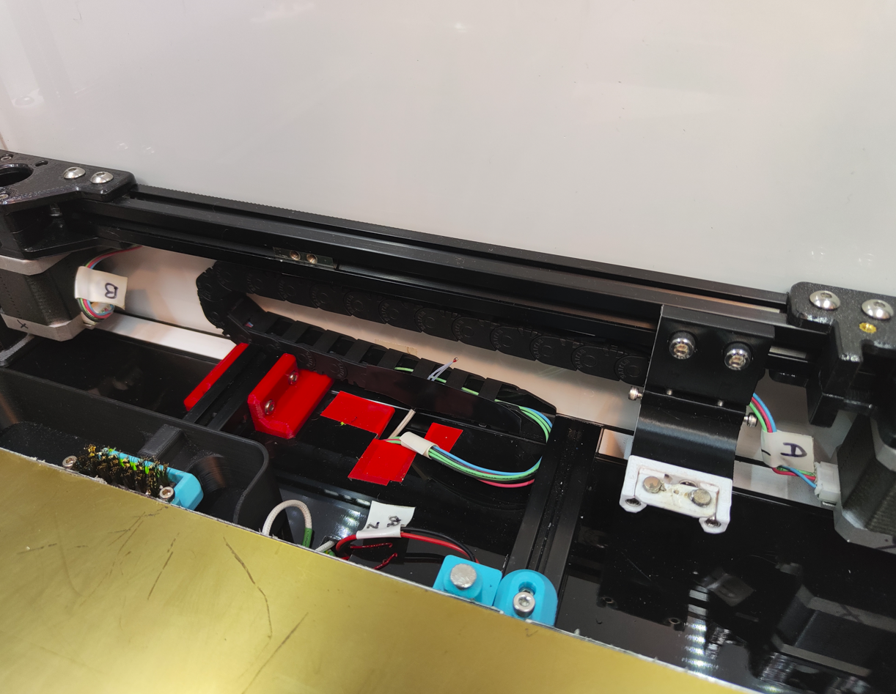
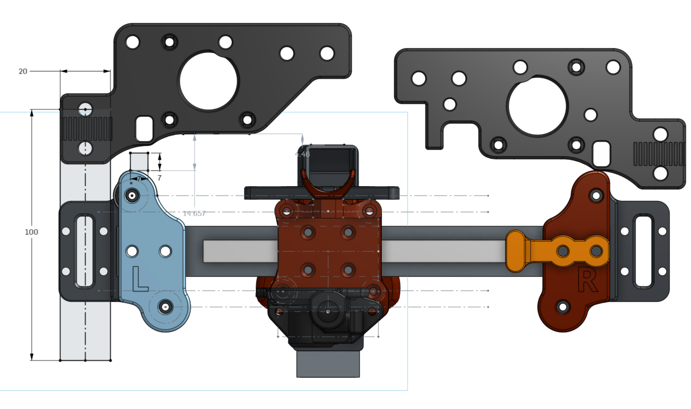

Many thanks to the VzBot and the Voron team for making excellent printers.

# VORON-2.4-TOP-MOUNT-X-RAIL
VORON-2.4-TOP-MOUNT-X-RAIL

# Work In Progress / ToDos
- 2023-01-18 - v3 uploaded - tested to be epic
- Many things under development

# Features
- Top Mount X Rail
- Simple install just new xy parts only. and modified VZPrintable tool head for the Dragon UltraHighFlow.
- No major belt changes just the idler belts are now routed to rear of x axis beam. No cuttin no trimming of belts required.
- Ultra lightweigth design with high accelerations. See Input Shaper graphs below.
- 682gram Total X-Rail Full System Install.
 
- Bed Printable area 336x 324y (TO DO:the bed can be pushed back ~4mm to increase ethe Y to 328ish)
 

# Requriments
- Sensorless homing. Recommend Y home 1st with 100-150mm back off. Home X. Center over Z EndStop. Home Z.
  - https://docs.vorondesign.com/community/howto/clee/sensorless_xy_homing.html
- klicky prob
  - https://github.com/jlas1/Klicky-Probe
  - My Custom adjustable KlickyProbe gantry mount that suits custom heights of different toolhead FanDucts in the STL folder.
- Umbelical or some kind of no cable chain system.
- Move the Z-Axis chain under the gantry.
  - https://www.printables.com/model/279739-voron-can-bus-z-chain-move

# Inspired By
- https://github.com/VzBoT3D/Vz-Printhead-Printed
- https://github.com/VzBoT3D/VzBoT-Vz330

# InputShaper

 

# V3 Images - Current Installation on printer

 

 

 

 

 

 

# YouTube

- Watch the videos for my build journey

# Known Issues
- Tool head fan and duct at the rear slightly collides with gantry corners in the rear left and right.
  - Solution is to implement heat-set-nuts on the fan mount to save ~4mm.
  - Increase the XY mounts to collide with the gantry sooner to allow more padding space for the hotend.
  - temporary Homing Y 1st with 150mm back off then X home.

# Resolved Issues
 - Z-Chain under the gantry extrusion is crushed especially with short hotends. Custom length hotend extension can be required. I also designed a new bed frame extrusion mount to allow the zChain to squeeze between. See STL downloads.

# What I Working On
- gantry collision working on a belt clip that pads out the frame to preventthe 5015 fan from colliding. estimate Y reduction of 8mm

# Feedback
TopMountXRail@jc84.com
julianjc84#7938
