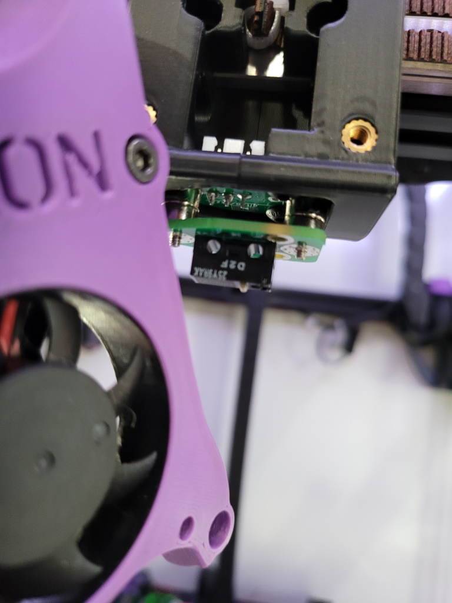
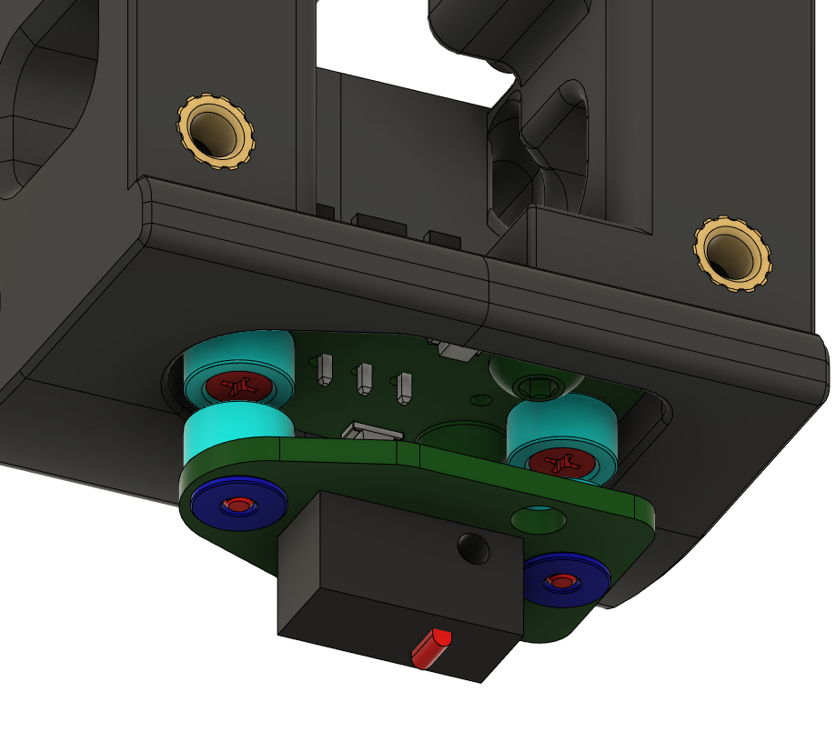
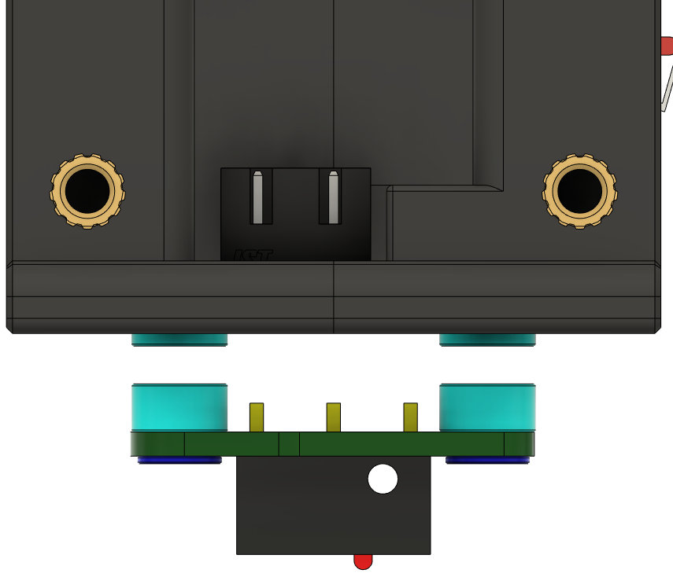
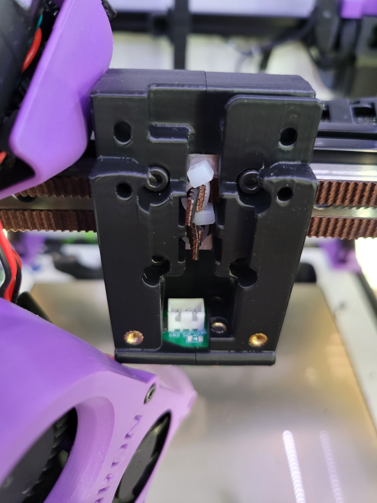

Afterburner MGN12 Carriage with Integrated Euclid Probe
=======================================================

Euclid Probe by [nionio6915 (Github)](https://github.com/nionio6915/Euclid_Probe), https://www.euclidprobe.com/

This is a modified version of the MGN12 carriage for a Voron Trident or modded Voron 2.4 with a cutout for mounting the upper Euclid PCB. 

Other than requiring a Euclid Probe, the only additional parts needed for the MGN12 carriage are two M3 heatset inserts for mounting the upper PCB. 

When installed, the Euclid's magnets should barely protrude from the bottom of the carriage.

The JST connector should be easily accessible from above

### Probe Dock

The Euclid Probe project has Voron docks available on 
[euclidprobe.com](https://www.euclidprobe.com/02-probe-docks-toolboard-mounts/), under "Mounts & Docks by Printers" > "Voron 2.4 / Voron Trident"

The available docks mount to the bed rails, removing the probe from the motion plane after moving up in the Z axis. Adjustment should be performed to move the dock along your maximum Y position to avoid errant pickups as much as possible.