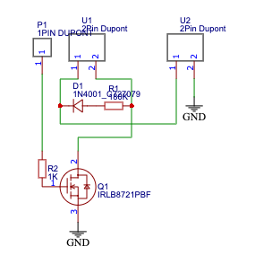
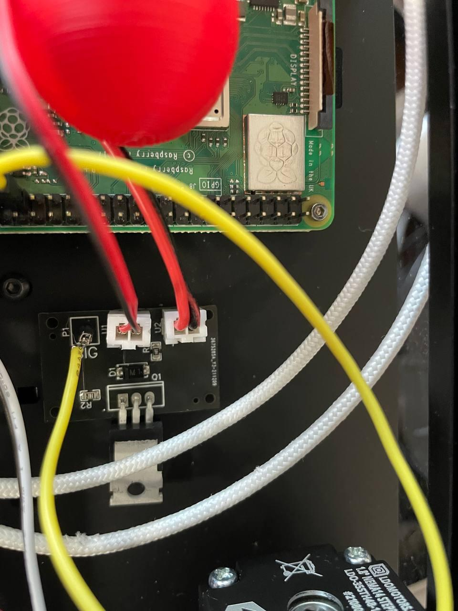
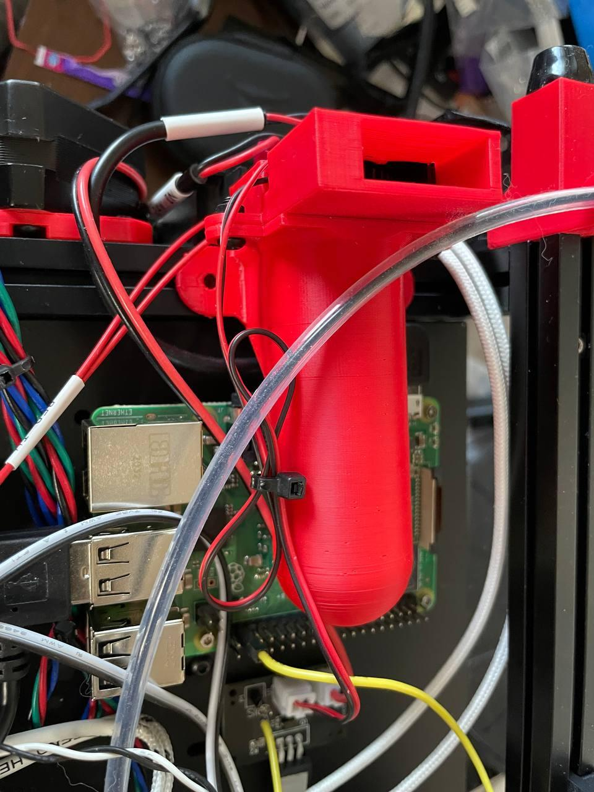

# Voron-0 Fan for Raspberry Pi 3/4

I noticed that, when printing, I was getting regular warnings about temerature
from my Raspberry Pi, so I added a temperature sensor. This indicated to me the
Pi would reach and sustain 60°C or higher during printing. When I looked at the
electronics area, I realized how little airflow there was in there. So, I
decided to add a bit of my own cooling and here's the design.

This uses a 24V 3010 blower fan, a custom circuit board, a couple 3D printed
parts, and one pin on the Raspberry Pi itself. (You could just as easy skip the
circuit board and use a pin on the MCU if one is available.)

The parts in the photos below were printed on V0.1084 (a V0.1)

## Circuit Board (optional)

The circuit board is a very simple transistor circuit that relies on the
IRLB8721 transistor. The Raspberry Pi (I used GPIO26) triggers the transistor
which turns on the 24V fan. I added a diode and resistor to protect the circuit
versus reverse power from the fan and a resistor to limit the current the
transistor can pull from the pi.



 (Excuse the lack of a proper dupont connector...
I ran out)

This circuit uses EasyEDA and is available as a json file for the schematic and
pcb. If you would like to order one from JCLPCB, compress the contents of the
`fan_controller_gerber` folder into a zip file and use the included
`fan_controller_bom.csv` and `fan_controller_pick_and_place.csv` files to have
the surface mount parts handled by them.

## Build

Print the parts and attach the duct to the fan housing with 8mm M3 BHCS and M3
nuts. Make sure they are aligned (the large hole is off-center so you can easily
tell). Press-fit the fan into place (it's a very tight fit). If you have some
nuts inserted into the 1515 rail already, you can screw the ducting into them,
or (as I didn't want to take the printer apart) use some 3M VHB tape to mount
the fan duct and housing to the 1515 rail just below the electronics bay (with
the fan ducting over the raspberry pi).



## Wiring

The wiring is very simple. Connect `24V IN` to the 24V PSU, `FAN` to the fan, and
`SIG` to GPIO26 (pin 37) on the Raspberry Pi. I affixed the circuit board with a
bit of 3M VHB tape left over from the build.

## Configuration

### Raspberry Pi controller

Follow the steps on Klipper's website to set up the
[Raspberry Pi as a secondary MCU](https://www.klipper3d.org/RPi_microcontroller.html).
Spcifically, you will need to install the rc script and make the linux process
micro-controller code. From there, add the following configurations to your
`printer.cfg`:

```
[mcu host]
serial: /tmp/klipper_host_mcu

[temperature_fan pi_fan]
pin: host:gpio26
sensor_type: temperature_host
min_temp: 10
max_temp: 100
target_temp: 55
control: watermark
```

This will create a temperature controlled fan on the Rasbperry Pi's GPIO26 (pin
37 on the header). Restart your configuration, and you're done!

### Non-Raspberry Pi controller
If you chose to use an available GPIO on the MCU, then use the `temperature_fan`
configuration, updating the `pin` value as appropriate.

```
[temperature_fan pi_fan]
pin: PA5
sensor_type: temperature_host
min_temp: 10
max_temp: 100
target_temp: 55
control: watermark
```
