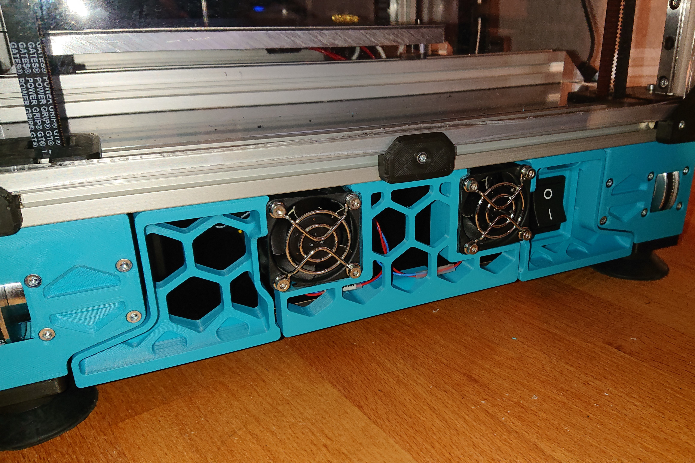

With building the famous V2 200mm² there are different challenges to encounter. Adding Skirts is one of them. 
Changing the file "side_fan_support_x2.stl" is the solution I have chosen. 
I changed the component to fit between the Standard parts "side_skirt_a_250_x2.stl" and "side_skirt_b_250_x2.stl".
Therefore, 6020 fans will no longer work. It is fitted to work with 4020 fans instead.
For blank inserts, scale "60mm_fan_blank_insert_x2.stl" to 40mm on X and Y.

