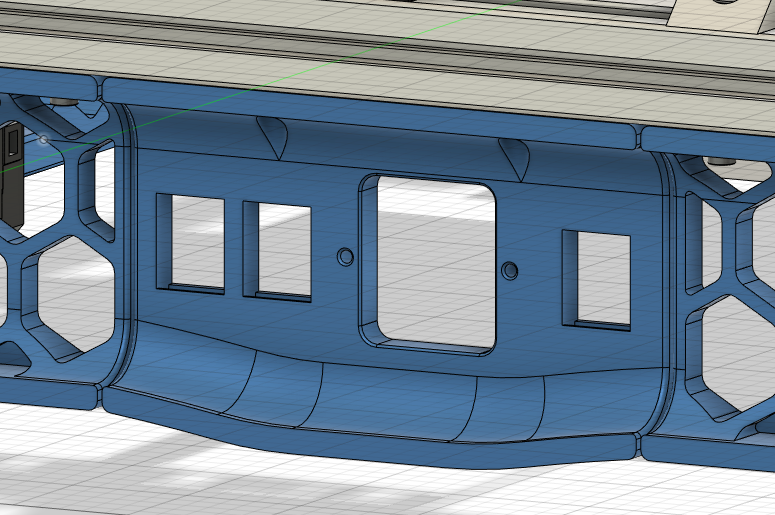

Adding an unnecessary amount of Keystone Holders to the Plug_Panel component. 
The part works with "TycoElectronics - 10EGG1-2 (Normal) or 10EHG1-2 (Medical) Filtered Power Inlet" or equal Inlets and needs moving the switch to another skirt 
like with @tayto-chip´s mod.

tayto-chip's [Skirt Switch Mod](../../tayto-chip/skirt_switch_mod)
